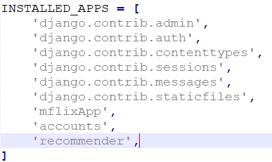
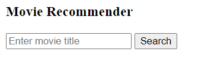
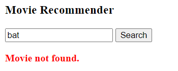
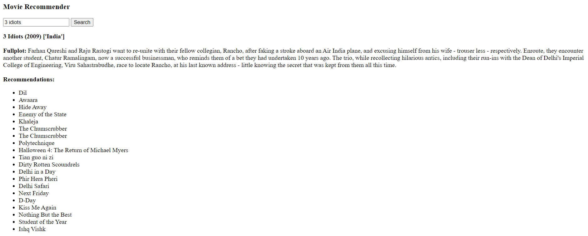
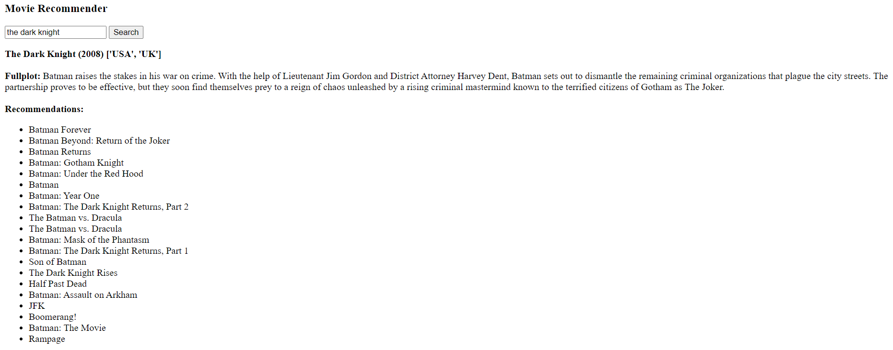
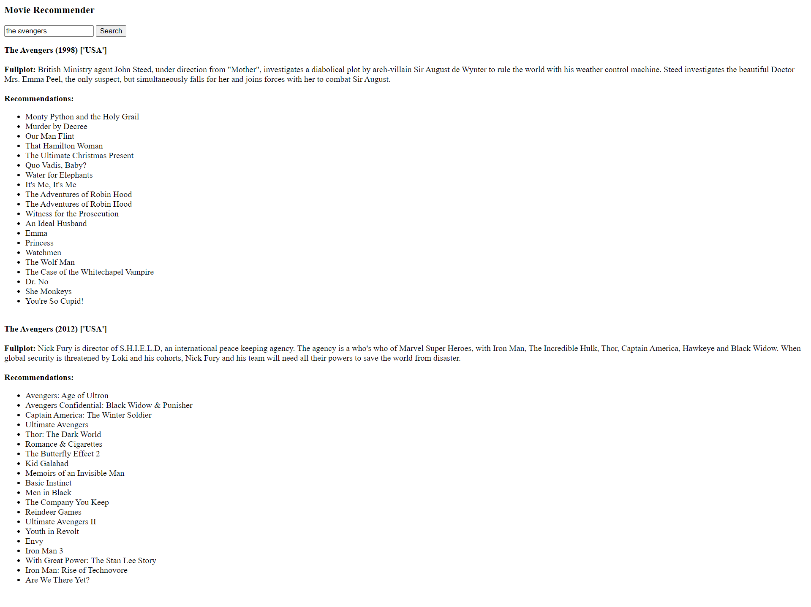

<a href="https://github.com/drshahizan/SECP3843/stargazers"></a>
<a href="https://github.com/drshahizan/SECP3843/network/members"></a>
<a href="https://github.com/drshahizan/SECP3843/pulls"></a>
<a href="https://github.com/drshahizan/SECP3843/issues"></a>
<a href="https://github.com/drshahizan/SECP3843/graphs/contributors"></a>


Don't forget to hit the :star: if you like this repo.

# Special Topic Data Engineering (SECP3843): Alternative Assessment

#### Name: Ong Han Wah
#### Matric No.: A20EC0129
#### Dataset: Mflix Dataset

## Question 4

One of the machine learning that can be used to improve the functioning of the portal is a movie recommendation system, specifically the content-based recommender.

1. Install necessary library.
```
pip install numpy
pip install pandas
pip install pymongo
pip install scikit-learn
```

2. Create a Django app called `recommender` and include the app in the `INSTALLED_APPS` list in the `settings.py` file.
```
python manage.py startapp recommender
```


3. Update the code in the `views.py` file of `recommender` app. Import the necessary libraries. Define an `index()` method. When user submit the form, the system will load the movie data from MongoDB, build the recommender and return the results. The recommender is based on the `fullplot` of the movies.
```python
from django.shortcuts import render
from django.contrib import messages
import pymongo
import pandas as pd
import numpy as np
from sklearn.feature_extraction.text import TfidfVectorizer, CountVectorizer
from sklearn.metrics.pairwise import linear_kernel, cosine_similarity

def index(request):
    
    if request.method == 'POST':
        # load data from mongodb
        myclient = pymongo.MongoClient()
        mydb = myclient["mflix"]
        mycol = mydb["movies"]
        mydoc = mycol.find()

        # load data into pandas dataframe
        df = pd.DataFrame(list(mydoc))
        
        # convert the title to lowercase for case insensitive match
        titles = df['title']
        indices = pd.Series(df.index, index=df['title'].str.lower())
        title = request.POST.get('title')
        title = title.lower()
        
        if title in indices.index:
            # build recommender
            df['fullplot'] = df['fullplot'].fillna('')
            # computes the word counts, IDF values, and Tf-idf scores
            tf = TfidfVectorizer(analyzer='word',ngram_range=(1, 2),min_df=0, stop_words='english')
            tfidf_matrix = tf.fit_transform(df['fullplot'])
            # Cosine Similarity Score
            cosine_sim = linear_kernel(tfidf_matrix, tfidf_matrix)

            idxlist = []
            metas = []
            desc = []
            results = []

            # get movie recommendations
            idx = indices[title]
            if(isinstance(idx, np.integer)):
                idxlist.append(idx)
                idx = idxlist
            for i in idx:
                sim_scores = list(enumerate(cosine_sim[i]))
                sim_scores = sorted(sim_scores, key=lambda x: x[1], reverse=True)
                sim_scores = sim_scores[1:21]
                movie_indices = [i[0] for i in sim_scores]
                meta = str(titles.iloc[i]) + ' (' + str(df.iloc[i]['year']) + ') ' + str(df.iloc[i]['countries'])
                metas.append(meta)
                desc.append(df.iloc[i]['fullplot'])
                tdf = titles.iloc[movie_indices].head(20).tolist()
                results.append(tdf)
            return render(request, 'recommender/index.html', {'recommendations': zip(metas, desc, results), "title": title})
        else:
            messages.error(request, 'Movie not found.')
            return render(request, 'recommender/index.html', {"title": title})
    return render(request, 'recommender/index.html')

```

4. Next, we need to create the html file for the recommender view. Inside the `recommender` directory, create a directory called `templates`. Then inside the templates directory, create another directory named `recommender` and put the html files in it.
- `index.html`
```html
<h3>Movie Recommender</h3>

<form action="" method="POST">
    
    <input type="text" name="title" placeholder="Enter movie title" value="{{title}}">

    <button type="submit">Search</button>
</form>


  
      <strong style="color:red">{{message}}</strong>
 




  
      <strong>{{meta}}</strong>
	  <br/>
	  <br/>
	  <b>Fullplot:</b> {{desc}}
	  <br/>
	  <br/>
	  <b>Recommendations:</b>
	  <ul>
	  
		  <li>{{i}}</li>
	 
	 </ul>
	 <br/>
 

```

5. Add the route to the `urls.py` file.
```py
...
from recommender import views as recommender_views

urlpatterns = [
    ...
    path('recommender/', recommender_views.index, name='recommender'),
]
```

6. Run server to see the result. The result can also be seen in the <a href="./files/code/movie_recommender.ipynb">movie_recommender.ipynb</a>

```
python manage.py runserver
```
- Recommender Page



- Movie Not Found



- Example query: 3 idiots. The system recommends some Indian and school movies.



- Example query: the dark knight. The system is able to recommend batman movies.



- If there are multiple movies with same title, the system return recommendations for each movie found.



## Contribution 🛠️
Please create an [Issue](https://github.com/drshahizan/special-topic-data-engineering/issues) for any improvements, suggestions or errors in the content.

You can also contact me using [Linkedin](https://www.linkedin.com/in/drshahizan/) for any other queries or feedback.

[](https://visitorbadge.io/status?path=https%3A%2F%2Fgithub.com%2Fdrshahizan)


