<a href="https://github.com/drshahizan/SECP3843/stargazers"></a>
<a href="https://github.com/drshahizan/SECP3843/network/members"></a>
<a href="https://github.com/drshahizan/SECP3843/pulls"></a>
<a href="https://github.com/drshahizan/SECP3843/issues"></a>
<a href="https://github.com/drshahizan/SECP3843/graphs/contributors"></a>


Don't forget to hit the :star: if you like this repo.

# Special Topic Data Engineering (SECP3843): Alternative Assessment

#### Name: Ong Han Wah
#### Matric No.: A20EC0129
#### Dataset: Mflix Dataset

## Question 5 (a)

- Caching

Caching mechanism can be implemented to store frequently accessed data to avoid redundant computations and faster esponse time.

- Database query optimization

Database queries can be optimized by reducing JOIN, subqueries and select only necessary columns. This can avoid unnecessary data retrieval that can affect performance.

- Database replication and sharding

MongoDB offers replication and sharding for increased performance. Replication increases data availability and provides redundancy. The applications tocan read from multiple servers to help with load balancing among replica sets. Sharding distributes large data sets across multiple servers. We can achieve improved data availability, scalability, load balancing, and performance optimization for the applications by implementing database replication and sharding.

## Question 5 (b)
1. Create a Django app called `dashboard` and include the app in the `INSTALLED_APPS` list in the `settings.py` file.
```
python manage.py startapp dashboard
```

2. Update the code in the `views.py` file of `dashboard` app.
```py
from django.shortcuts import render

def index(request):
    return render(request, "dashboard/index.html")
```

3. Build the dashboard using **MongoDB Atlas Charts**. Login to MongoDB Atlas and navigate to Charts to create a dashboard. The dashboard is built with several charts including:

- A card that show the total number of movies.

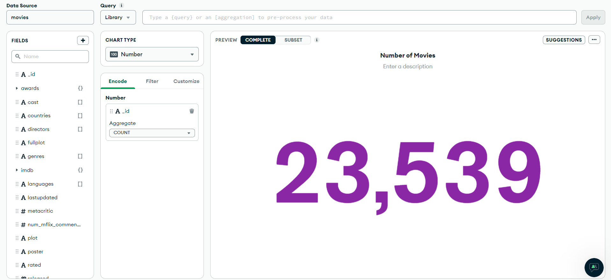

- Gauge chart that show the average metacritic score

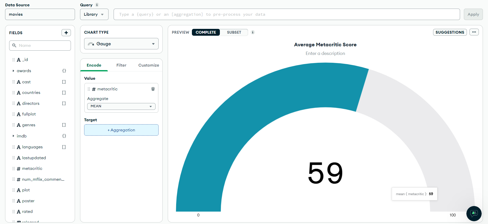

- Doughnut chart that shows the number and percentages of movies based on their rating. The chart includes top 10 ratings and the others.

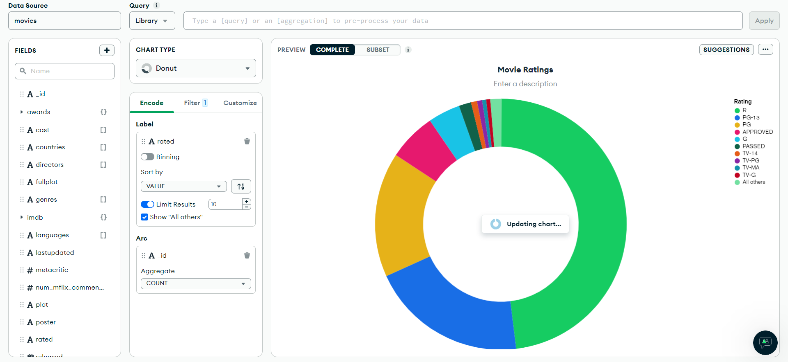

- A bar chart that shows top 10 genres having highest number of movies.

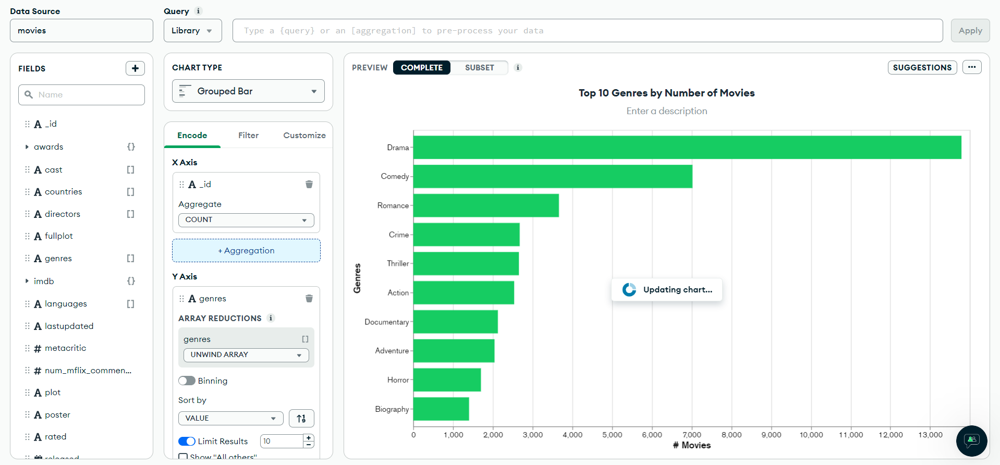

- A bar chart that shows top 10 languages among the movies.

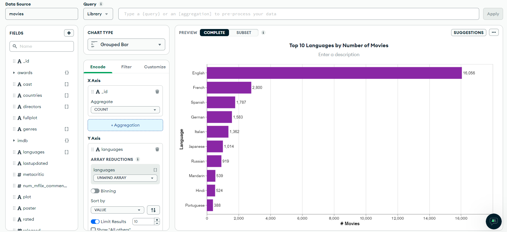

- A bar chart that shows top 10 movies based on their number of Mflix comments.

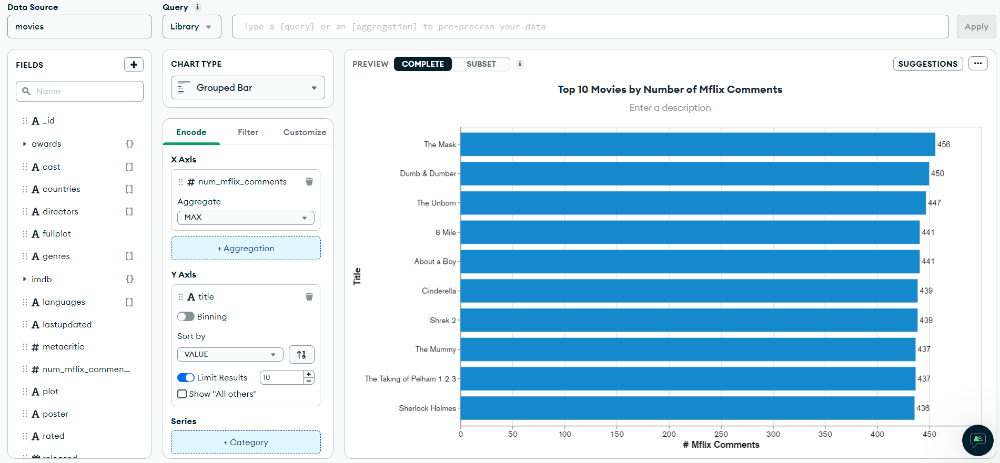

- A table shows the most awarded directors. The table includes the number of movies, winning and nominations counts for each directors.

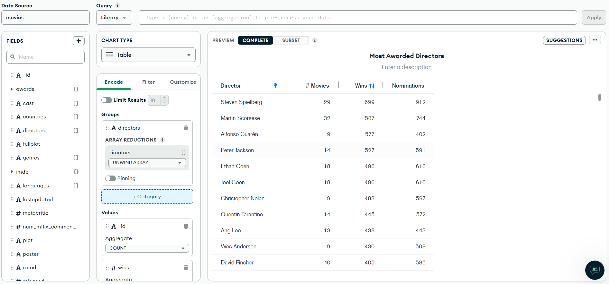

- A bar chart that shows the most active actors based on their number of movies involved.

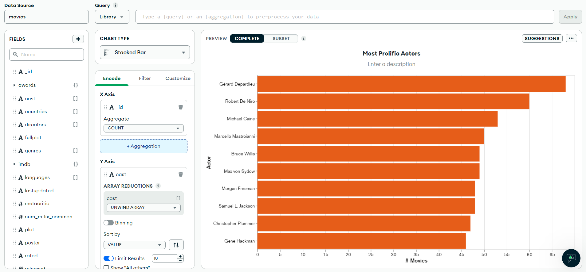

- A combo chart shows the number of movies, average critic and viewer review past the decades.

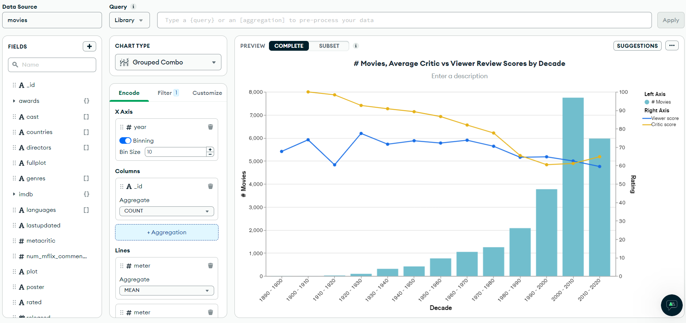

- A choropleth map can be useful to visualize the average metacritics score of movies in different countries with color scale.

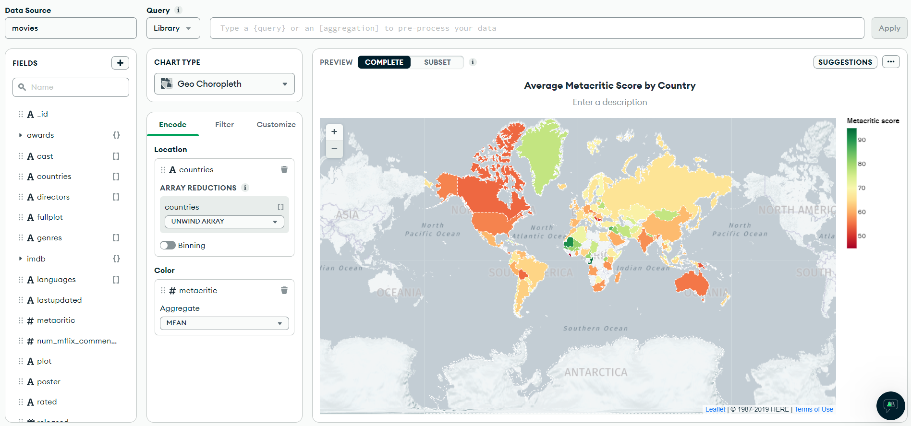

4. Create the html file for the dashboard view. Inside the `dashboard` directory, create a directory called `templates`. Then inside the templates directory, create another directory named `dashboard` and put the html files in it. In the MongoDB Atlas Charts page, find the embed option, enable unauthenticated access, configure the embedding setting and then copy the dashboard embed code and paste it in the html file.


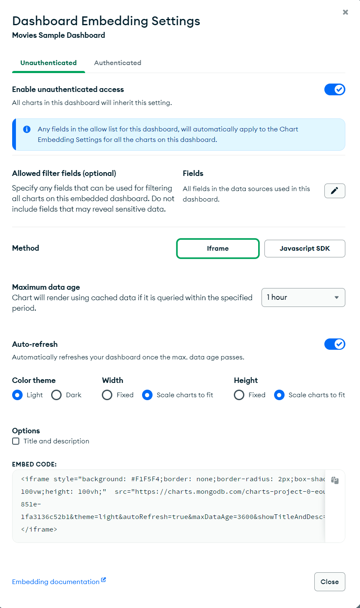

- `index.html`
```
<h2>Dashboard</h2>

<iframe style="background: #F1F5F4;border: none;border-radius: 2px;box-shadow: 0 2px 10px 0 rgba(70, 76, 79, .2);width: 100vw;height: 100vh;"  src="https://charts.mongodb.com/charts-project-0-eouzt/embed/dashboards?id=649d1991-b269-433f-851e-1fa3136c52b1&theme=light&autoRefresh=true&maxDataAge=3600&showTitleAndDesc=false&scalingWidth=fixed&scalingHeight=fixed"></iframe>
```


5. Add the route to the `urls.py` file.
```py
...
from dashboard import views as dashboard_views

urlpatterns = [
    ...
    path('dashboard/', dashboard_views.index, name='dashboard'),
]
```

6. Run server to see the result.
```
python manage.py runserver
```
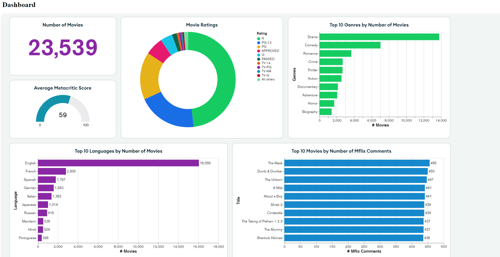
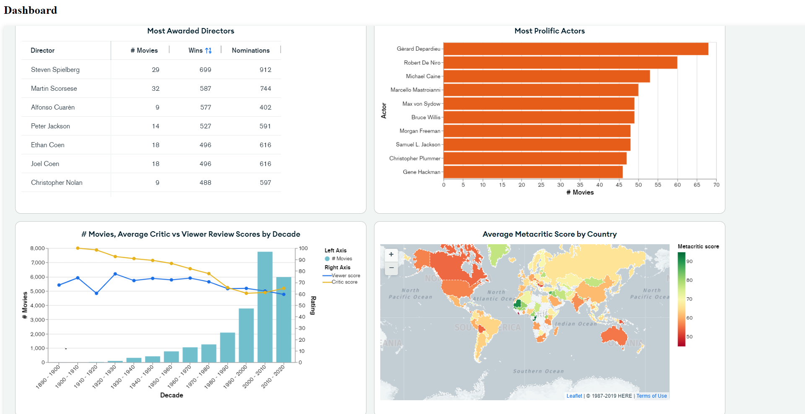


## Contribution 🛠️
Please create an [Issue](https://github.com/drshahizan/special-topic-data-engineering/issues) for any improvements, suggestions or errors in the content.

You can also contact me using [Linkedin](https://www.linkedin.com/in/drshahizan/) for any other queries or feedback.

[](https://visitorbadge.io/status?path=https%3A%2F%2Fgithub.com%2Fdrshahizan)


