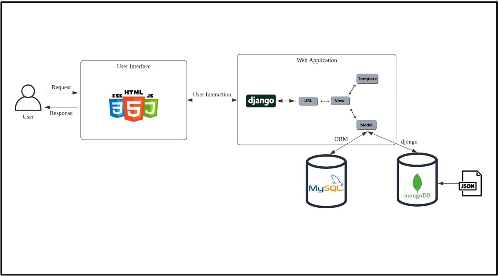

Don't forget to hit the :star: if you like this repo.

# Special Topic Data Engineering (SECP3843): Alternative Assessment

#### Name: Hong Pei Geok
#### Matric No.: A20EC0044
#### Dataset: <a href="https://github.com/drshahizan/dataset/tree/main/mongodb/06-tweets" >Tweets</a>

## Question 1 (a)
Lorem ipsum dolor sit amet, consectetur adipisicing elit, sed do eiusmod tempor incididunt ut labore et dolore magna aliqua. Ut enim ad minim veniam, quis nostrud exercitation ullamco laboris nisi ut aliquip ex ea commodo consequat. Duis aute irure dolor in reprehenderit in voluptate velit esse cillum dolore eu fugiat nulla pariatur. Excepteur sint occaecat cupidatat non proident, sunt in culpa qui officia deserunt mollit anim id est laborum.

## Question 1 (b)
</img>

- #### User
  User is who uses the portal, initiates the request and interacts with the user interface.

- #### User Interface
  User interface is the front end where users interact with. It may include the following components:
  - HTML/CSS/JavaScript: These technologies are used to develop visually appealing and interactive web pages as the user interfaces for users to interact with the portal.
  - Dashboard: Dashboard is an important component for users to have better user experience and gain insight from data easily in helping decision making. It may include statistics, graphs and tables that summarize the data. 

- #### Web Application
  Django will be used as the web framework in this project.
  - Django, a python web framework has been used as the back end for handling requests, processing data, and interacting with the databases. Basically, it follows the MVT design pattern (Model, View, Template).
    - Model: Model component represents the data structure and defines how data is stored in the databases.
    - View: View receives requests from the user interface, retrieves and manipulates data from the models, and renders the appropriate templates for generating HTML or other response formats. 
    - Template: Template is a file to describe how the result should be represented. It is responsible for generating the user interface and presenting the data to the user. 
  - Django ORM:ORM (Object-Relational Mapping) is an abstract layer provided by django The ORM allows developers to perform database operations such as inserting, updating, deleting and querying using Python code and eliminates the need to write raw SQL queries.

- #### Database
  There will be two databases integrate in this project 
  - MySQL: MySQL is a relational database that is suitable to store structure data related to the portal. For example, it is used to store user registration and login information in this project. 
  - MongoDB: MongoDB is a non-relational database that is suitable to store unstructured or semi-structured data. For example, it is used to store the JSON file related to tweets in this project. 

- #### JSON
  It represents the file type that was used in this project. 

## Contribution 🛠️
Please create an [Issue](https://github.com/drshahizan/special-topic-data-engineering/issues) for any improvements, suggestions or errors in the content.

You can also contact me using [Linkedin](https://www.linkedin.com/in/drshahizan/) for any other queries or feedback.

