<a href="https://github.com/drshahizan/SECP3843/stargazers"></a>
<a href="https://github.com/drshahizan/SECP3843/network/members"></a>
<a href="https://github.com/drshahizan/SECP3843/pulls"></a>
<a href="https://github.com/drshahizan/SECP3843/issues"></a>
<a href="https://github.com/drshahizan/SECP3843/graphs/contributors"></a>


Don't forget to hit the :star: if you like this repo.

# Special Topic Data Engineering (SECP3843): Alternative Assessment

#### Name: Hong Pei Geok
#### Matric No.: A20EC0044
#### Dataset: <a href="https://github.com/drshahizan/dataset/tree/main/mongodb/06-tweets" >Tweets</a>

## Question 1 (a)
There are five servers used in this project.
- Web Server<br>
  This server is required to host the Django web framework and render dynamic web pages.The Django application is deployed on this server.<br>

- MySQL Database Server<br>
  This server is responsible for hosting the MySQL database management system. The Django application communicates with this server to perform operations such as storing, retrieving, and manipulating data using the MySQL database.

- MongoDB Database Server<br>
  This server is responsible for hosting the MongoDB database management system. The Django application communicates with this server to perform operations such as storing, retrieving, and manipulating data using the MongoDB database.

- Load Balancer<br>
  Load balancer can distribute incoming requests across multiple web servers to ensure efficient handling and prevent overload. Therefore, the user requests can be handled in an efficient way by the web servers hosting the Django application.

- File Server<br>
  This server is responsible for serving static files used in the Django web application, such as CSS, JavaScript, and media files. By separating these files from the web server, it will increase the performance.

Below show the steps to integrate Django with the JSON dataset and ensure efficient data storage and retrieval from both MySQL and MongDB databases for the three main servers which are web server, MySQL database server and MongoDB database server.

### Steps to Setup Django Server
1. Create Virtual Environment
```
virtualenv env
```

Once you have created the virtual environment, you can activate it by running the following command.
```
env\Scripts\activate
```

2. Install Django
   
After creating and activating the virtual environment, the next step is to install django by using the pip command.
```
pip install django
```

Command Prompt:
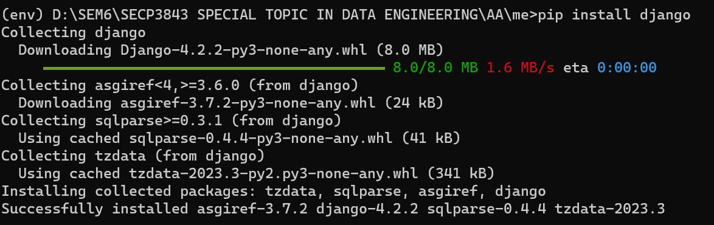</img>

3. Start the project by creating a new Django project using the following command.
```
django-admin startproject AA
```

Result:

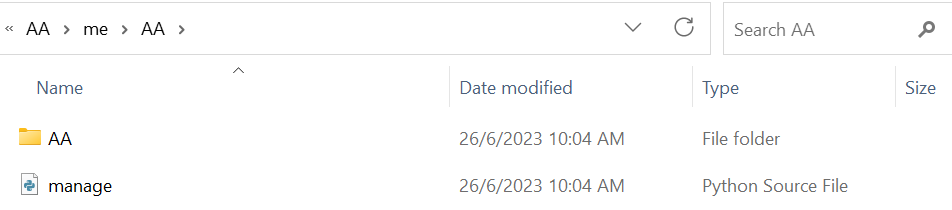</img>

4. Afterward, create an app inside the project and you should ensure you are in the same directory as manage.py of the project.
```
python manage.py startapp tweets
```

5. The last step for setting the django will be registering the newly created app in setting.py.

<p align="center">
  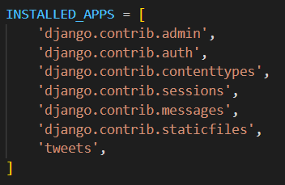</img>
</p>

### Steps to Setup MySQL Database Server
1. Install and configure MySQL. For example, below shows the access to MySQL using XAMPP.
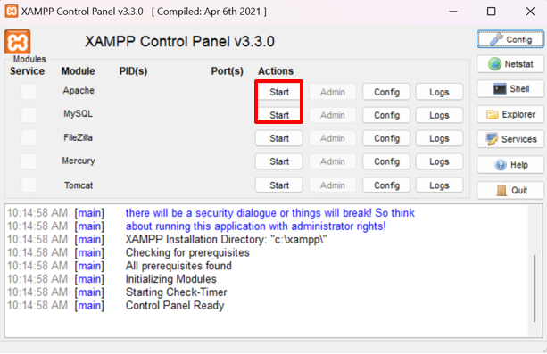</img>

2. Then, you can create a new database for the django project by following the steps as shown in figure below. 
</img>

### Steps to Setup MongoDB Server
1. Install and configure MongoDB. For example, below shows the access to MongoDB by downloading MongoDB Community Server.
<p align = "center">
  </img>
</p>

3. Create a new database for the django project by following the steps as shown in figure below.
  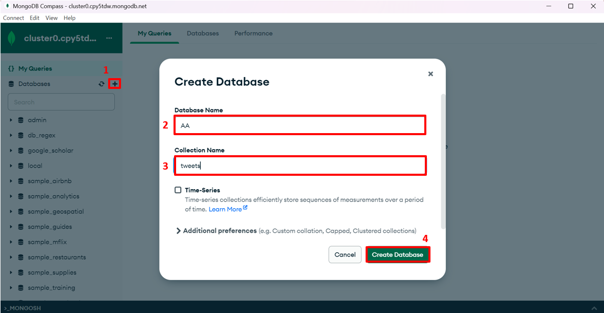</img>

### Integration Steps
1. Since we need to integrate django with MySQL and MongoDB, there will be several packages that need to be installed.
  - MySQL
    ```
    pip install mysqlclient
    ```
    Result:
    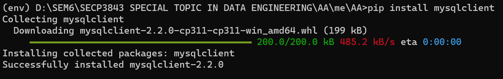</img>
  
  - MongoDB:
    ```
    pip install pymongo
    ```
    Result:
    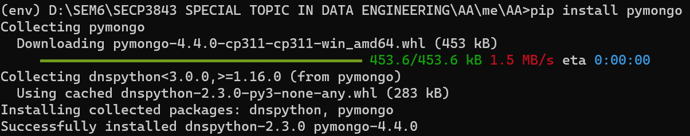</img>
    
  - Python Library to provides timezone support:
    ```
    pip install pytz
    ```
    Result:
    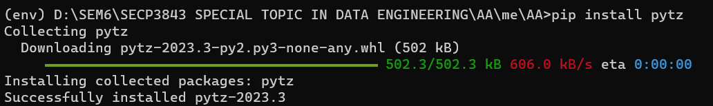</img>

2. Configure the Django project's settings: Open setting.py to configure the setting in order to connect with MySQL and MongoDB database.
    ```
    DATABASES = {
        'default': {
            'ENGINE': 'django.db.backends.mysql',
            'NAME': 'tweets',
            'USER': 'root',
            'PASSWORD': '',
            'HOST': 'localhost',
            'PORT': '3306',
        },
        'mongodb': {
            'ENGINE': 'djongo',
            'NAME': 'AA',
            'CLIENT': {
                'host': 'mongodb+srv://cluster0.cpy5tdw.mongodb.net',
                'username': 'peiyu',
                'password': '1',
                'authMechanism': 'SCRAM-SHA-1',
                'authSource': 'admin',
            },
        },
    }
    ```

3. Define Model: Open tweets/models.py and define Django models to represent the structure of JSON dataset.

    ```
    from django.db import models
    
    class Tweet(models.Model):
        _id = models.CharField(max_length=255)
        text = models.TextField()
        in_reply_to_status_id = models.CharField(max_length=255, null=True)
        retweet_count = models.IntegerField(null=True)
        contributors = models.CharField(max_length=255, null=True)
        created_at = models.DateTimeField()
        geo = models.CharField(max_length=255, null=True)
        source = models.CharField(max_length=255)
        coordinates = models.CharField(max_length=255, null=True)
        in_reply_to_screen_name = models.CharField(max_length=255, null=True)
        truncated = models.BooleanField()
        entities = models.JSONField()
        retweeted = models.BooleanField()
        place = models.CharField(max_length=255, null=True)
        user = models.JSONField()
        favorited = models.BooleanField()
        in_reply_to_user_id = models.CharField(max_length=255, null=True)
        id = models.CharField(max_length=255, unique=True)
    ```

4. Migrate Database: Run the following commands to generate and apply migration  to create the necessary tables in both MySQL and MongoDB. 
  - MySQL
    ```
    python manage.py makemigrations
    python manage.py migrate
    ```   
    Command Prompt:
    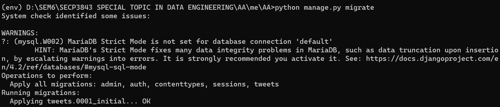</img>
  
    Result:
    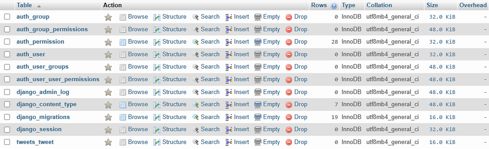</img>
  
  - MongoDB
    ```
    python manage.py migrate --database=mongodb
    ```
    Command Prompt:
    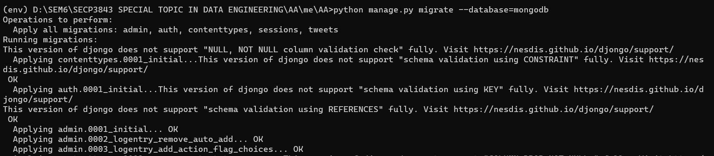</img>
    
    Result:
    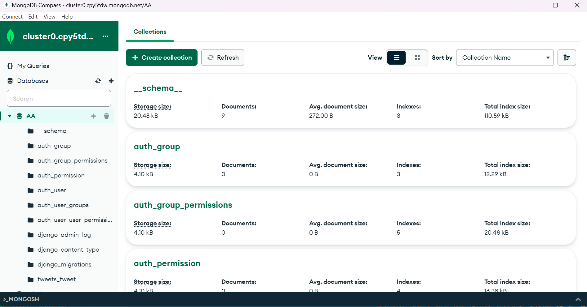</img>
    
5. Load JSON Data into Databases: A Python script has been declared to read the JSON dataset and populate the Django models.
     ```
     from django.core.management.base import BaseCommand
    import json
    from tweets.models import Tweet
    from datetime import datetime
    
    class Command(BaseCommand):
        help = 'Loads JSON data into the Tweet model'
    
        def add_arguments(self, parser):
            parser.add_argument('json_file', type=str, help='Path to the JSON file')
    
        def handle(self, *args, **options):
            json_file = options['json_file']
            with open(json_file, encoding='utf-8') as f:
                data = json.load(f)
                for item in data:
                    created_at = datetime.strptime(item['created_at'], "%a %b %d %H:%M:%S %z %Y").strftime("%Y-%m-%d %H:%M:%S")
                    tweet = Tweet(
                        _id=item['_id'],
                        text=item['text'],
                        in_reply_to_status_id=item['in_reply_to_status_id'],
                        retweet_count=item['retweet_count'],
                        contributors=item['contributors'],
                        created_at=created_at,
                        geo=item['geo'],
                        source=item['source'],
                        coordinates=item['coordinates'],
                        in_reply_to_screen_name=item['in_reply_to_screen_name'],
                        truncated=item['truncated'],
                        entities=item['entities'],
                        retweeted=item['retweeted'],
                        place=item['place'],
                        user=item['user'],
                        favorited=item['favorited'],
                        in_reply_to_user_id=item['in_reply_to_user_id'],
                        id=item['id']
                    )
                    tweet.save()
                    tweet.save(using='mongodb')
                    self.stdout.write(self.style.SUCCESS(f'Successfully loaded data for tweet with id {tweet.id}'))
     ```
    Then, run the following command to import JSON file into MySQL and MongoDB database.
    ```
    python manage.py load_data modified_tweets.json
    ```
    Result: 
    - MySQL
      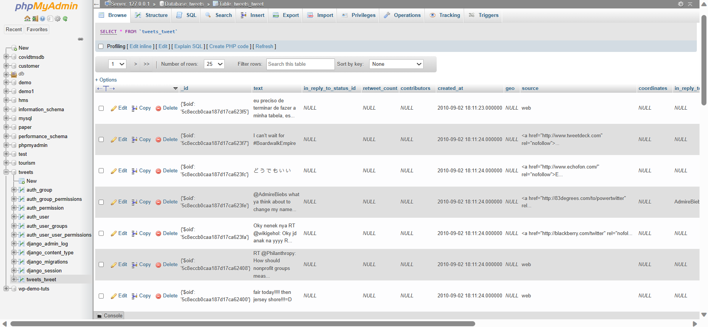</img>
    - MongoDB
      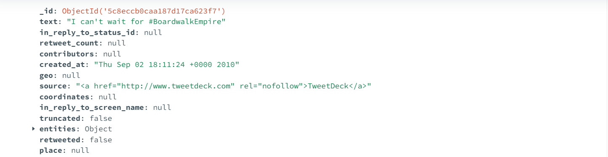</img>

6. Query and Retrieve Data: Django’s ORM will be used to query and retrieve data from both databases.
  ```
  target_source = "web"
  tweets_mysql = Tweet.objects.using('default').filter(source=target_source)
  tweets_mongodb = Tweet.objects.using('mongodb').filter(source=target_source)
  ```
  > The above code will retrieve all the documents with source equal to "web" from MySQL and MongoDB.

## Question 1 (b)
</img>

- #### User
  User is who uses the portal, initiates the request and interacts with the user interface.

- #### User Interface
  User interface is the front end where users interact with. It may include the following components:
  - HTML/CSS/JavaScript: These technologies are used to develop visually appealing and interactive web pages as the user interfaces for users to interact with the portal.
  - Dashboard: Dashboard is an important component for users to have better user experience and gain insight from data easily in helping decision making. It may include statistics, graphs and tables that summarize the data. 

- #### Web Application
  Django will be used as the web framework in this project.
  - Django, a python web framework has been used as the back end for handling requests, processing data, and interacting with the databases. Basically, it follows the MVT design pattern (Model, View, Template).
    - Model: Model component represents the data structure and defines how data is stored in the databases.
    - View: View receives requests from the user interface, retrieves and manipulates data from the models, and renders the appropriate templates for generating HTML or other response formats. 
    - Template: Template is a file to describe how the result should be represented. It is responsible for generating the user interface and presenting the data to the user. 
  - Django ORM: ORM (Object-Relational Mapping) is an abstract layer provided by django The ORM allows developers to perform database operations such as inserting, updating, deleting and querying using Python code and eliminates the need to write raw SQL queries.
  - Djongo: Djongo is a third-party library that provides integration between Django and MongoDB. 

- #### Database
  There will be two databases integrate in this project 
  - MySQL: MySQL is a relational database that is suitable to store structure data related to the portal. For example, it is used to store user registration and login information in this project. 
  - MongoDB: MongoDB is a non-relational database that is suitable to store unstructured or semi-structured data. For example, it is used to store the JSON file related to tweets in this project. 

- #### JSON
  It represents the file type that was used in this project.

#### Flow
Basically, the flow starts when the user initiates the request and the requests will go through the user interface components, where the user interacts with the portal using dashboard, CSS, HTML, and JavaScript. 

After that, the user interface then communicates with the web application. In this case, the web application is implemented with Django, which includes URL routing, views, templates, and models.

The web application component processes the user's requests and queries the databases (MySQL and MongoDB) accordingly. The web application interacts with the MySQL database for structured data and the MongoDB database for JSON data.


## Contribution 🛠️
Please create an [Issue](https://github.com/drshahizan/special-topic-data-engineering/issues) for any improvements, suggestions or errors in the content.

You can also contact me using [Linkedin](https://www.linkedin.com/in/drshahizan/) for any other queries or feedback.

[](https://visitorbadge.io/status?path=https%3A%2F%2Fgithub.com%2Fdrshahizan)


