<a href="https://github.com/drshahizan/SECP3843/stargazers"></a>
<a href="https://github.com/drshahizan/SECP3843/network/members"></a>
<a href="https://github.com/drshahizan/SECP3843/pulls"></a>
<a href="https://github.com/drshahizan/SECP3843/issues"></a>
<a href="https://github.com/drshahizan/SECP3843/graphs/contributors"></a>


Don't forget to hit the :star: if you like this repo.

# Special Topic Data Engineering (SECP3843): Alternative Assessment

#### Name: Hong Pei Geok
#### Matric No.: A20EC0044
#### Dataset: <a href="https://github.com/drshahizan/dataset/tree/main/mongodb/06-tweets" >Tweets</a>
#### Content
- [Question 2 (a)](#question-2-a)
- [Question 2 (b)](#question-2-b)

## Question 2 (a)
There are several steps to import tweets.json files into MongoDB.

#### Prerequisites
Download and Install All Required Software.
- MongoDB Community Server <br>
  Navigate to https://www.mongodb.com/try/download/community and click download button.
  <p align="center">
    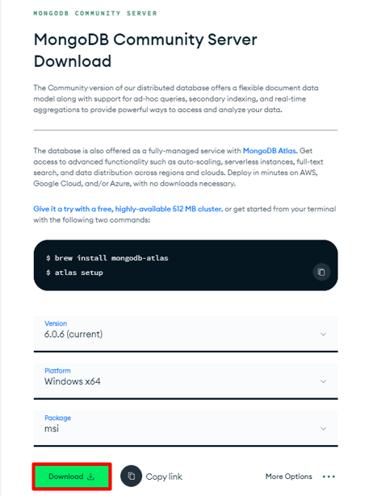</img>
  </p>

- MongoDB Shell <br>
Navigate to https://www.mongodb.com/try/download/shell and click download button.
  <p align="center">
    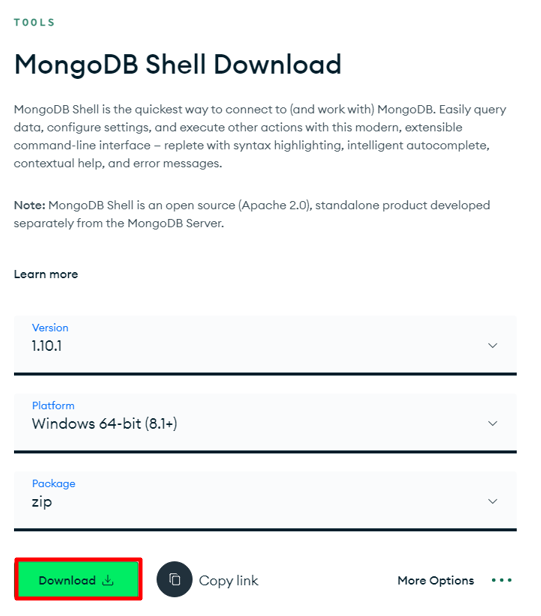</img>
  </p>
  
- MongoDB Command Line Database Tools <br>
Navigate to https://www.mongodb.com/try/download/database-tools and click download button.
  <p align="center">
    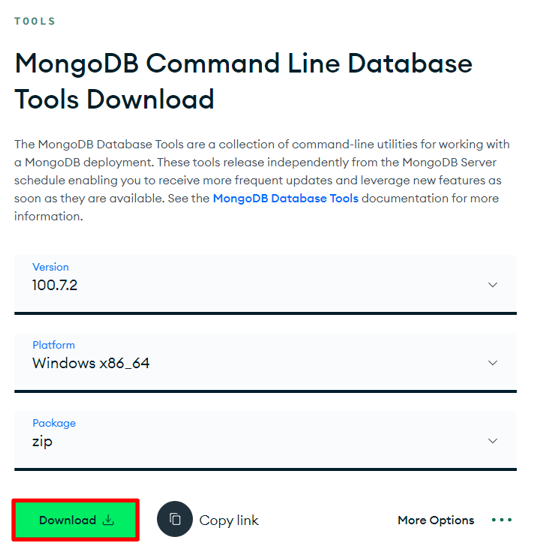</img>
  </p>

#### Step 1: Prepare the JSON File
Download the dataset from <a href="https://github.com/drshahizan/dataset/tree/main/mongodb/06-tweets" >Tweets</a>. It is important to ensure the JSON file follows the appropriate structure for MongoDB documents. It is found that the tweets.json file is not formatted correctly as a JSON array. Therefore, python will be used to perform data preparation by adding brackets at the beginning and end of the file. Each individual tweet object should be enclosed within square brackets '[ ]' and separated by commas ','. <br>

```Data Preparation```: <a href="./files/code/DataPreparation.ipynb">DataPreparation.ipynb</a> <br>
```Modified dataset```: <a href="./files/code/modified_tweets.json">modified_tweets.json</a>

#### Step 2: Start the MongoDB Server
After download is completed, extract and copy all the .exe files from MongoDB Shell and  MongoDB Command Line Database Tools into the MongoDB bin folder[C:\Program Files\MongoDB\Server\6.0\bin].  

The .exe file in MongoDB Shell:
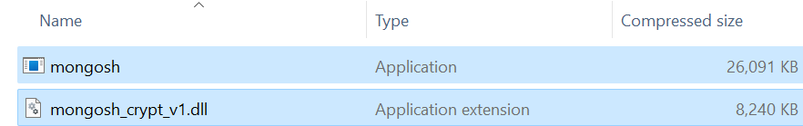</img>

The .exe file in MongoDB Command Line Database Tools:
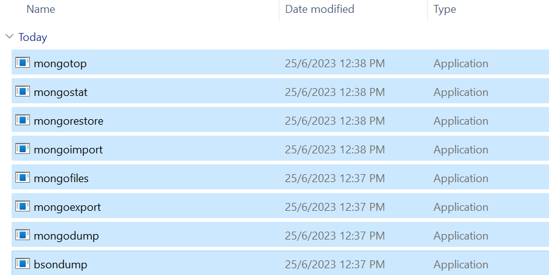</img>

Then, open the command prompt and navigate to the MongoDB installation directory.
```
cd C:\Program Files\MongoDB\Server\6.0\bin
```

Start the MongoDB server by running the mongod command. 
```
mongod
```
Command Prompt:
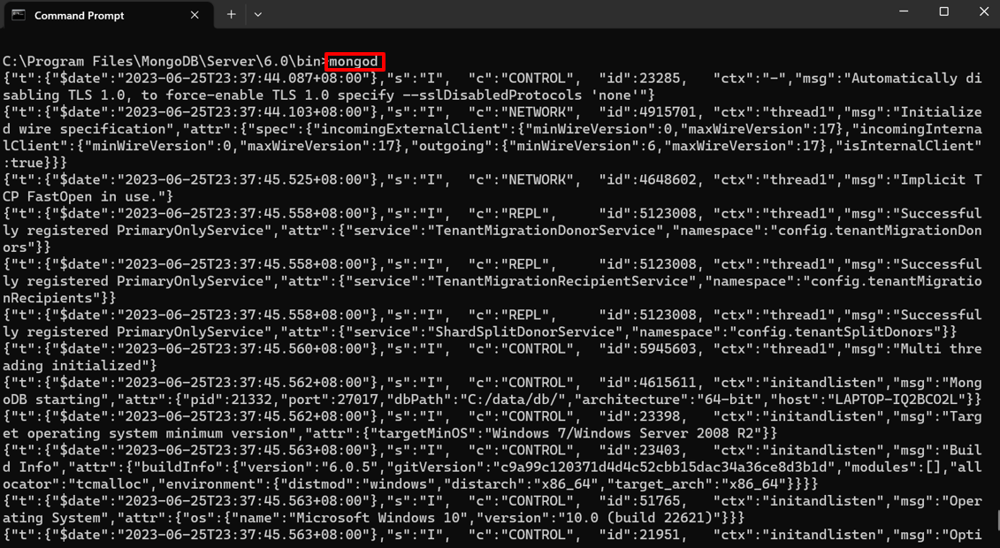</img>

#### Step 3: Access the MongoDB Shell
In order to access MongoDB Shell, type the following command in the command prompt.
```
mongosh "mongodb+srv://cluster0.cpy5tdw.mongodb.net/" --apiVersion 1 --username <username>
```
Then, you need to enter your password. Below shows the output after successfully connecting.
</img>

> How to get connection string <br>
> 1. Navigate to https://www.mongodb.com/atlas/database and sign in. 
> 2. Click the Connect button beside the cluster name. 
> 3. Since I want to connect through MongoDB Shell, select Shell.
> 4. Then, select “I have the MongoDB Shell installed” and copy the connection string.

#### Step 4: Select the Target Database
Run the following command to create or select a target database.
```
use test
```
MongoDB Shell: <br>
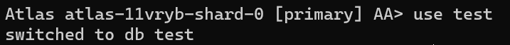</img>

#### Step 5: Choose the Collection
Then, choose the collection where you want to import the data. If the collection doesn't exist, MongoDB will create it automatically during the import process. In this case, I have select a collection named "tweets", 
```
db.tweets
```
MongoDB Shell: <br>
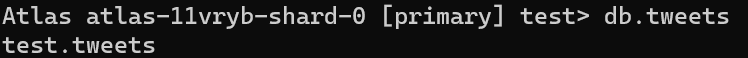</img>

#### Step 6: Import Dataset
To import the data from the JSON file into the selected collection, use the mongoimport command as below.
```
mongoimport --uri="<connection_string>" --collection=<collection_name> --file="<file_path>" --jsonArray
```
```<connection_string>```: MongoDB connection string. <br>
```<collection_name>```: Name of the collection to import the JSON data. <br>
```<file_path>```: File path to the JSON file. 


In my case, I have replaced it with my own data.
```
mongoimport --uri="mongodb+srv://peiyu:1@cluster0.cpy5tdw.mongodb.net/" --collection=tweets --file="D:\SEM6\SECP3843 SPECIAL TOPIC IN DATA ENGINEERING\AA\me\modified_tweets.json" --jsonArray
```
MongoDB Shell:
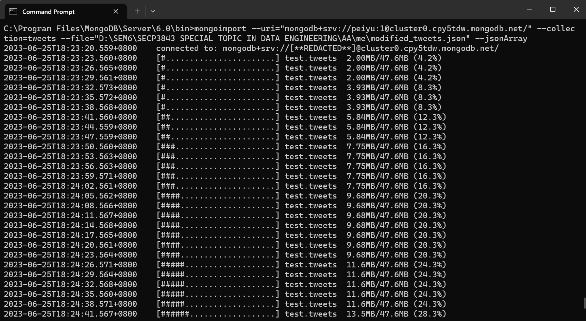</img>

> #### Alternative <br>
> The original dataset format can be imported by using the following command, from there we do not need to prepare the data as in step 1 and we only need to download the dataset.
> ```
> mongoimport --uri="mongodb+srv://peiyu:1@cluster0.cpy5tdw.mongodb.net/" --collection=tweets --file="D:\SEM6\SECP3843 SPECIAL TOPIC IN DATA ENGINEERING\AA\me\tweets.json" 
> ```
> MongoDB Shell:
> 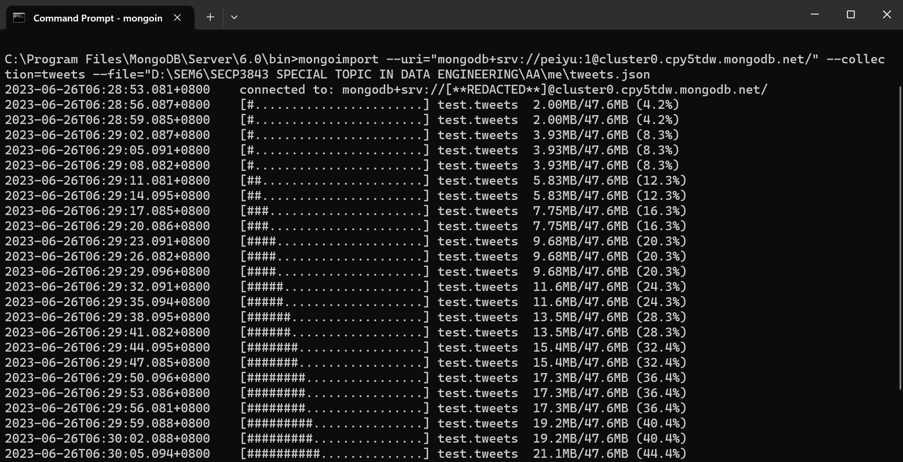</img>

#### Step 7: Verify the Import
To ensure the json dataset is imported, run the following command to query the collection using the MongoDB shell.
```
db.tweets.find()
```
Result:
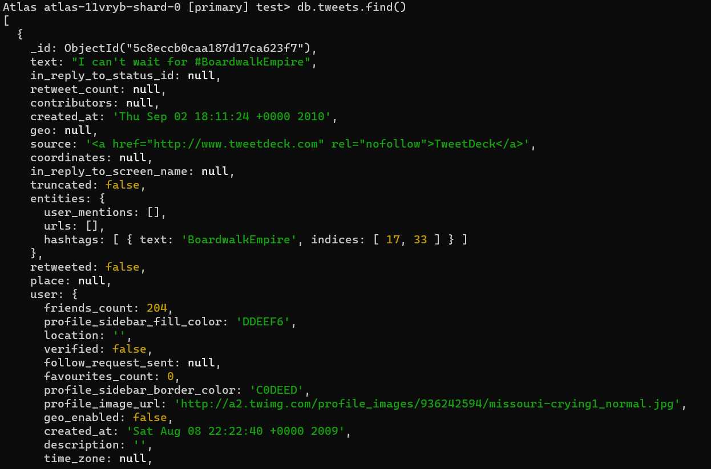</img>

We can also check it in MongoDB Compass.
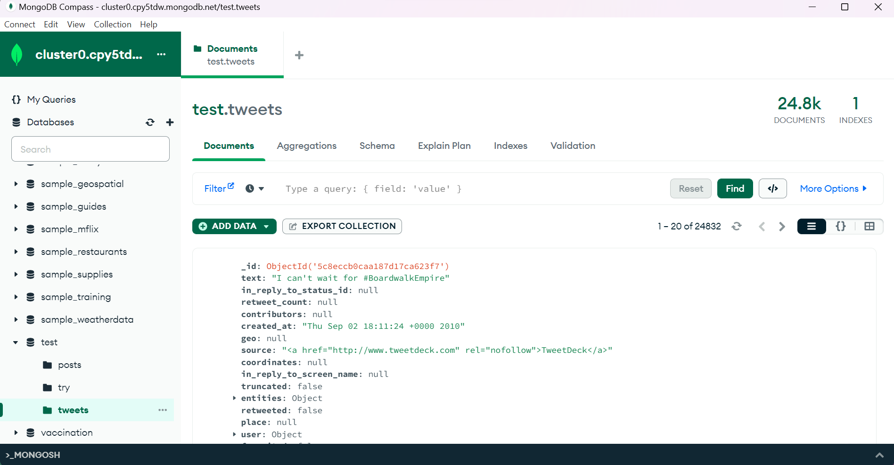</img>

## Question 2 (b)
#### a) Create Query <br>
There are 2 methods to insert documents into a MongoDB database. <br>
```insertOne()```: This method inserts a single object into the database. <br>
```insertMany()```: This method inserts an array of objects into the database.

The following example shows the query using ```insertOne()```.
```
db.tweets.insertOne({
  text: "Alternative Assessment.",
  in_reply_to_status_id: null,
  retweet_count: 5,
  contributors: null,
  created_at: "2023-05-25 10:30:00",
  geo: null,
  source: "Twitter",
  coordinates: null,
  in_reply_to_screen_name: null,
  truncated: false,
  entities: { mentions: [], urls: [], hashtags: [] },
  retweeted: false,
  place: null,
  favorited: false,
  in_reply_to_user_id: null
});

```
MongoDB Shell:
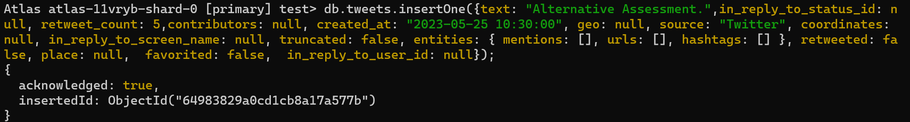</img>
> The above query creates a new document in the tweets collection and includes values for some of the fields like text, retweet_count and created_at.

We can find the inserted document from the database.
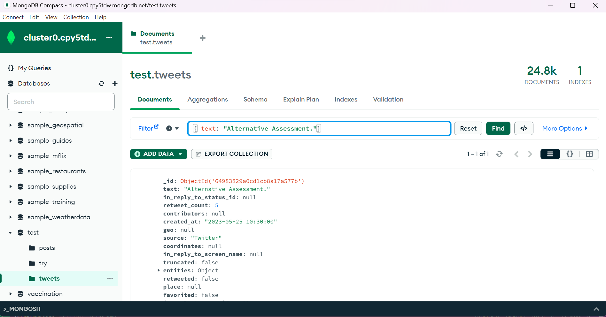</img>

#### b) Read Query
There are 2 methods to find and select data from a MongoDB collection. <br>
```find()```: The method will find all documents that match the query provided. <br>
```findOne()```: The method will find the first document matches the query provided.
The following example shows the query using ```find()```.
```
db.tweets.find({ source: "web" });
```

MongoDB Shell:
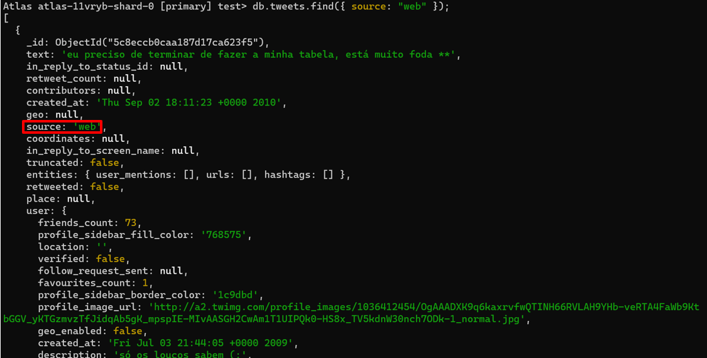</img>
>The above query retrieves all documents from the "tweets" collection where the "source" field matches the provided value ("web").

Result: 
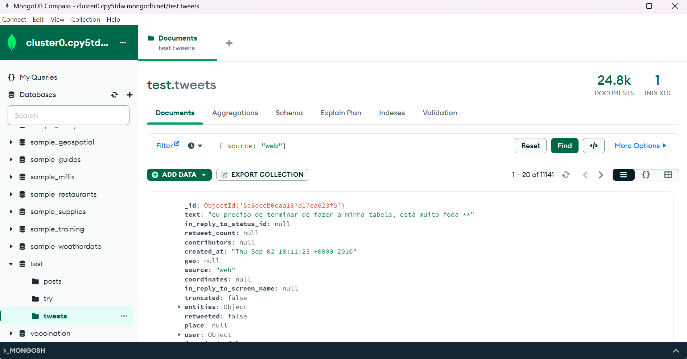</img>

#### c) Update Query
There are 2 methods to update an existing document. <br>
```updateOne()```: The updateOne() method will update the first document that is found matching the provided query. <br>
```updateMany()```: The updateMany() method will update all documents that match the provided query.

##### updateOne
The following example shows the query using ```updateOne()```.

```
db.tweets.updateOne(
  { text: "Alternative Assessment."},
  { $set: { retweet_count: 10 } }
);
```
MongoDB Shell:
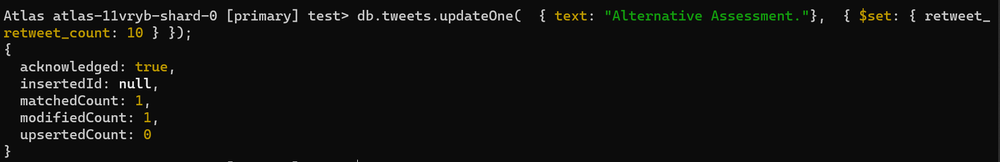</img>
> The above query updates a single document in the "tweets" collection that matches the provided "text" field by setting the value of the "retweet_count" field to 10 for the matching document.

Before updating the data:
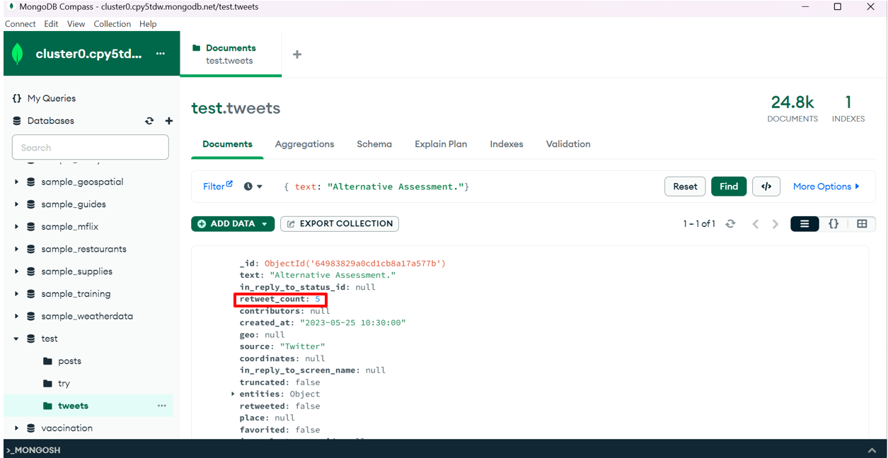</img>

After updating the data: 
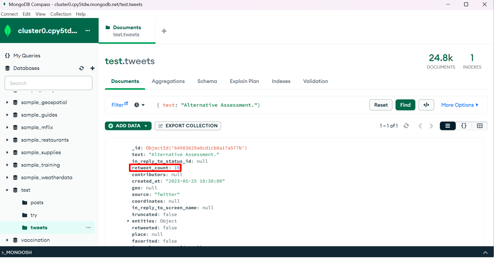</img>

##### updateMany
The following example shows the query using ```updateMany()```.

```
db.tweets.updateMany(
  { retweet_count: null },
  { $set: { retweet_count: 0 } }
);
```
MongoDB Shell:
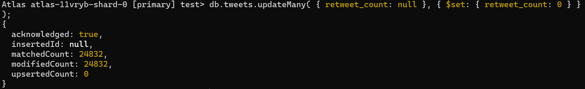</img>
> The above query updates all documents in the "tweets" collection where the "retweet_count" field is null to 0.

Before updating the data:
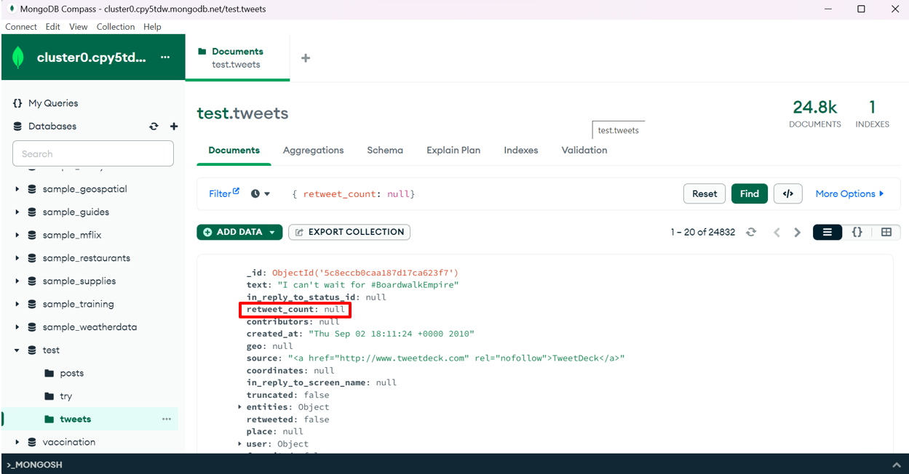</img>

After updating the data: 
</img>

#### d) Delete Query
There are 2 methods to delete documents from a MongoDB database. <br>
```deleteOne()```: The deleteOne() method will delete the first document that matches the query provided. <br>
```deleteMany()```: The deleteMany() method will delete all documents that match the query provided.

The following example shows the query using ```deleteOne()```.

```
db.tweets.deleteOne({ text: "Alternative Assessment."});
```
MongoDB Shell:
</img>
> The above query deletes a single document from the "tweets" collection that matches the provided "text" field value.

Before deleting the data:
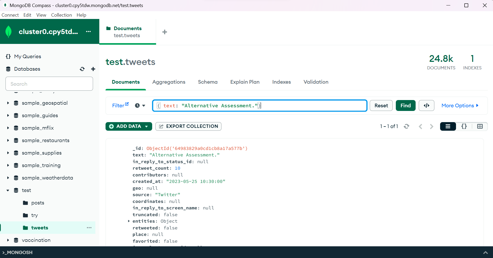</img>

After deleting the data: 
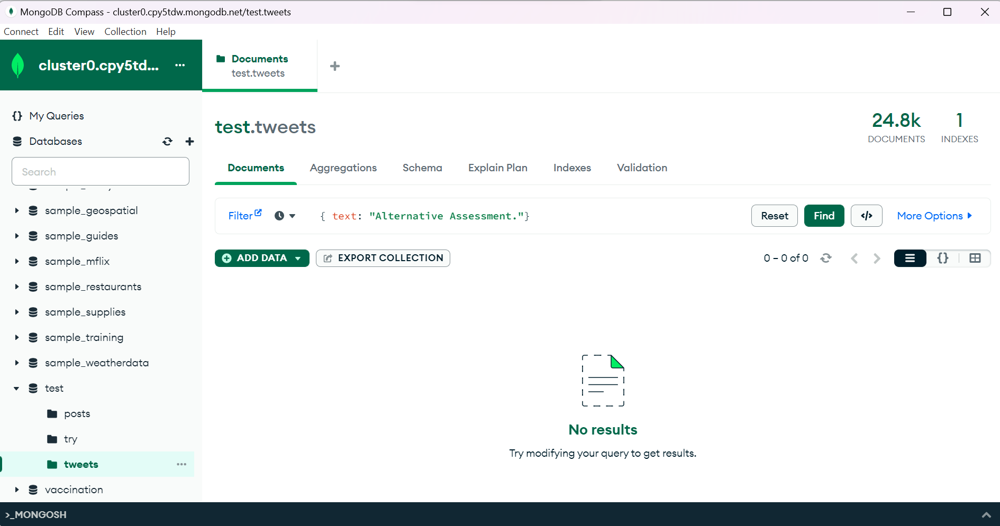</img>

## Contribution 🛠️
Please create an [Issue](https://github.com/drshahizan/special-topic-data-engineering/issues) for any improvements, suggestions or errors in the content.

You can also contact me using [Linkedin](https://www.linkedin.com/in/drshahizan/) for any other queries or feedback.

[](https://visitorbadge.io/status?path=https%3A%2F%2Fgithub.com%2Fdrshahizan)


