<a href="https://github.com/drshahizan/SECP3843/stargazers"></a>
<a href="https://github.com/drshahizan/SECP3843/network/members"></a>
<a href="https://github.com/drshahizan/SECP3843/pulls"></a>
<a href="https://github.com/drshahizan/SECP3843/issues"></a>
<a href="https://github.com/drshahizan/SECP3843/graphs/contributors"></a>


Don't forget to hit the :star: if you like this repo.

# Special Topic Data Engineering (SECP3843): Alternative Assessment

#### Name: Hong Pei Geok
#### Matric No.: A20EC0044
#### Dataset: <a href="https://github.com/drshahizan/dataset/tree/main/mongodb/06-tweets" >Tweets</a>

## Question 3 (a)
There will be several steps to create the managing user module.
### Assumptions:
1. The project and application have been created.
2. The required packages have been installed. (django, mysqlclient)
3. The superuser has been created.
4. In this project, I assume customers will register through the website while technical workers and senior management will be registered by admin.

### Step 1: Configure Database
Open setting.py to configure the database setting in order to connect with MySQL.
<p align="center">
  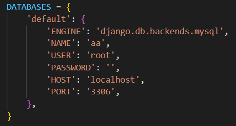</img>
</p>

### Step 2: Define Model
I have defined a custom user model that extends Django's built-in AbstractBaseUser or AbstractUser class to customize the user model fields according to the requirements of the three user types which are customers, technical workers, and senior management.
<p align="center">
  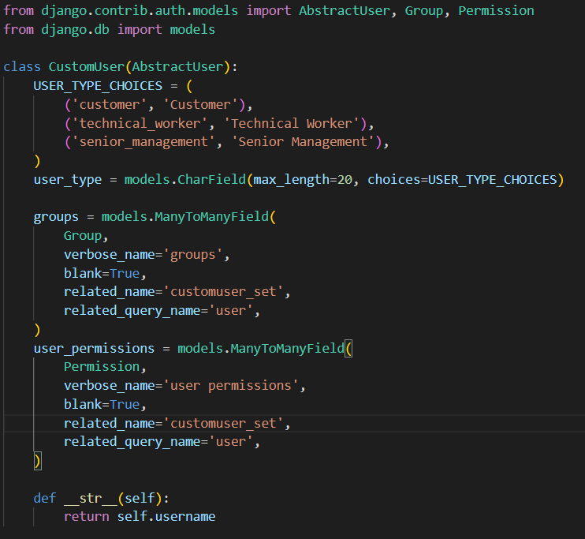</img>
</p>

Afterward, specify the custom user model as the default authentication model by setting AUTH_USER_MODEL to the custom user model in the settings.py file.
```
AUTH_USER_MODEL = 'your_app_name.CustomUser'
```
In my case, I have the application name as authentication.

<p align="center">
  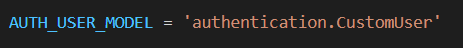</img>
</p>

### Step 3: Migrate Database
Run the following command to apply the migrations and create the necessary database tables.
```
python manage.py makemigrations
python manage.py migrate
```
Command Prompt:
<p align="center">
  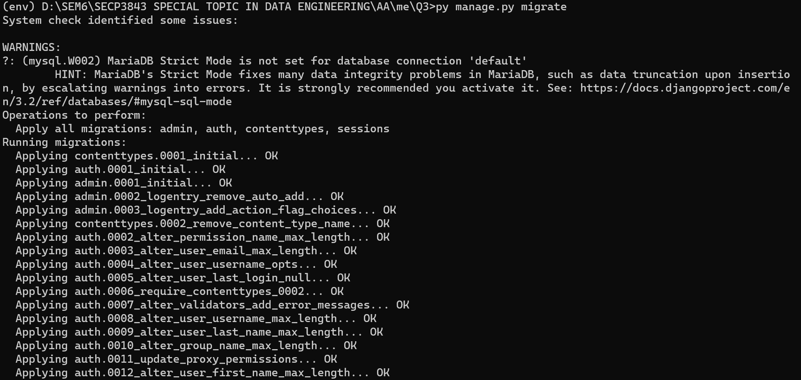</img>
</p>

Result:
<p align="center">
  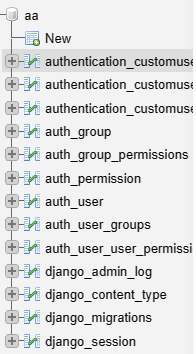</img>
</p>

### Step 4: Define Admin Site
This step is to enable the admin to register users through the http://127.0.0.1:8000/admin/. 
<p align="center">
  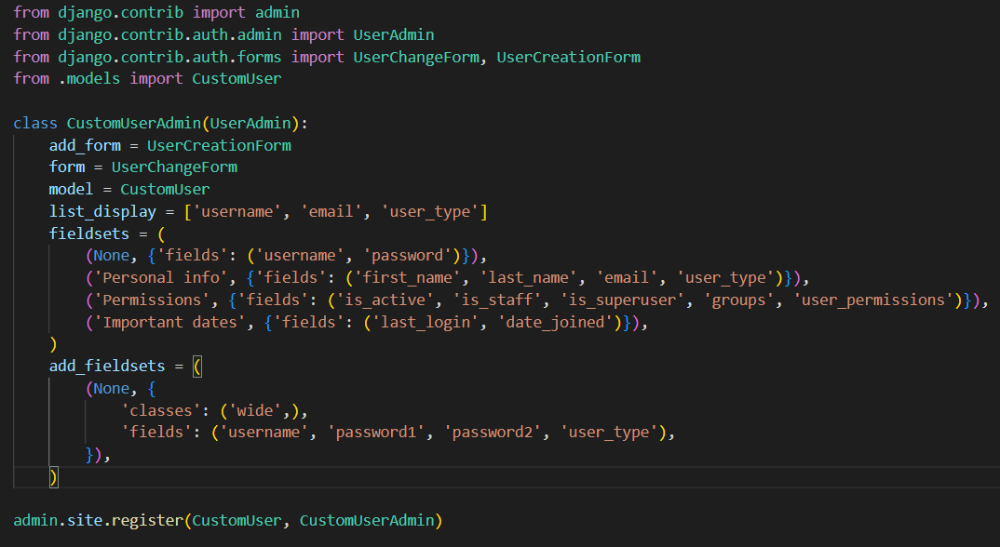</img>
</p>

### Step 5: Define User Registration and Login View
Define views in Django app's views.py file for user registration and login functionality to handle the registration and login forms, validate user input, and interact with the MySQL database.
First, import the required libraries.
```
from django.shortcuts import render, redirect
from django.contrib.auth import authenticate, login
from .forms import LoginForm, SignUpForm
```

Register
  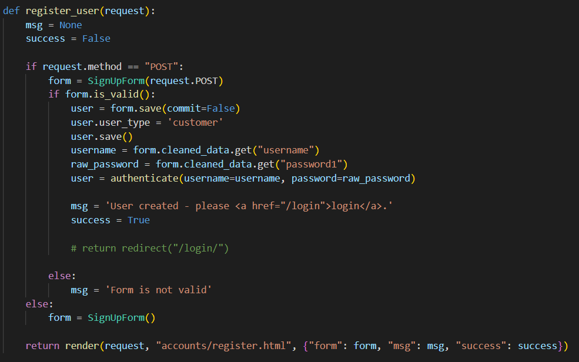</img>
  > It can be noted that the user who registered through the website will have the user type as customer.

Login

The user credentials will be verified and determine the type of user. For example, if the user is a customer, he will be redirected to the customer dashboard. Below shows the code to determine the user type. 
<p align="center">
  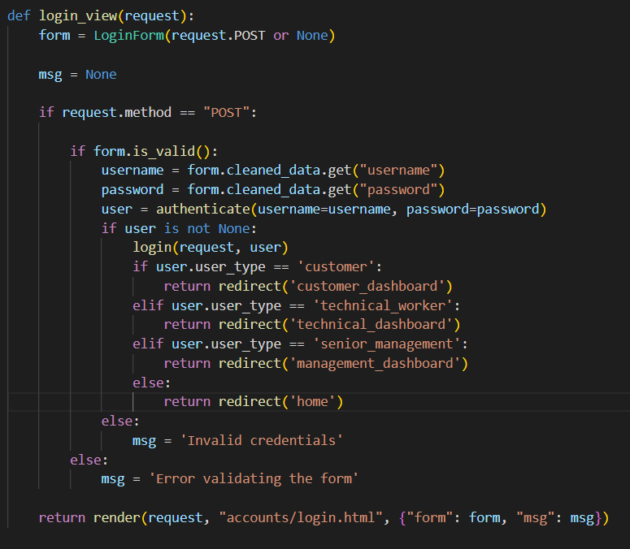</img>
</p>

The following code will be the view that renders the template for each user type. 
<p align="center">
  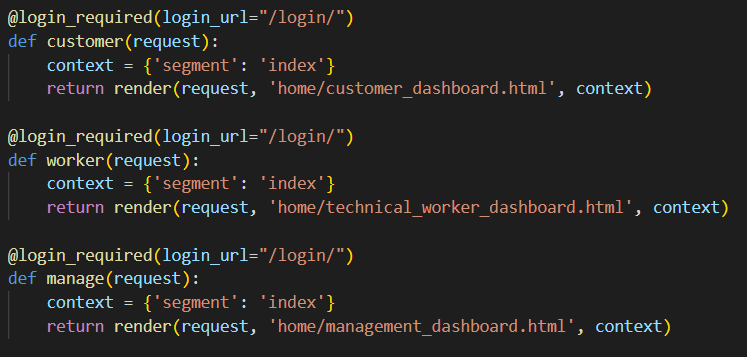</img>
</p>


### Step 6: Create User Registration and Login Templates
The HTML templates for user registration and login forms will be created in Django app's templates folder to render the forms and handle form submissions.
- register.html
  <p align="center">
    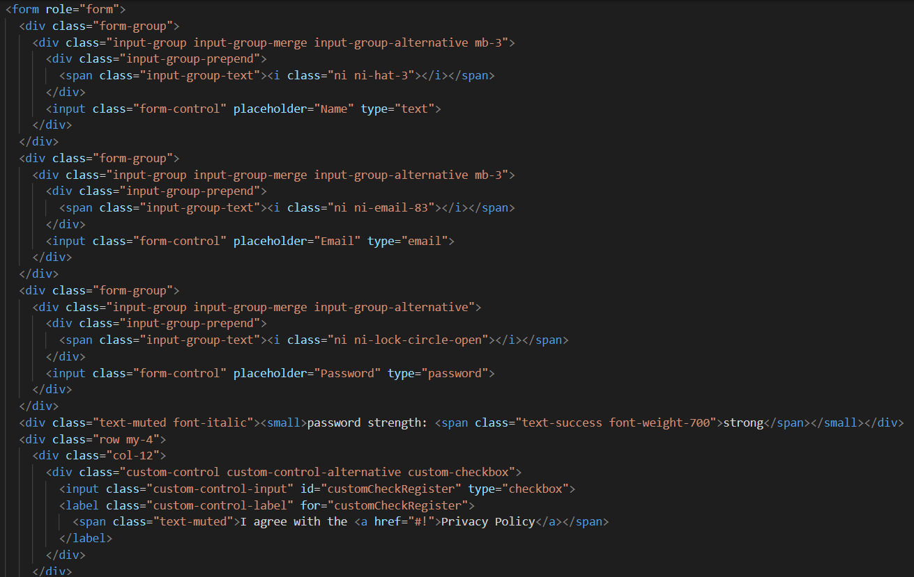</img>
  </p>
- login.html
  <p align="center">
    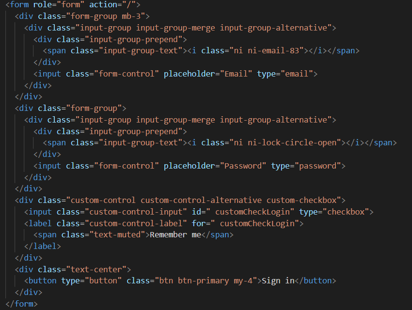</img>
  </p>


### Step 7: Configure URL

Define URL patterns for the registration and login views.
<p align="center">
  </img>
</p>

The URL for the dashboard view after login is defined as below.
<p align="center">
  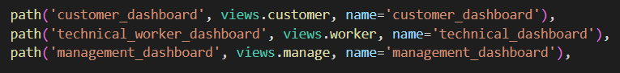</img>
</p>

### Output: User Interfaces
#### Register
- Customer <br>
  Customer will be registered through the website.
  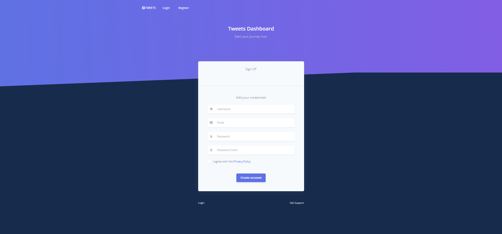</img>
- Admin <br>
  Admin is able to register all users.
  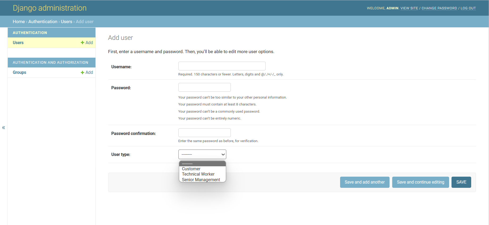</img>
#### Login
  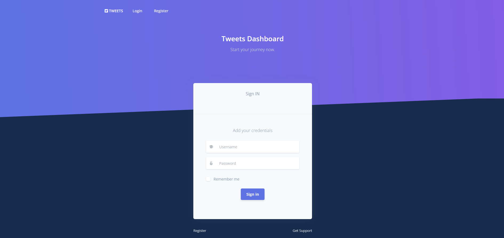</img>
  
#### Customer Dashboard
</img>

#### Technical Worker Dashboard
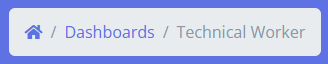</img>

#### Senior Management Dashboard
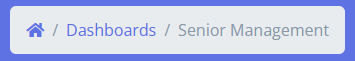</img>


## Question 3 (b)

It is common for web developers to work with two different databases like MySQL and MongoDB due to its efficiency and effectiveness in managing the data. However, this causes the challenge of data replication and synchronization. 

There will be several ways to ensure the data consistency between both databases including exploring database-specific replication techniques or leveraging external tools that facilitate real time updates and seamless interaction between the databases. Below shows the steps to overcome the challenge. 

### Step 1: Identify the Replication Strategy
First, we need to determine the replication strategy that aligns with our requirements and the capabilities of the chosen databases. In this case, I have chosen a `dual write` technique to ensure that any changes made in one database are replicated and synchronized in the other database, maintaining data consistency across both systems.

### Step 2: Configure the database
The MySQL and MongoDB connection have been declared in setting.py. 
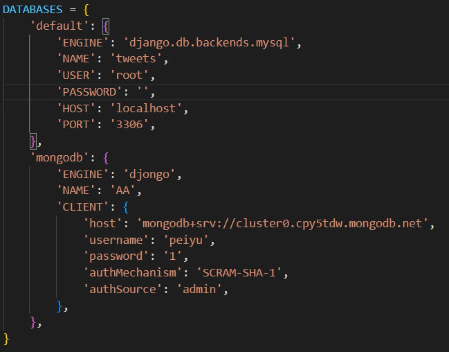</img>

### Step 3: Set up connections to both MySQL and MongoDB databases
This step is done by importing necessary libraries like MongoClient to make connections with MySQL and MongoDB.
```
from django.db import connections
from pymongo import MongoClient

# Establish connections to MySQL and MongoDB
mysql_connection = connections['default']
mongodb_client = MongoClient('mongodb+srv://cluster0.cpy5tdw.mongodb.net', username='peiyu', password='1')
```

### Step 4: Define the dual_write function 
The dual_write function will implement the logic of synchronizing both databases during insert, update and delete. However, I will show the dual write operation for insertion in this example. 
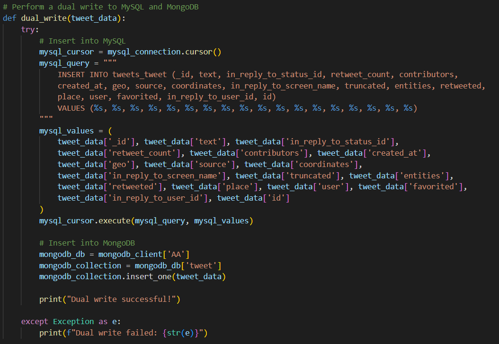</img>

### Step 5: Define view
In this step, create a view in the Django application that triggers the dual_write function to test it.
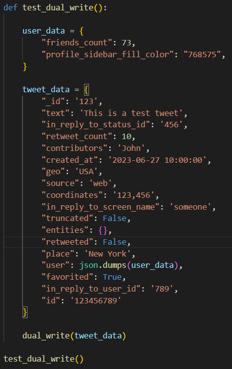</img>
> The above code will pass a tweet document to dual_write function in order to test the insert operation. 


### Step 6: Test and validate the dual write process
Lastly, open the command prompt and execute ```py manage.py runserver```.

Output: 

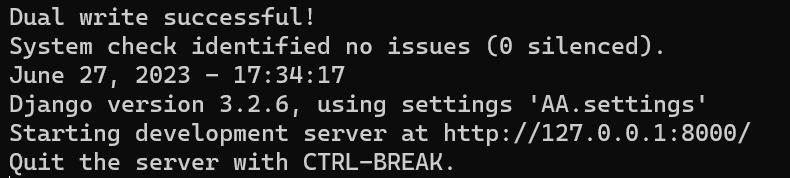</img>
> It can be noted that the “Dual write successful!” has been printed out and this indicated the success of insertion.

### Step 7: Check the data in MySQL and MongoDB
We can find the newly inserted data in both MySQL and MongoDB.
- MySQL
  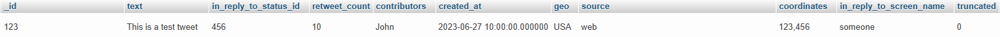</img>
  
- MongoDB
  <p align="center">
    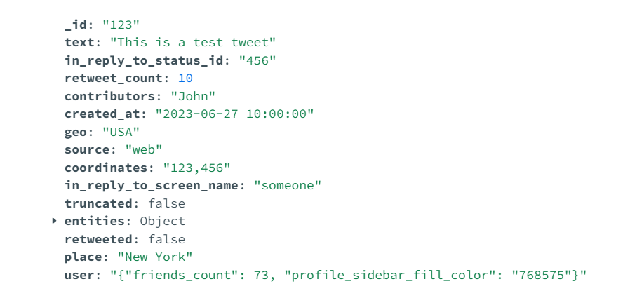</img>
  </p>
  
## Contribution 🛠️
Please create an [Issue](https://github.com/drshahizan/special-topic-data-engineering/issues) for any improvements, suggestions or errors in the content.

You can also contact me using [Linkedin](https://www.linkedin.com/in/drshahizan/) for any other queries or feedback.

[](https://visitorbadge.io/status?path=https%3A%2F%2Fgithub.com%2Fdrshahizan)


