<a href="https://github.com/drshahizan/SECP3843/stargazers"></a>
<a href="https://github.com/drshahizan/SECP3843/network/members"></a>
<a href="https://github.com/drshahizan/SECP3843/pulls"></a>
<a href="https://github.com/drshahizan/SECP3843/issues"></a>
<a href="https://github.com/drshahizan/SECP3843/graphs/contributors"></a>


Don't forget to hit the :star: if you like this repo.

# Special Topic Data Engineering (SECP3843): Alternative Assessment

#### Name: Hong Pei Geok
#### Matric No.: A20EC0044
#### Dataset: <a href="https://github.com/drshahizan/dataset/tree/main/mongodb/06-tweets" >Tweets</a>

## Question 4
Based on the case study, there are several machine learning that can be applied including sentiment analysis, text classification, and predictive analytics. However, I decided to utilize the **sentiment analysis** to improve the functioning of the portal. Below shows the steps to apply sentiment analysis on my case study which is the tweets dataset. 

Code: <a href="./files/code/ML_Q4.ipynb">ML_Q4.ipynb</a>

### Step 1: Install the required libraries

Run the below code and install all of the required libraries including pymongo to make connections with MongoDB, textblob to perform sentiment analysis and WordCloud to generate word clouds for positive, negative, and neutral sentiments..
```
!pip install pymongo
!pip install textblob
!pip install WordCloud
```
Output:
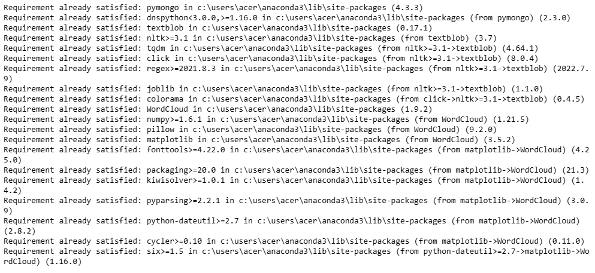</img>


### Step 2: Import the required libraries

Using the import command to import the necessary libraries.
```
import json
import pymongo
from textblob import TextBlob
import pandas as pd
import re
from nltk.corpus import stopwords
from nltk.tokenize import word_tokenize
import matplotlib.pyplot as plt
from wordcloud import WordCloud
from nltk.corpus import words
```

### Step 3: Load Data

Make a connection with MongoDB to retrieve the JSON data which is stored as a document inside the collection.
```
client = pymongo.MongoClient('mongodb+srv://cluster0.cpy5tdw.mongodb.net', username='peiyu', password='1')
db = client["test"]
collection = db["tweets"]
dataset = list(collection.find())
first_data = ""

if len(dataset) > 0:
    first_data = dataset[0]
    print(first_data)
else:
    print("No data found in the dataset.")
```

Output: 
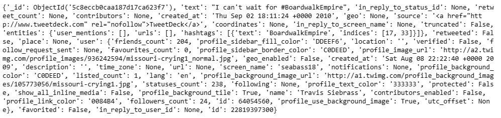</img>


### Step 4: Preprocess Data

In this step, I will perform data preprocessing to ensure the quality of data. It involves converting text to lowercase, removing special characters, punctuation, and numbers, tokenization and removing stopwords. 
```
processed_texts = []

for data in dataset:
    text = data['text']
    
    # Convert text to lowercase
    text = text.lower()
    
    # Remove special characters, punctuation, and numbers
    text = re.sub(r'[^a-zA-Z\s]', '', text)
    
    # Tokenization
    tokens = word_tokenize(text)
    
    # Remove stopwords
    stop_words = set(stopwords.words('english'))
    tokens = [token for token in tokens if token not in stop_words]
    
    # Join tokens back to form text
    processed_text = ' '.join(tokens)
    processed_texts.append(processed_text)
```

Output: 

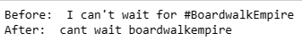</img>


### Step 5: Sentiment Analysis 

Iterate through each text and perform sentiment analysis using TextBlob.
```
sentiments = []
sentiment_labels = []

for text in processed_texts:
    blob = TextBlob(text)
    sentiment = blob.sentiment.polarity
    sentiments.append(sentiment)

for sentiment in sentiments:
    if sentiment > 0:
        sentiment_labels.append("Positive")
    elif sentiment < 0:
        sentiment_labels.append("Negative")
    else:
        sentiment_labels.append("Neutral")

data = {"Text": processed_texts, "Sentiment": sentiment_labels}
df = pd.DataFrame(data)

df.tail()
```

Output: 

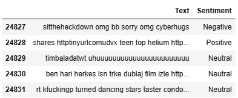</img>


### Step 6: Analyze the sentiment scores

In the below code, I have calculated the count of positive, negative, and neutral text.
```
# Analyze the sentiment scores
positive_count = sum(sentiment > 0 for sentiment in sentiments)
negative_count = sum(sentiment < 0 for sentiment in sentiments)
neutral_count = len(sentiments) - positive_count - negative_count

# Print the sentiment analysis results
print("Positive Feedback Count:", positive_count)
print("Negative Feedback Count:", negative_count)
print("Neutral Feedback Count:", neutral_count)
```

Output:

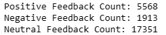</img>

### Step 7: Visualization
Visualization can be used to provide better insight into the data obtained. In the below example, a pie chart is created using Matplotlib to visualize the sentiment distribution. 
```
labels = ['Positive', 'Negative', 'Neutral']
counts = [positive_count, negative_count, neutral_count]

colors = ['#66b3ff', '#ff9999', '#99ff99']  

plt.pie(counts, labels=labels, colors=colors, autopct='%1.1f%%', startangle=90)
plt.title('Sentiment Distribution')
plt.axis('equal')
plt.show()
```

Output: 

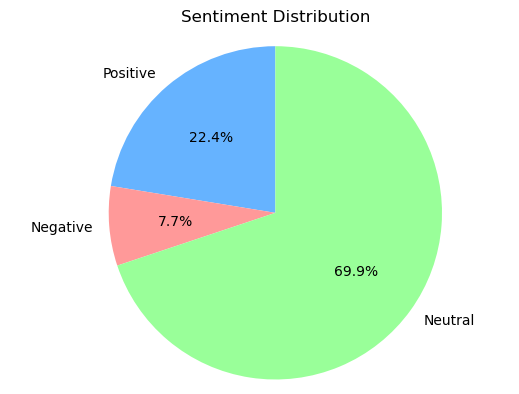</img>

Word Cloud has also been used to generate the most frequent words in each sentiment category including neutral, negative and positive.
```
positive_texts = [text for text, sentiment in zip(processed_texts, sentiments) if sentiment > 0]
negative_texts = [text for text, sentiment in zip(processed_texts, sentiments) if sentiment < 0]
neutral_texts = [text for text, sentiment in zip(processed_texts, sentiments) if sentiment == 0]

positive_combined_text = ' '.join(positive_texts)
negative_combined_text = ' '.join(negative_texts)
neutral_combined_text = ' '.join(neutral_texts)

positive_wordcloud = WordCloud(width=800, height=400).generate(positive_combined_text)
negative_wordcloud = WordCloud(width=800, height=400).generate(negative_combined_text)
neutral_wordcloud = WordCloud(width=800, height=400).generate(neutral_combined_text)

fig, axes = plt.subplots(1, 3, figsize=(15, 5))

axes[0].imshow(positive_wordcloud, interpolation='bilinear')
axes[0].set_title('Positive Sentiment')
axes[0].axis('off')

axes[1].imshow(negative_wordcloud, interpolation='bilinear')
axes[1].set_title('Negative Sentiment')
axes[1].axis('off')

axes[2].imshow(neutral_wordcloud, interpolation='bilinear')
axes[2].set_title('Neutral Sentiment')
axes[2].axis('off')

plt.tight_layout()
plt.show()
```

Output: 

- Positive

    <p align="center">
      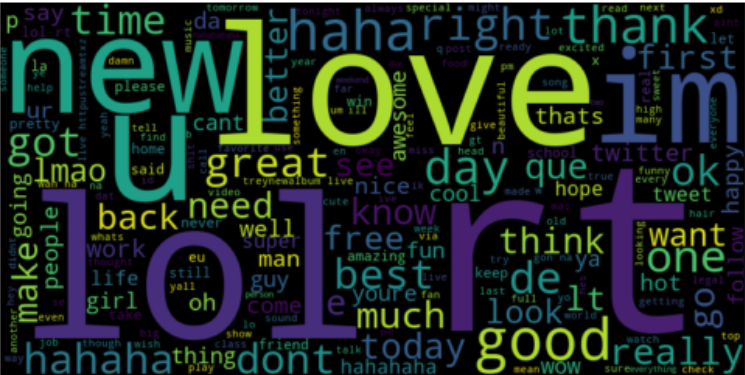</img>
    </p>
    
- Negative

    <p align="center">
      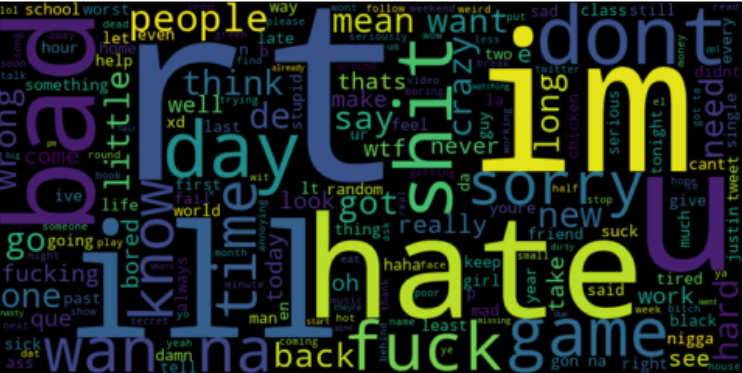</img>
    </P>
- Neutral

    <p align="center">
      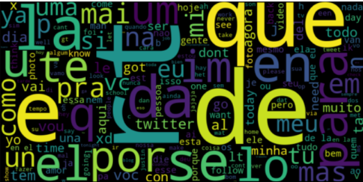</img>
    </P>

Then, three bar charts will be plotted to show the valid top 10 words for positive, negative and neutral sentiment. 
```
positive_word_freq = positive_wordcloud.process_text(positive_combined_text)
negative_word_freq = negative_wordcloud.process_text(negative_combined_text)
neutral_word_freq = neutral_wordcloud.process_text(neutral_combined_text)

english_words = set(words.words())

def filter_valid_words(word_freq, min_length=1):
    valid_word_freq = {}
    for word, freq in word_freq.items():
        if word in english_words and len(word) > min_length:
            valid_word_freq[word] = freq
    return valid_word_freq

positive_valid_word_freq = filter_valid_words(positive_word_freq)
negative_valid_word_freq = filter_valid_words(negative_word_freq)
neutral_valid_word_freq = filter_valid_words(neutral_word_freq, min_length=3)

positive_sorted_word_freq = dict(sorted(positive_valid_word_freq.items(), key=lambda x: x[1], reverse=True))
negative_sorted_word_freq = dict(sorted(negative_valid_word_freq.items(), key=lambda x: x[1], reverse=True))
neutral_sorted_word_freq = dict(sorted(neutral_valid_word_freq.items(), key=lambda x: x[1], reverse=True))

top_positive_words = list(positive_sorted_word_freq.keys())[:10]
top_positive_freq = list(positive_sorted_word_freq.values())[:10]

top_negative_words = list(negative_sorted_word_freq.keys())[:10]
top_negative_freq = list(negative_sorted_word_freq.values())[:10]

top_neutral_words = list(neutral_sorted_word_freq.keys())[:10]
top_neutral_freq = list(neutral_sorted_word_freq.values())[:10]

fig, axes = plt.subplots(1, 3, figsize=(15, 5))

# Positive Sentiment
axes[0].bar(top_positive_words, top_positive_freq)
axes[0].set_title('Top 10 Words - Positive Sentiment')
axes[0].set_xlabel('Word')
axes[0].set_ylabel('Frequency')
axes[0].set_xticklabels(top_positive_words, rotation=45)

# Negative Sentiment
axes[1].bar(top_negative_words, top_negative_freq)
axes[1].set_title('Top 10 Words - Negative Sentiment')
axes[1].set_xlabel('Word')
axes[1].set_ylabel('Frequency')
axes[1].set_xticklabels(top_negative_words, rotation=45)

# Neutral Sentiment
axes[2].bar(top_neutral_words, top_neutral_freq)
axes[2].set_title('Top 10 Words - Neutral Sentiment')
axes[2].set_xlabel('Word')
axes[2].set_ylabel('Frequency')
axes[2].set_xticklabels(top_neutral_words, rotation=45)

plt.tight_layout()
plt.show()
```

Output: 

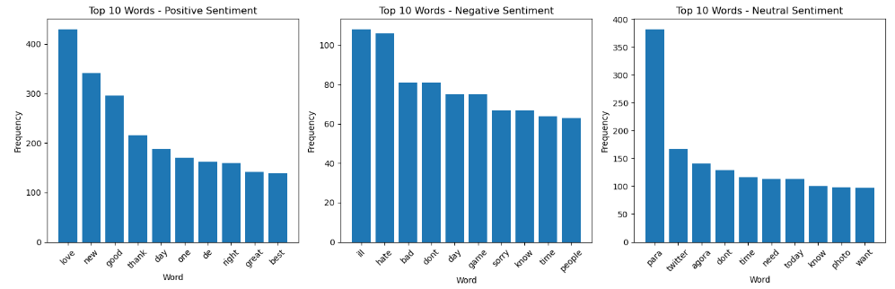</img>

### Conclusion
After conducting sentiment analysis on the tweets dataset using the TextBlob library in Python, I gained valuable insights into the sentiment expressed by users. There are a series of steps involved in this task including preprocessing the text data by removing noise and performing tokenization, followed by applying sentiment analysis using the TextBlob library.

```Sentiment Distribution```: The majority of tweets exhibited a neutral sentiment, with **17351** of the tweets expressing neutral, **5568** expressing positivity, and **1913** being negativity.

```Positive Tweets```: The positive sentiment expressed in tweets reflects users' satisfaction, enthusiasm, and positive experiences. 

```Negative Tweets```: The negative sentiment expressed in some tweets highlights areas where improvements can be made. Identifying specific pain points and addressing them can lead to enhanced user satisfaction.

In summary, by performing sentiment analysis on tweets dataset can help to improve the functioning of the portal. For example, identify areas of improvement based on negative feedback, understand user sentiment trends, and make data-driven decisions for enhancing user experience.


## Integrate Sentiment Analysis in Django
#### Step 1: Install required libraries
To perform sentiment analysis, install the textblob library to our project using the following commands:
```
Pip install textblob
```
Command Prompt:

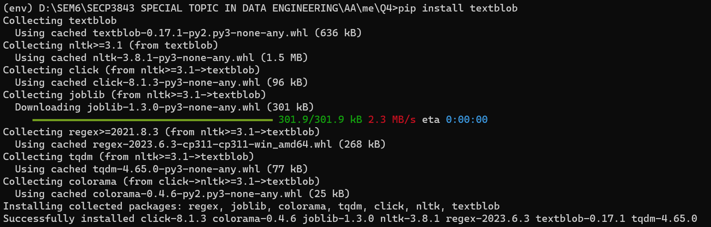</img>

#### Step 2: Define View
Inside the Django view.py, define a function that will receive the input text and perform sentiment analysis. 
```
def analyze_sentiment(request):
    if request.method == 'POST':
        text = request.POST.get('text', '')
        blob = TextBlob(text)
        sentiment = blob.sentiment.polarity


        if sentiment > 0:
            sentiment_label = 'Positive'
        elif sentiment < 0:
            sentiment_label = 'Negative'
        else:
            sentiment_label = 'Neutral'

        return render(request, 'analyze.html', {'sentiment_label': sentiment_label})

    return render(request, 'analyze.html')
```

#### Step 3: Create Template
Next, create Django templates to render the sentiment analysis form and display the sentiment analysis results.
```
<form method="POST" action="">
  
  <label for="text">Enter Text:</label>
  <br>
  <textarea name="text" id="text" rows="5" cols="30"></textarea>
  <br><br>
  <button type="submit" class="btn btn-primary">
    <i class="fas fa-search"></i> Analyze Sentiment
  </button>
</form>


  <div class="result">
    <h3>Sentiment Analysis Result:</h3>
    <p>Sentiment: {{ sentiment_label }}</p>
  </div>

```

#### Step 4: Configure URL
Configure the URL in urls.py.
```
from django.urls import path
from sentiment_analysis.views import analyze_sentiment

urlpatterns = [
    path('analyze/', analyze_sentiment, name='analyze_sentiment'),
]
```

#### Step 5: Run the Django server
Run the following command to test the sentiment analysis.
```
python manage.py runserver
```

Output:

- Positive

    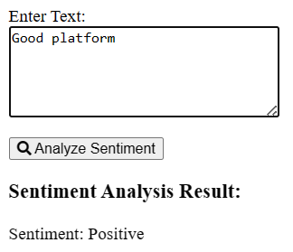</img>

- Negative

    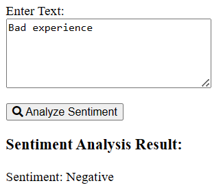</img>

- Neutral
  
    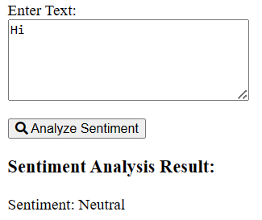</img>
    
After utilizing sentiment analysis in django to analyze the sentiments expressed in the text data collected from the portal's users, the portal can gain insights into the sentiment expressed by the user in order to understand user satisfaction, identify areas of improvement, and tailor the portal's content accordingly.


## Contribution 🛠️
Please create an [Issue](https://github.com/drshahizan/special-topic-data-engineering/issues) for any improvements, suggestions or errors in the content.

You can also contact me using [Linkedin](https://www.linkedin.com/in/drshahizan/) for any other queries or feedback.

[](https://visitorbadge.io/status?path=https%3A%2F%2Fgithub.com%2Fdrshahizan)


