<a href="https://github.com/drshahizan/SECP3843/stargazers"></a>
<a href="https://github.com/drshahizan/SECP3843/network/members"></a>
<a href="https://github.com/drshahizan/SECP3843/pulls"></a>
<a href="https://github.com/drshahizan/SECP3843/issues"></a>
<a href="https://github.com/drshahizan/SECP3843/graphs/contributors"></a>


Don't forget to hit the :star: if you like this repo.

# Special Topic Data Engineering (SECP3843): Alternative Assessment

#### Name: Hong Pei Geok
#### Matric No.: A20EC0044
#### Dataset: <a href="https://github.com/drshahizan/dataset/tree/main/mongodb/06-tweets" >Tweets</a>

## Question 5 (a)
There are several techniques that can be implemented to optimize the performance of the portal when dealing with large volumes of JSON data during dashboard visualizations. I will discuss about data preprocessing and data aggregation.

### Data Preprocessing

Data preprocessing needs to be performed for large amounts of JSON data in order to ensure that the data is in the most efficient and usable state for visualization. It may involve data cleaning, feature selection and data transformation.

Code: <a href="./files/code/Q5.ipynb">Q5.ipynb</a>

#### Step 1: Load the JSON data
The JSON data is loaded for further analysis and preprocess. 
```
import json
import pandas as pd


with open('modified_tweets.json', encoding='utf-8') as file:
    data = json.load(file)
    
print(data[0])
```
Output: 

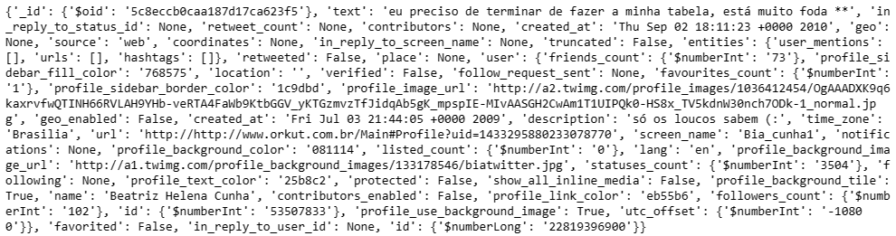</img>


#### Step 2: Analyze the structure and content
Then, understand the JSON data structure to identify fields that are relevant for analysis and visualization.
```
df = pd.DataFrame(data)
df.info()
```
Output: 

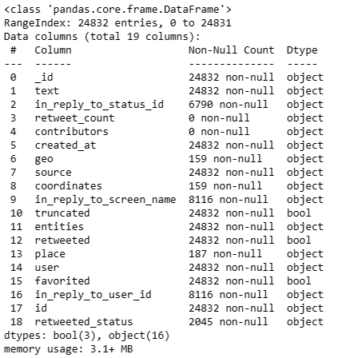</img>


#### Step 3: Select the feature
In my case, assume we will only use some columns like text, user, entities and source. The other fields will be removed. 
```
selected_columns = ['text', 'source', 'entities', 'user']
filtered_data = [{column: record[column] for column in selected_columns} for record in data]
```

Output:

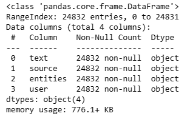</img>

#### Step 4: Clean the data
Data cleaning is an important step in data processing. It may involve handling missing values, removing duplicate records and fixing inconsistency. In the code below, I am checking if the record contains null value.
```
df.isna().sum()
```
Output:

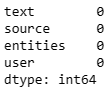</img>
> It can be noted that the memory usage reduces from 3.1+ MB to 776.1+ KB.

**Why does data preprocessing help in optimizing large data?**
- Since large datasets often contain missing values, inconsistent formatting and duplicate records, data preprocessing can help to enhance the accuracy and reliability of the data. 
- It is normal that large datasets contain a vast number of features or variables which may be relevant to the analysis task and dashboard visualization. Feature selection can help to reduce the dimensionality of the dataset and improve performance. 


### Data Aggregation

We can use techniques like grouping and aggregation functions(sum, count and average) to optimize the performance when dealing with large datasets. 

#### Step 1: Open the MongoDB shell
We can access the MongoDB Shell by using MongoDB Compass or run the following command in command prompt to connect with MongoDB. I will using the MongoDB Shell through MongoDB Compass in this example.

Command Prompt:
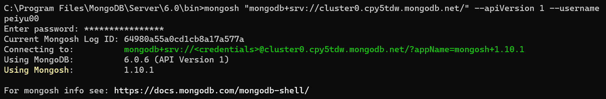</img>

MongoDB Compass:
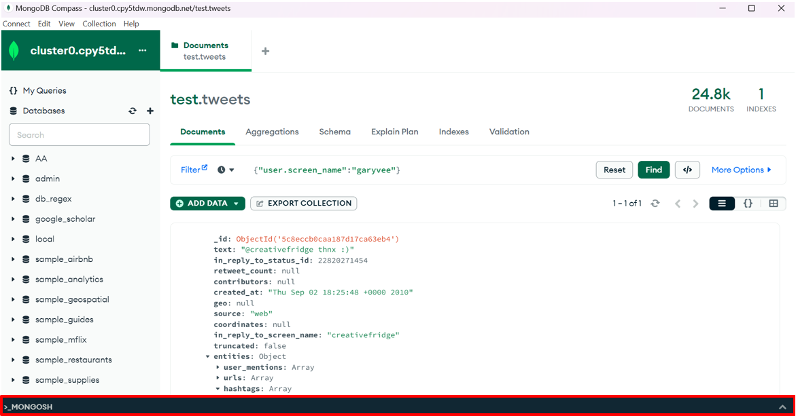</img>

#### Step 2: Switch to the database
Switch to the database where the collection contains the JSON data to be analyzed. 
```
use test
```
Output:

</img>

#### Step 3: Define the aggregation pipeline

Define the aggregation pipeline code. In the below example, there will be four stages.

`First Stage`: The first stage is $group and it is used to group the documents based on the user.screen_name field and calculate the sum of favorite_count for each group. 

`Second Stage`: The second stage is $sort and it is used to sort the documents based on the total_favorites field in descending order.

`Third Stage`: The third stage is $limit which limits the output to only the top 3 users with the highest total favorites.

`Four Stage`: The fourth stage is $project that will reshape the output document by excluding the _id field and including the user_screen_name and total_favorites fields.

```
var pipeline = [
  {
    $group: {
      _id: "$user.screen_name",
      total_favorites: { $sum: "$user.favourites_count" }
    }
  },
  {
    $sort: { total_favorites: -1 }
  },
  {
    $limit: 3
  },
  {
    $project: {
      _id: 0,
      user_screen_name: "$_id",
      total_favorites: 1
    }
  }
];
```

#### Step 4: Execute the aggregation pipeline

The following command will execute the aggregation pipeline to the collection with name tweets.
```
db.tweets.aggregate(pipeline);
```
Output:

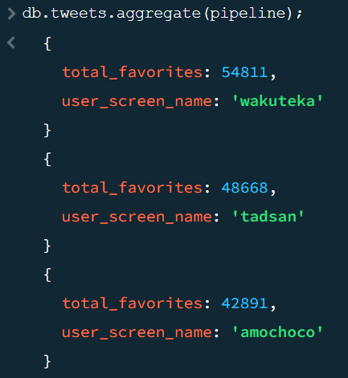</img>

**Why does data aggregation help in optimizing large data?**
- Data Aggregation enables us to perform calculations, and analyses on a smaller set of summarized data. So, it results in faster processing times and improved performance when dealing with large datasets.
- Data Aggregation will help in reducing data volume by summarizing multiple records into a single representation. This condensed form reduces the overall data size since large datasets are difficult to process and analyze.


## Question 5 (b)
The dashboard utilizing tweets dataset consists of user statistics, user registration trend, source distribution, user location analysis, top users by followers and hashtag analysis.
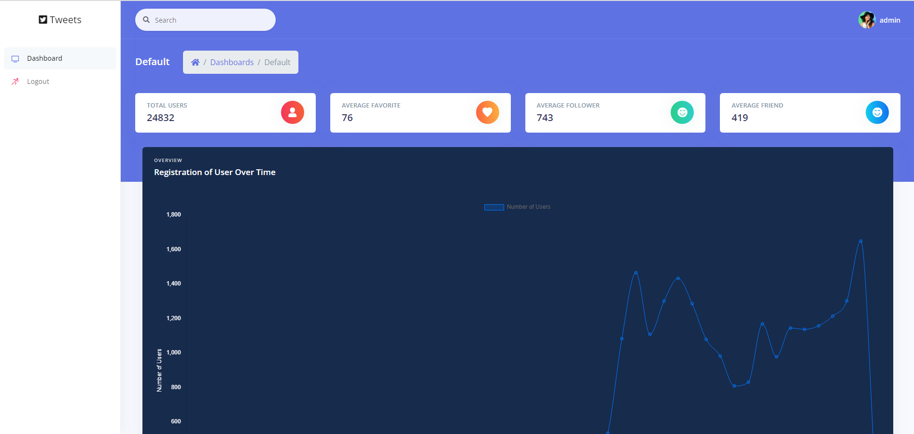</img>
</img>
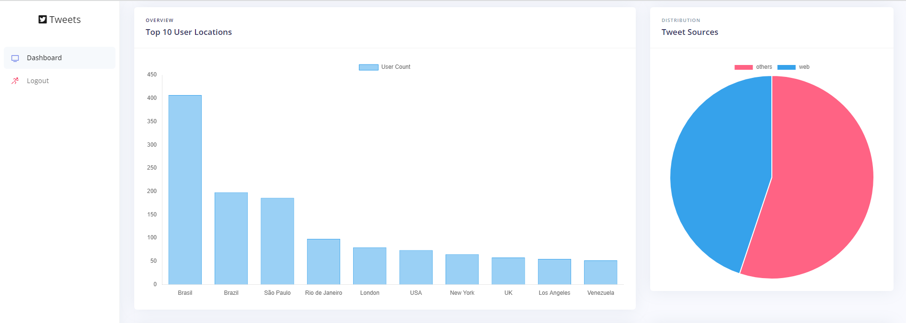</img>
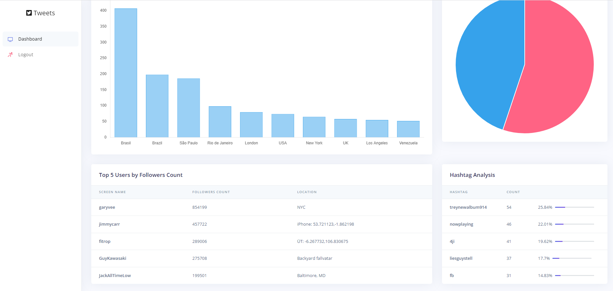</img>


### User Statistics
The user statistics consists of total count of users and the average values of favorites, followers, and friends of the user. These statistics help understand the overall user engagement and popularity, giving insights into the general user behavior and preferences. For example, we know that there are a total of **248332** users involved in this analysis.
- Total Users
  
  The dashboard displays the total count of users in the dataset.
  ```
  documents = list(collection.find())
  total_count = len(documents)
  ```
  Output:
  
  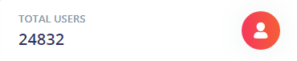</img>

- Average Favorite
  
  The average favorite of the user will be displayed which is **76**. 
  	``` 
      avg_favourites = collection.aggregate([
          {
              "$group": {
                  "_id": None,
                  "avg_favourites": {
                      "$avg": {
                          "$toInt": "$user.favourites_count"
                      }
                  }
              }
          }
      ])
  	```
  Output:
  
  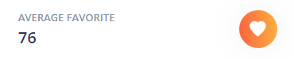</img>

- Average Follower
  
  The average follower of the user will be displayed which is **743**.
  	``` 
  	    avg_followers = collection.aggregate([
          {
              "$group": {
                  "_id": None,
                  "avg_followers": {
                      "$avg": {
                         "$toInt": "$user.followers_count"
                      }
                  }
              }
          }
      ])
    ```
Output:

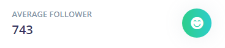</img>

- Average Friend
  
  The average friend of the user will be displayed which is **419**. 
	``` 
  avg_friends = collection.aggregate([
          {
              "$group": {
                  "_id": None,
                  "avg_friends": {
                      "$avg": {
                          "$toInt": "$user.friends_count"
                      }
                  }
              }
          }
      ])
  ```
  Output:
  
  </img>


### User Registration Trend
The dashboard displays a line chart that shows the trend of user registrations over time. It helps identify patterns in user registrations, which can be useful for understanding user growth and identifying peak registration periods. For example, it can be noticed that the peak registration period would be **August, 2010** with **1649** users. 
```
    pipeline = [
    {
        "$group": {
            "_id": {
                "$dateToString": {
                    "format": "%Y-%m",
                    "date": {
                        "$toDate": "$user.created_at"
                    }
                }
            },
            "total_users": {
                "$addToSet": "$user.id"
            }
        }
    },
    {
        "$sort": {
            "_id": 1
        }
    },
    {
        "$project": {
            "_id": 1,
            "user_count": {
                "$size": "$total_users"
            }
        }
    }
]
```
Output:

</img>

### Source Distribution
The dashboard includes a pie chart showing the distribution of user sources. I have divided it into two categories which are web and others. From there, we can gain insights into the platforms or channels through which users access the application or website of Twitter in order to understand the effectiveness of different user acquisition channels and prioritize marketing efforts accordingly. From the pie chart, we can find that the user access through the **web** occupies **11141**. 
```
    pipeline = [
        {
            "$group": {
                "_id": {
                    "$cond": {
                        "if": { "$eq": ["$source", "web"] },
                        "then": "web",
                        "else": "others"
                    }
                },
                "count": { "$sum": 1 }
            }
        },
        {
            "$project": {
                "_id": 0,
                "source": "$_id",
                "count": 1
            }
        }
    ]
```
Output:

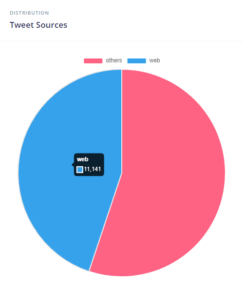</img>

### User Location Analysis
The dashboard analyzes the user locations by displaying the top 10 locations with the highest user counts. From the bar chart, we can understand the geographic distribution of users and identify regions with higher user engagement or potential target markets. For example, most of the users come from **Brazil** with a total of **407** users. 
```
pipeline = [
        {
            "$match": {
                "user.location": {"$ne": ""}
            }
        },
        {
            "$group": {
                "_id": "$user.location",
                "count": {"$sum": 1}
            }
        },
        {
            "$sort": {"count": -1}
        },
        {
            "$limit": 11
        }
    ]
```
Output:

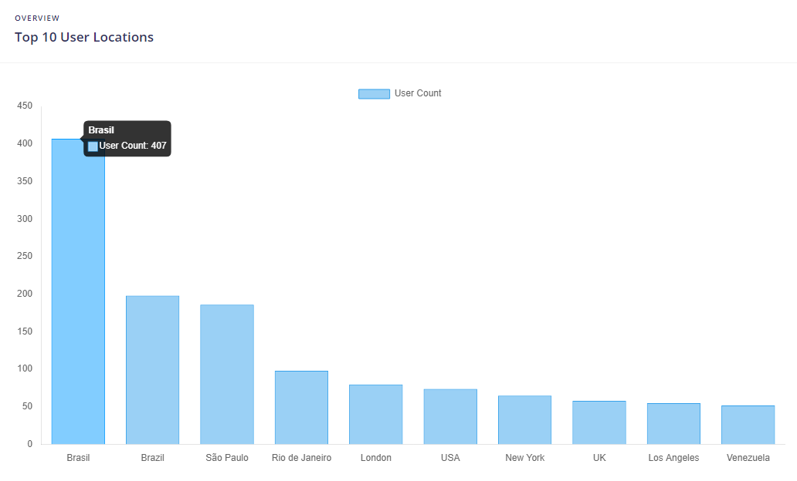</img>

### Top Users
The dashboard identifies the top 5 users with the highest number of followers. It provides insights into influential users or accounts within the dataset so we can identify key influencers or targeting specific user segments. From the table, the username **garyvee** has the highest number of followers which is **854199**. 
```
    pipeline = [
        {
            "$sort": {"user.followers_count": -1}
        },
        {
            "$limit": 5
        },
        {
            "$project": {
                "_id": "$user.id",
                "followers_count": "$user.followers_count",
                "screen_name": "$user.screen_name",
                "location": "$user.location"
            }
        }
    ]
```
Output:

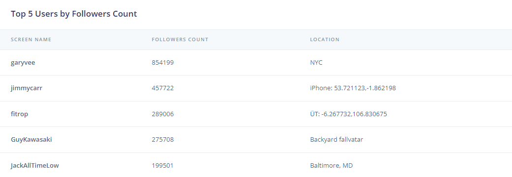</img>

### Hashtag Analysis
The dashboard performs an analysis of hashtags used in the dataset which identifies the top 5 most frequently used hashtags. By having that, we can identify trending topics from the commonly used hashtag. For example, the most common hashtag in this dataset is **treynewalbum914** with a count of **54**.
```
    pipeline = [
        {
            "$unwind": "$entities.hashtags"
        },
        {
            "$group": {
                "_id": "$entities.hashtags.text",
                "count": { "$sum": 1 }
            }
        },
        {
            "$sort": { "count": -1 }
        },
        {
            "$limit": 5
        }
    ]
```
Output:

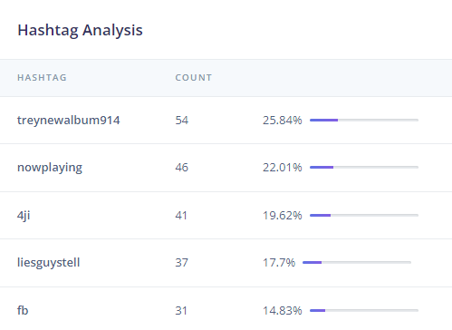</img>

Overall, the dashboard provides various functionalities which give users a comprehensive overview of the dataset, allowing them to explore user statistics, trends, source distribution, user locations, top users, and popular hashtags. The dashboard acts as the summary of important data and enables us to extract valuable insight from the dataset in terms of decision making. For most of the above analysis, I am utilizing MongoDB's aggregation framework in django which is a convenient way for me to summarize the data.


## Contribution 🛠️
Please create an [Issue](https://github.com/drshahizan/special-topic-data-engineering/issues) for any improvements, suggestions or errors in the content.

You can also contact me using [Linkedin](https://www.linkedin.com/in/drshahizan/) for any other queries or feedback.

[](https://visitorbadge.io/status?path=https%3A%2F%2Fgithub.com%2Fdrshahizan)


