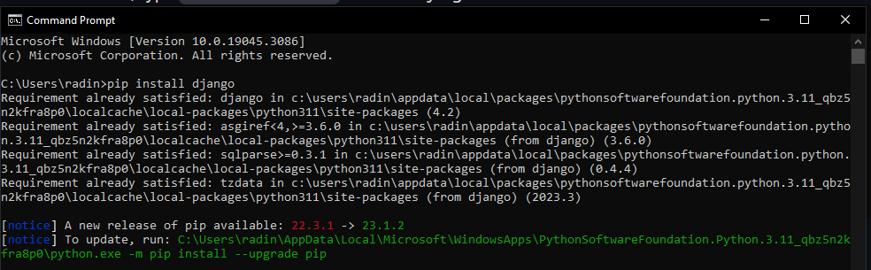
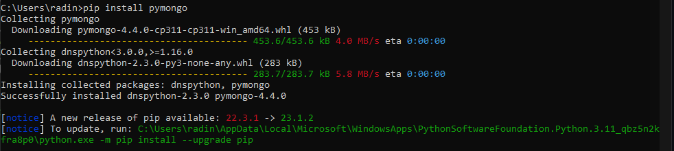
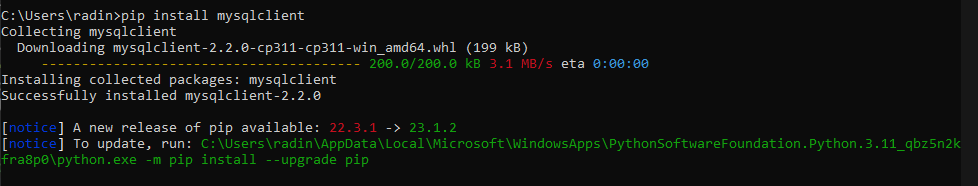
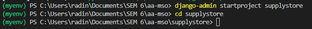
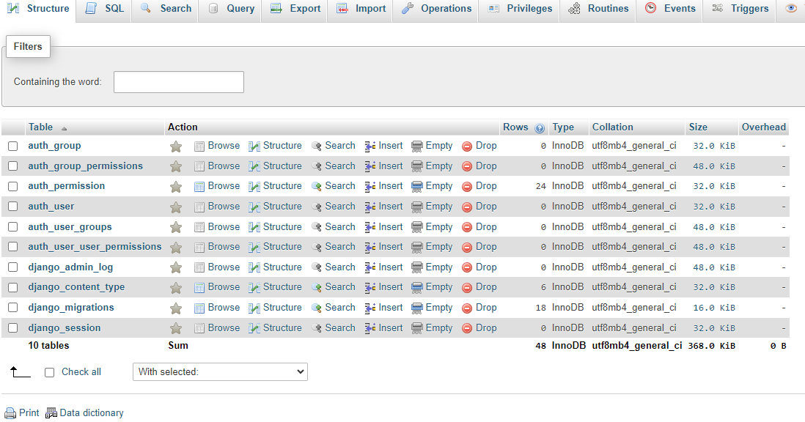
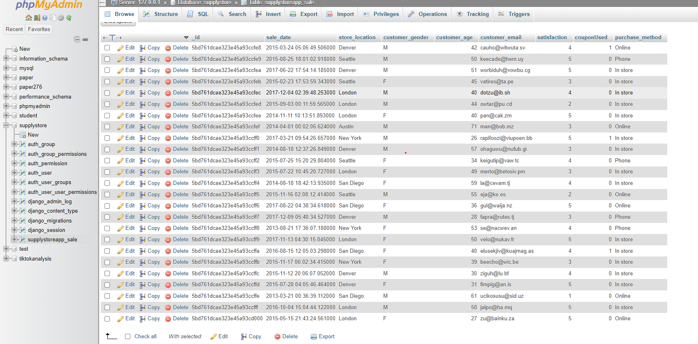
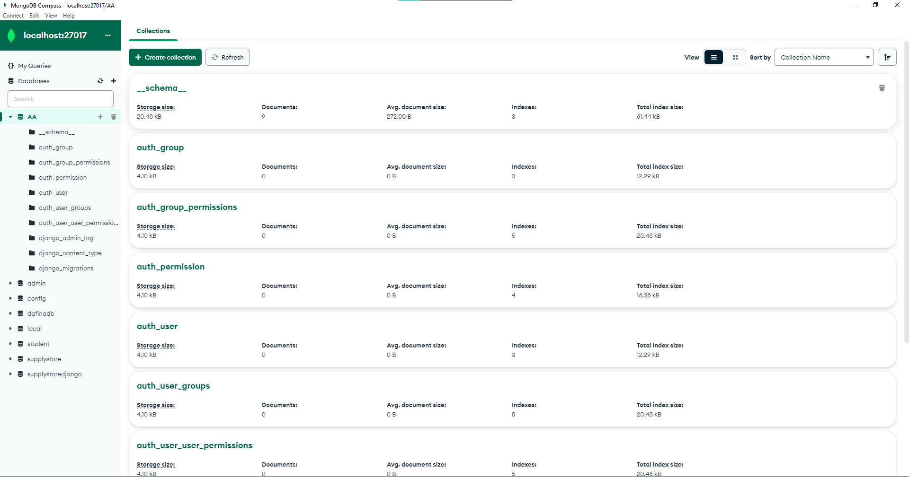
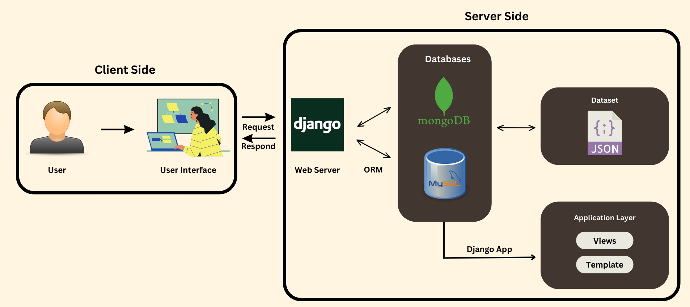

<a href="https://github.com/drshahizan/SECP3843/stargazers"></a>
<a href="https://github.com/drshahizan/SECP3843/network/members"></a>
<a href="https://github.com/drshahizan/SECP3843/pulls"></a>
<a href="https://github.com/drshahizan/SECP3843/issues"></a>
<a href="https://github.com/drshahizan/SECP3843/graphs/contributors"></a>


Don't forget to hit the :star: if you like this repo.

# Special Topic Data Engineering (SECP3843): Alternative Assessment

#### Name: RADIN DAFINA BINTI RADIN ZULKAR NAIN
#### Matric No.: A20EC0135
#### Dataset: [Supply Store](https://github.com/drshahizan/dataset/tree/main/mongodb/01-sales)

## Question 1 (a)

We will be utilizing five servers to create a robust and dynamic web application:

  1. ``Apache Web Server:`` Apache is a widely used and powerful web server software. It handles HTTP requests from clients (such as web browsers) and delivers web pages and other content over the internet. Apache supports various technologies like PHP and Python  making it flexible for hosting dynamic websites.
  
  2. ``MySQL Database Server:`` MySQL is a popular open-source relational database management system (RDBMS). It provides a robust and scalable platform for storing and managing structured data. MySQL is widely used for web applications, powering content management systems, e-commerce websites, and more.
  
  3. ``MongoDB Server:`` MongoDB is a NoSQL database server designed for handling unstructured and semi-structured data. It offers a flexible document-oriented data model, allowing for easy scalability and high-performance querying. MongoDB is commonly used in modern web applications that deal with large amounts of data or require flexible data schemas.
  
  4. ``Django Server:`` Django is a high-level Python web framework that simplifies the development of complex web applications. It includes a built-in web server for development purposes. Django handles various tasks, such as URL routing, template rendering, database abstraction, and user authentication. It follows the Model-View-Controller (MVC) architectural pattern.
  
  5. ``Nginx Server:`` Nginx is a lightweight and high-performance web server that excels at serving static content and acting as a reverse proxy. It can efficiently handle concurrent connections and is often used to improve the performance and scalability of web applications. Nginx can also be used as a load balancer, distributing incoming requests across multiple servers to ensure high availability and fault tolerance.

### Steps to integrate JSON dataset with Django

### Prerequisite
  1. Make sure you have Python installed on the system. You can check if Python is installed by opening a terminal or command prompt and running the following command:

```
python --version
```

If Python is not installed, you can download and install it from the   official Python website (https://www.python.org).

  2.  Create a Virtual Environment. Open a terminal or command prompt and run the following commands:
```
python -m venv myenv
myenv\Scripts\activate
```
  3.  Install Django and related packages.
With the virtual environment activated, run the following command to install Django using pip, the Python package installer:

  ```
  pip install django
  ```
  <div align="center"></div>
  
  ```
  pip install pymongo
  ```
   <div align="center"></div>
   
  ```
  pip install mysqlclient
  ```

  <div align="center"></div>
  
  ```
  pip install djongo
  ```
 
  4. Setup Project in Django

  ```
  django-admin startproject supplystore
  cd supplystore
  ```
 <div align="center"></div>
 
  ```
  python manage.py startapp supplystoreapp   
  ```

 <div align="center"></div>

- Define connection details for MySQL and MongoDB.
  
  - In settings.py,
    
  ```python
      DATABASES = {
        'default': {
            'ENGINE': 'django.db.backends.mysql',
            'NAME': 'supplystore',
            'USER' : 'root',
            'PASSWORD' : '',
            'HOST' : 'localhost',
            'PORT' : '3306',
        },
    
        'mongodb': {
                'ENGINE': 'djongo',
                'NAME': 'AA',
                'ENFORCE_SCHEMA': False,
                'CLIENT': {
                    'host': 'localhost',
                    'port': 27017,
                    'username': 'dafina',
                    'password': 'dafina123',
                    'authSource': 'admin',
                    'authMechanism': 'SCRAM-SHA-1',
                }
            }
    }
  ```
  - In models.py,
    
  ```python
  from django.db import models
     class Sale(models.Model):
      _id = models.CharField(max_length=255, primary_key=True)
      saleDate = models.DateTimeField(db_column='sale_date')  # Rename field to match JSON key
      storeLocation = models.CharField(max_length=100, db_column='store_location')  # Rename field to match JSON key
      customerGender = models.CharField(max_length=1, db_column='customer_gender')  # Rename field to match JSON key
      customerAge = models.PositiveIntegerField(db_column='customer_age')  # Rename field to match JSON key
      customerEmail = models.EmailField(db_column='customer_email')  # Rename field to match JSON key
      satisfaction = models.PositiveSmallIntegerField()
      couponUsed = models.BooleanField(db_column='couponUsed')  # Rename field to match JSON key
      purchaseMethod = models.CharField(max_length=100, db_column='purchase_method')  # Rename field to match JSON key
  ```

5. Run database migration for Mysql and MongoDB
 
   MySQL: ``python manage.py migrate``
   
  <div align="center"></div>
  <div align="center"></div>
  
   MongoDB: ``python manage.py migrate --database=mongodb``

   <div align="center"></div>


## Question 1 (b)

### System Architecture

   <div align="center"></div>

  1. User: Represents the user interacting with the system through a user interface.
     
  3. User Interface: The user interface is built using Django, a Python web framework. It includes web pages or a GUI that enables users to interact with the system.
     
  5. Django Server: The Django server acts as the web server and application logic layer. It receives user requests from the user interface, processes them, and generates responses. The Django server is responsible for handling HTTP requests, routing, and executing the application logic.
  
  6. Django ORM (Object-Relational Mapping): The Django ORM allows you to interact with a MySQL database. It provides an abstraction layer that maps database tables to Python objects. The ORM simplifies database operations and enables you to perform CRUD (Create, Read, Update, Delete) operations using Python code.
  
  7. MySQL: MySQL is a relational database management system (RDBMS). In the system, it serves as the primary database for storing structured data. The Django ORM communicates with the MySQL database to read and write data.
  
  8. MongoDB: MongoDB is a NoSQL document-oriented database. In the system, it serves as one of the databases for storing data. MongoDB stores data in a flexible, schema-less format using JSON-like documents.
  
  9. JSON Dataset: JSON datasets can be loaded into the MongoDB database as initial data or for specific application needs. MongoDB's flexible schema allows you to store JSON documents without enforcing a specific structure, making it suitable for handling various data formats.
      
  11. Application Layer: The application layer in Django includes various components such as views, models, templates, and other application-specific modules. It encapsulates the business logic of the application and interacts with the MongoDB database to process data and generate appropriate responses.

   In summary, this system architecture involves a user interface built using Django, which communicates with a Django server. The Django server acts as the web server, handles user requests, and processes them using the application layer. The server communicates directly with the MongoDB database using MongoDB drivers or libraries. MongoDB stores data in a JSON-like format and provides flexible schema capabilities. The application layer in Django interacts with the MongoDB database to perform data operations and generate responses. JSON datasets can be loaded into MongoDB and utilized by the application for data initialization or specific application needs.

## Contribution 🛠️
Please create an [Issue](https://github.com/drshahizan/special-topic-data-engineering/issues) for any improvements, suggestions or errors in the content.

You can also contact me using [Linkedin](https://www.linkedin.com/in/drshahizan/) for any other queries or feedback.

[](https://visitorbadge.io/status?path=https%3A%2F%2Fgithub.com%2Fdrshahizan)


