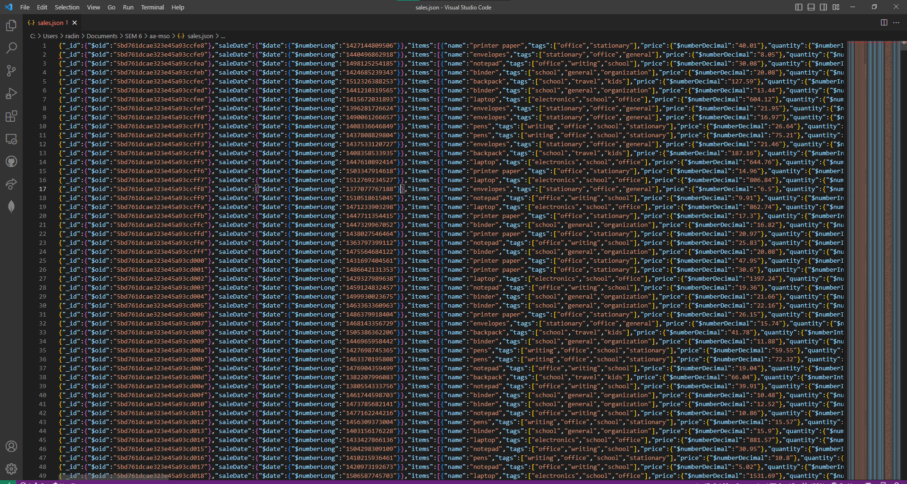
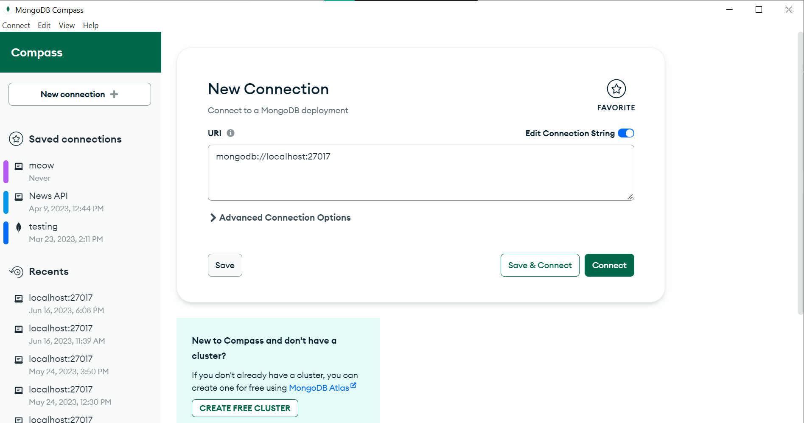
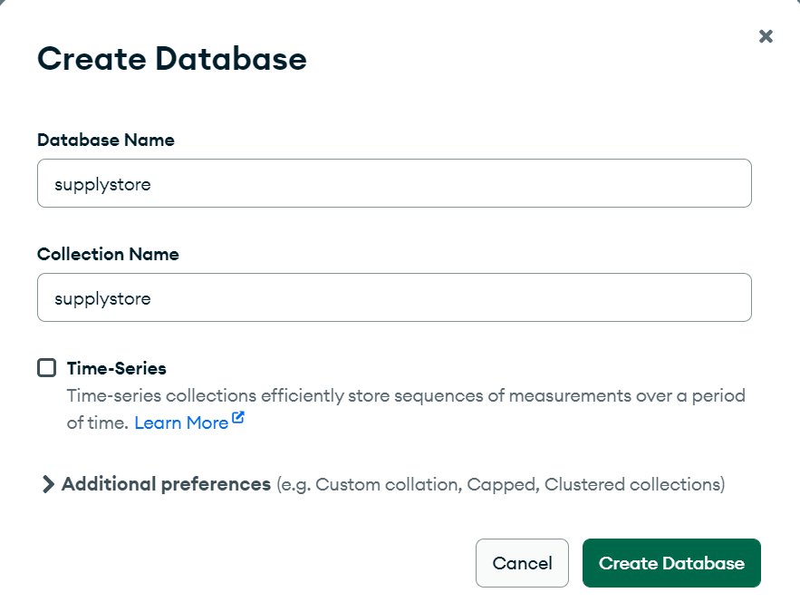
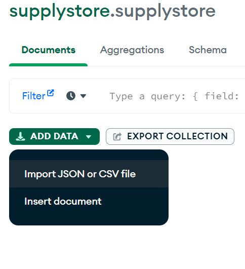
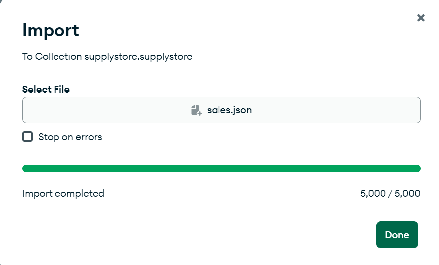
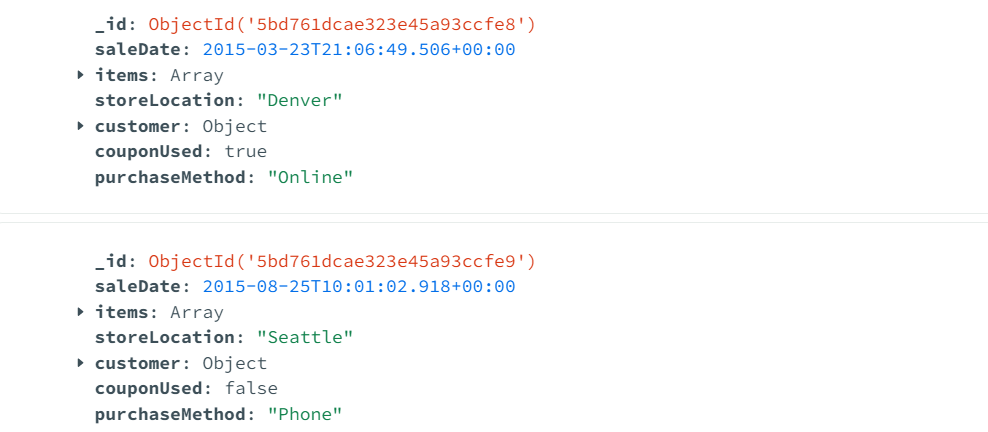
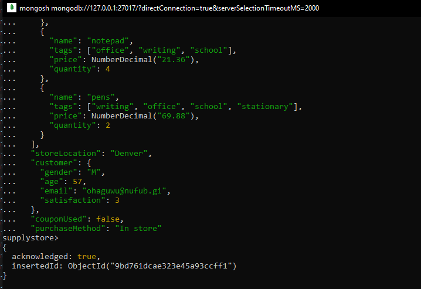
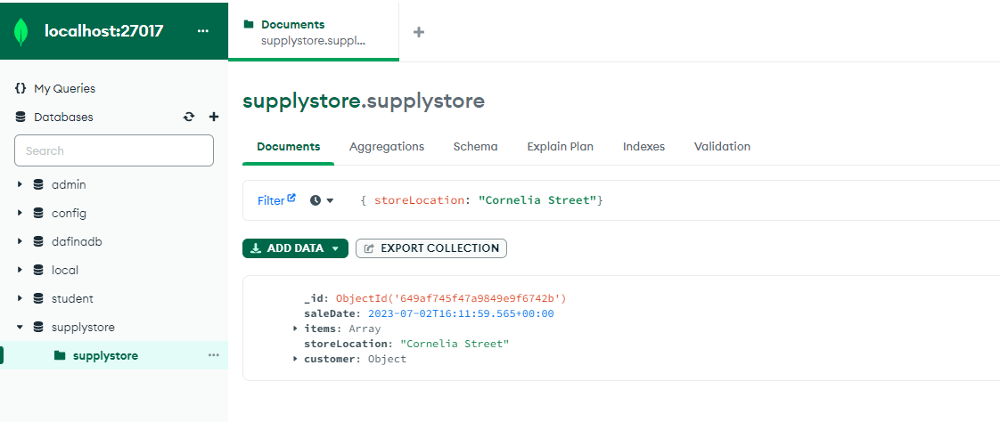

<a href="https://github.com/drshahizan/SECP3843/stargazers"></a>
<a href="https://github.com/drshahizan/SECP3843/network/members"></a>
<a href="https://github.com/drshahizan/SECP3843/pulls"></a>
<a href="https://github.com/drshahizan/SECP3843/issues"></a>
<a href="https://github.com/drshahizan/SECP3843/graphs/contributors"></a>


Don't forget to hit the :star: if you like this repo.

# Special Topic Data Engineering (SECP3843): Alternative Assessment

#### Name: RADIN DAFINA BINTI RADIN ZULKAR NAIN
#### Matric No.: A20EC0135
#### Dataset: [Supply Store](https://github.com/drshahizan/dataset/tree/main/mongodb/01-sales)

## Question 2 (a)

Before proceeding with the import process, ensure that you have the following prerequisites in place:

### Prerequisite

  1. **Supply Store Dataset:** Download the [Supply Store Dataset](https://github.com/drshahizan/dataset/tree/main/mongodb/01-sales).This dataset will serve as the source of the JSON data that you will import into MongoDB. It contains essential information related to sales.
     
     <div align="center"></div>
     
  3. **MongoDB Server:** Install and set up the latest version of [MongoDB Server](https://www.mongodb.com/try/download/community) on your system. MongoDB Server will act as the database where you will import the JSON data.
     
     <div align="center"></div>

### Steps to import JSON data to MongoDB

  **Step 1:** Launch MongoDB Compass and connect to the localhost server.
<div align="center"></div>
  
  **Step 2:** Create a database named "supplystore" to proceed further.
  <div align="center"></div>

  **Step 3:** In the "Add Data" section, select "Import JSON file" and upload the dataset that you have downloaded.
  <div align="center"></div>
  <div align="center"></div>
  
  **Step 4:** Once uploaded, the JSON file will be displayed as shown below.
  <div align="center"></div>

## Question 2 (b)

### Prerequisite

  1. **MongoDB Shell:** Ensure that you have installed and set up the [MongoDB Shell](https://www.mongodb.com/try/download/shell) on your system. The MongoDB Shell provides a command-line interface to interact with MongoDB and perform various operations.
     
     <div align="center"></div>

### Steps to create MongoDB queries for CRUD

  1. To launch MongoDB Shell, simply locate the "mongosh.exe" file within the "bin" folder of your downloaded MongoDB directory and open. This is how MongoDB Shell looks like.

     <div align="center"></div>

  2. Run the following commands:
   ```python
    show databases
   ```
   ```python
    use supplystore
   ```

### Create

  ```python
  db.supplystore.insertOne({
   saleDate: ISODate("2023-07-02T16:11:59.565Z"),
   items: [
     {
        name: "binder",
        tags: ["school", "general", "organization"],
        price: NumberDecimal("16.7"),
        quantity: 7
     },
     {
        name: "laptop",
        tags: ["electronics", "school", "office"],
        price: NumberDecimal("1217.84"),
        quantity: 1
     }
   ],
   storeLocation: "Cornelia Street",
   customer: {
     gender: "W",
     age: 22,
     email: "gracie@gmail.com",
     satisfaction: 4,
     couponUsed: false,
     purchaseMethod: "In store"
   }}) 
  ```
<div align="center"></div>

<div align="center"></div>

### Read

### Update 

  - Query 1:
  - Query 2:
    
### Delete


## Contribution 🛠️
Please create an [Issue](https://github.com/drshahizan/special-topic-data-engineering/issues) for any improvements, suggestions or errors in the content.

You can also contact me using [Linkedin](https://www.linkedin.com/in/drshahizan/) for any other queries or feedback.

[](https://visitorbadge.io/status?path=https%3A%2F%2Fgithub.com%2Fdrshahizan)


