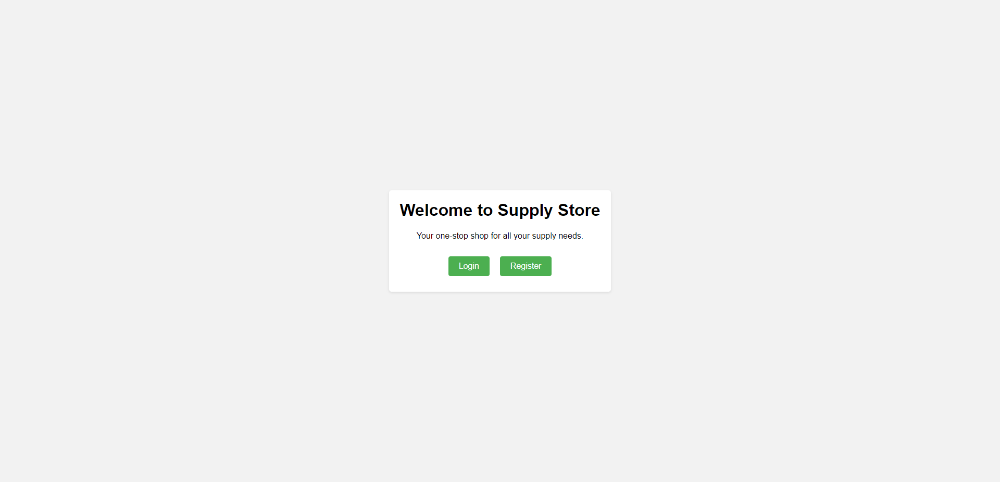
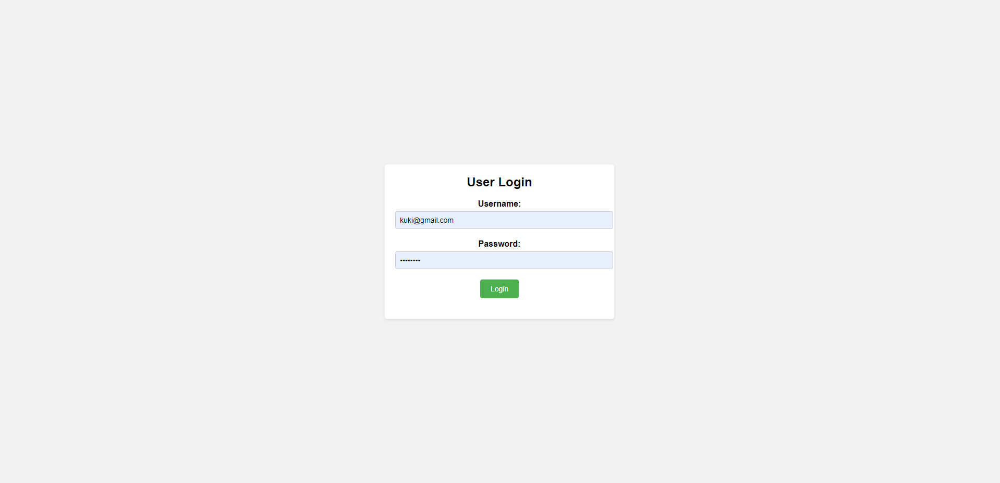
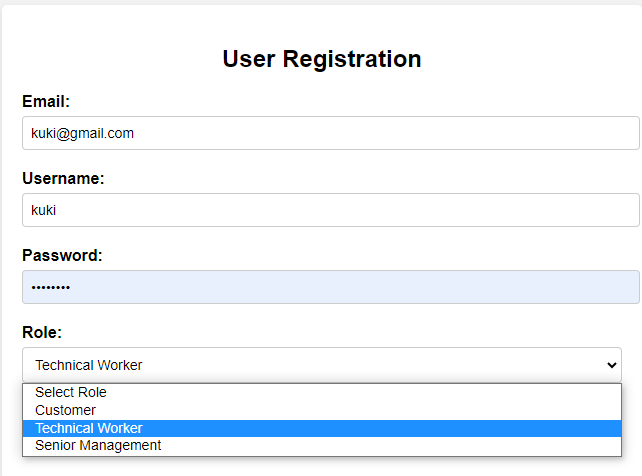
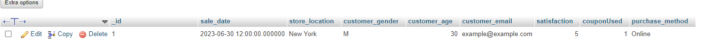
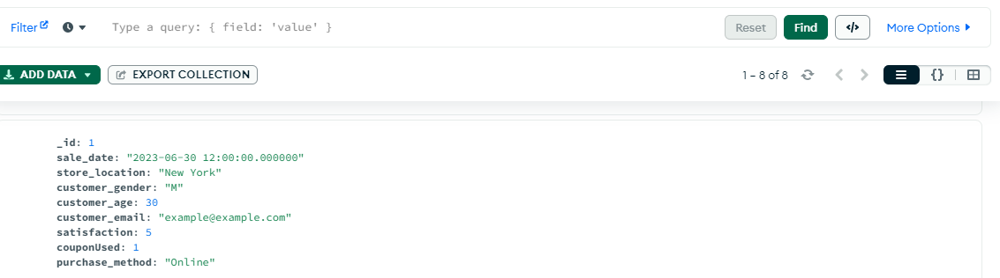

<a href="https://github.com/drshahizan/SECP3843/stargazers"></a>
<a href="https://github.com/drshahizan/SECP3843/network/members"></a>
<a href="https://github.com/drshahizan/SECP3843/pulls"></a>
<a href="https://github.com/drshahizan/SECP3843/issues"></a>
<a href="https://github.com/drshahizan/SECP3843/graphs/contributors"></a>


Don't forget to hit the :star: if you like this repo.

# Special Topic Data Engineering (SECP3843): Alternative Assessment

#### Name: RADIN DAFINA BINTI RADIN ZULKAR NAIN
#### Matric No.: A20EC0135
#### Dataset: [Supply Store](https://github.com/drshahizan/dataset/tree/main/mongodb/01-sales)

## Question 3 (a)
### [Question 3: Code](https://github.com/drshahizan/SECP3843/tree/main/submission/radindafina/question3/files/code/supplystore)

### Prerequisite
  - Ensure that you have installed the mysqlclient package by running the command ``pip install mysqlclient``
  - Make sure you have a database named "supplystore" available.

### Set up

1. Connect to the database by configuring the database settings in your Django project's settings.py file. Use the following code as a template, modifying the values to match your database configuration:
   
 ```python
DATABASES = {
  'default': {
      'ENGINE': 'django.db.backends.mysql',
      'NAME': 'supplystore',
      'USER' : 'root',
      'PASSWORD' : '',
      'HOST' : 'localhost',
      'PORT' : '3306',
  },
}
```

2. Define the required models in your Django project's models.py file. The provided code snippet shows an example of a custom user model with additional fields for different roles:

 ```python
from django.contrib.auth.models import AbstractUser, Group, Permission
class CustomUser(AbstractUser):
    customer = models.BooleanField(default=False)
    technical_worker = models.BooleanField(default=False)
    senior_management = models.BooleanField(default=False)

    groups = models.ManyToManyField(Group, blank=True, related_name='custom_user_set')
    user_permissions = models.ManyToManyField(Permission, blank=True, related_name='custom_user_set')

```

3. Create the required views in your Django project's views.py file. The code snippets provided demonstrate example views for the index, login, and register pages:
  - views.py - index
    
    ```python
    def index_view(request):
        # Add your logic here
        return render(request, 'index.html')
    ```

  - views.py - login
    ```python
    def login_view(request):
        if request.method == 'POST':
            # Retrieve the username and password from the POST request
            username = request.POST.get('username')
            password = request.POST.get('password')
    
            if username == 'admin' and password == 'password':
                # If the login is successful, you can redirect to a success page
                return redirect('/success/')
            else:
                # If the login fails, you can render the login page again with an error message
                error_message = 'Invalid username or password.'
                return render(request, 'login.html', {'error_message': error_message})
    
        # If the request method is GET, render the login page
        return render(request, 'login.html')
    ```
  - views.py - register
    ```python
    def register_view(request):
        if request.method == 'POST':
                email = request.POST.get('email')
                username = request.POST.get('username')
                password = request.POST.get('password')
                role = request.POST.get('role')
                
                # Check if the username already exists
                if User.objects.filter(username=username).exists():
                    error_message = "Username already exists. Please choose a different username."
                    return render(request, 'register.html', {'error_message': error_message})
    
        return render(request, 'register.html')
    ```
  4. Create the HTML templates for the index, login, and register pages. Use the provided HTML snippets as a starting point, customizing the content and layout as desired.
  
  - index.html
    ```python
    <body>
        <div class="container">
            <h1>Welcome to Supply Store</h1>
            <p>Your one-stop shop for all your supply needs.</p>
            <div class="button-container">
                <a href="/login">Login</a>
                <a href="/register">Register</a>
            </div>
        </div>
    </body>
    ```

  <div align="center"></div>
  
  - login.html
  ```python
  <body>
      <div class="container">
          <h2>User Login</h2>
          <form action="/login" method="post">
              
              <div class="form-group">
                  <label for="username">Username:</label>
                  <input type="text" id="username" name="username" required>
              </div>
              <div class="form-group">
                  <label for="password">Password:</label>
                  <input type="password" id="password" name="password" required>
              </div>
              <div class="form-group">
                  <button type="submit">Login</button>
              </div>
          </form>
      </div>
  </body>
  ```
  
  <div align="center"></div>
    
  - register.html
  ```python
  <body>
      <div class="container">
          <h2>User Registration</h2>
          <form action="/register" method="post">
              
              <div class="form-group">
                  <label for="email">Email:</label>
                  <input type="email" id="email" name="email" required>
              </div>
              <div class="form-group">
                  <label for="username">Username:</label>
                  <input type="text" id="username" name="username" required>
              </div>
              <div class="form-group">
                  <label for="password">Password:</label>
                  <input type="password" id="password" name="password" required>
              </div>
              <div class="form-group">
                  <label for="role">Role:</label>
                  <select id="role" name="role" required>
                      <option value="">Select Role</option>
                      <option value="customer">Customer</option>
                      <option value="technical_worker">Technical Worker</option>
                      <option value="senior_management">Senior Management</option>
                  </select>
              </div>
              <div class="form-group">
                  <button type="submit">Register</button>
              </div>
          </form>
      </div>
  </body>
  ```
    
  <div align="center"></div>

## Question 3 (b)
### Challenges of Data Replication between Mysql and MongoDB

Replicating and synchronizing data between MySQL and MongoDB databases poses challenges due to differences in data models, query languages, and replication mechanisms. Mapping and transforming data, handling schema inconsistencies, ensuring consistent queries, managing conflicts, and monitoring replication are key challenges. Addressing them requires a well-planned replication strategy, leveraging database-specific mechanisms or external tools for real-time updates. Overcoming these challenges ensures data consistency and reliability across the databases. However, there are several approaches to address this challenge. 

### Steps to maintain data consistency across both systems

  1. Install the required database connectors: Django supports MySQL through the mysqlclient package and MongoDB through the djongo package. Install them using pip.
     
     ```python
     pip install mysqlclient djongo
     pip install djongo pymongo
     ```
     
  1. Identify the Replication Requirements: Determine which data needs to be replicated between the MySQL and MongoDB databases. Not all data may require synchronization, so it's essential to define the scope of replication.
     
  3. Configure both database: Open Django project's settings file (settings.py) and configure the databases section to include both MySQL and MongoDB settings. For example:

     ```python
           DATABASES = {
          'default': {
              'ENGINE': 'django.db.backends.mysql',
              'NAME': 'supplystore',
              'USER' : 'root',
              'PASSWORD' : '',
              'HOST' : 'localhost',
              'PORT' : '3306',
          },
      
          'mongodb': {
                      'ENGINE': 'djongo',
                      'NAME': 'AA',
                      'ENFORCE_SCHEMA': False,
                      'CLIENT': {
                          'host': 'localhost',
                          'port': 27017,
                          'username': 'dafina',
                          'password': 'dafina123',
                          'authSource': 'admin',
                          'authMechanism': 'SCRAM-SHA-1',
                      }
                  }
      }
     ```
  3. Define models for both databases: Create separate model classes for MySQL and MongoDB in Django app's models.py file. Annotate the models with the database routing information to specify which database to use for each model.
     
       ```python
      from django.db import models
      from djongo import models as djongo_models
      
      
      class MySQLSale(models.Model):
          _id = models.CharField(max_length=255, primary_key=True)
          saleDate = models.DateTimeField(db_column='sale_date')
          storeLocation = models.CharField(max_length=100, db_column='store_location')
          customerGender = models.CharField(max_length=1, db_column='customer_gender')
          customerAge = models.PositiveIntegerField(db_column='customer_age')
          customerEmail = models.EmailField(db_column='customer_email')
          satisfaction = models.PositiveSmallIntegerField()
          couponUsed = models.BooleanField(db_column='couponUsed')
          purchaseMethod = models.CharField(max_length=100, db_column='purchase_method')
      ```
  5. Define the insert data in views.py:

```python
  def insert_data(request):
      # Create a Sale object for MySQL
      sale_mysql = Sale(
          _id='1',
          saleDate='2023-06-30 12:00:00',
          storeLocation='New York',
          customerGender='M',
          customerAge=30,
          customerEmail='example@example.com',
          satisfaction=5,
          couponUsed=True,
          purchaseMethod='Online'
      )
      sale_mysql.save()
  
      # Create a Sale object for MongoDB
      sale_mongodb = Sale(
          _id='1',
          saleDate='2023-06-30 12:00:00',
          storeLocation='New York',
          customerGender='M',
          customerAge=30,
          customerEmail='example@example.com',
          satisfaction=5,
          couponUsed=True,
          purchaseMethod='Online'
      )
      sale_mongodb.save(using='mongodb')
  
      # Rest of the view logic
      return render(request, 'insert_data.html')
```   
  6. Run migration.
      We can see data is now stored in both database.
     
       <div align="center"></div>
       
       <div align="center"></div>
       
## Contribution 🛠️
Please create an [Issue](https://github.com/drshahizan/special-topic-data-engineering/issues) for any improvements, suggestions or errors in the content.

You can also contact me using [Linkedin](https://www.linkedin.com/in/drshahizan/) for any other queries or feedback.

[](https://visitorbadge.io/status?path=https%3A%2F%2Fgithub.com%2Fdrshahizan)


