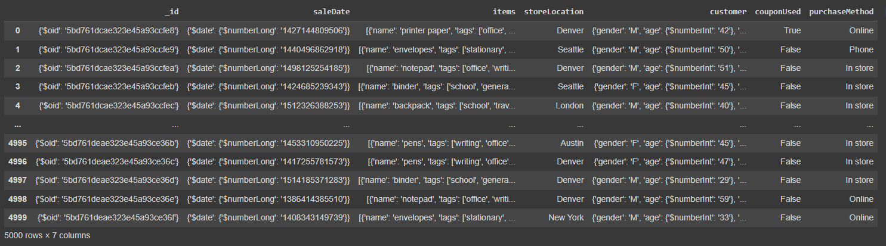
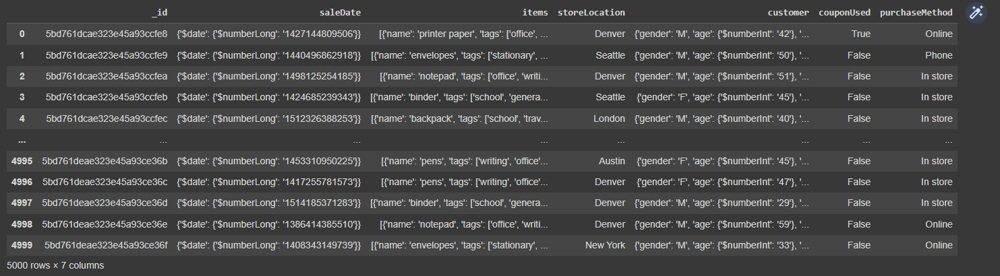
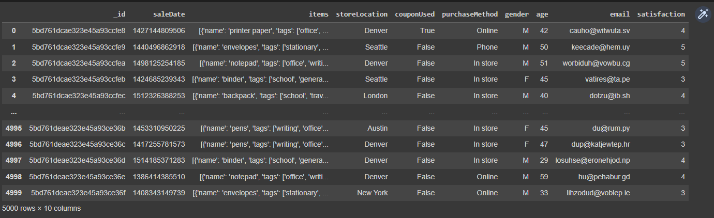
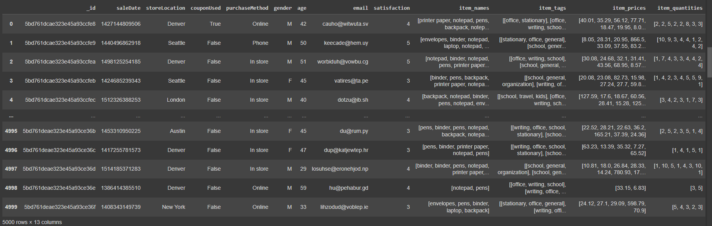
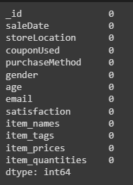
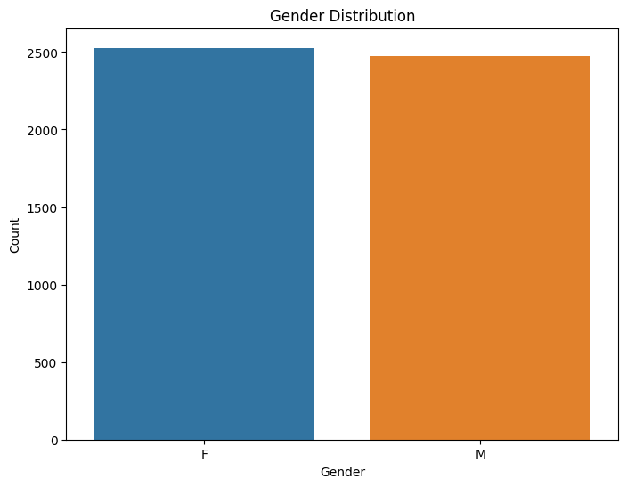
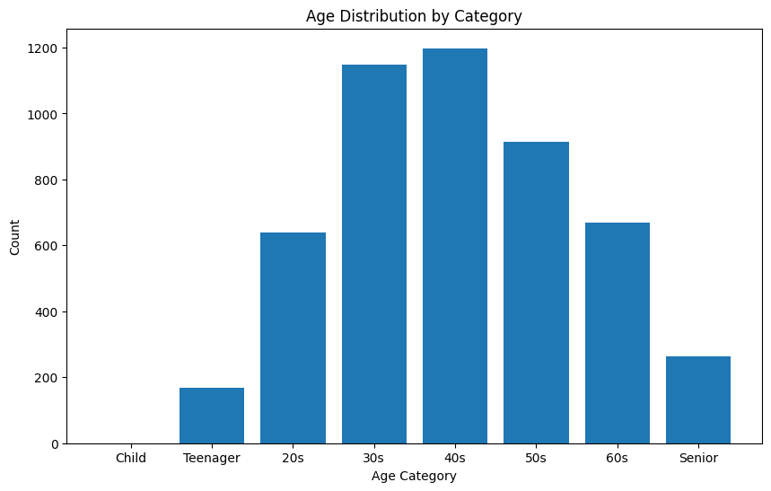
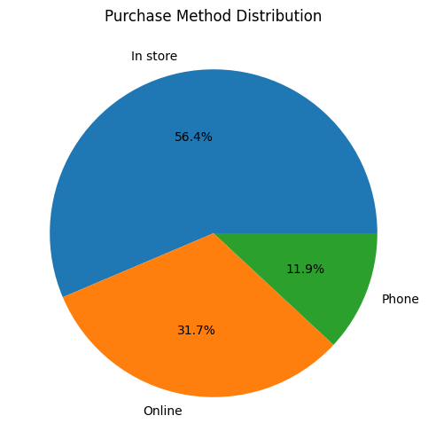
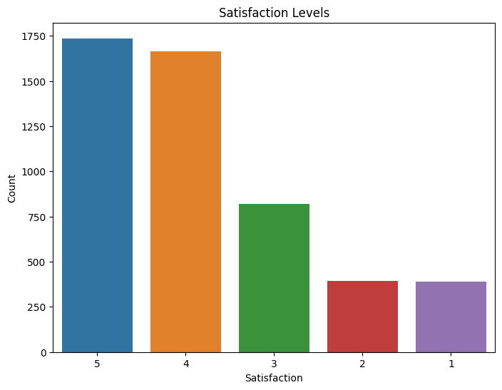
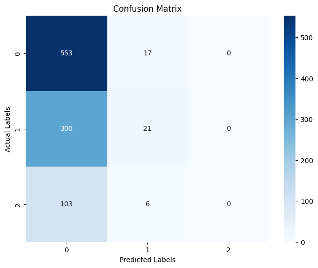

<a href="https://github.com/drshahizan/SECP3843/stargazers"></a>
<a href="https://github.com/drshahizan/SECP3843/network/members"></a>
<a href="https://github.com/drshahizan/SECP3843/pulls"></a>
<a href="https://github.com/drshahizan/SECP3843/issues"></a>
<a href="https://github.com/drshahizan/SECP3843/graphs/contributors"></a>


Don't forget to hit the :star: if you like this repo.

# Special Topic Data Engineering (SECP3843): Alternative Assessment

#### Name: RADIN DAFINA BINTI RADIN ZULKAR NAIN
#### Matric No.: A20EC0135
#### Dataset: [Supply Store](https://github.com/drshahizan/dataset/tree/main/mongodb/01-sales)

## Question 4 
### Data Preparation
```python
import pandas as pd
import numpy as np
```
```python
import json
from pandas import json_normalize

with open('/content/drive/MyDrive/supplystore.json', 'r', encoding='utf-8') as file:
    data = json.load(file)

# Convert JSON data to DataFrame
df = pd.DataFrame.from_records(data)

# Display the DataFrame
display(df)
```
<div align="center"></div>

```python
df['_id'] = df['_id'].str['$oid']
```

  <div align="center"></div>
  
```python
df['saleDate'] = df['saleDate'].apply(lambda x: x['$date']['$numberLong'])
```

```python
# Splitting Customer Data
df['gender'] = df['customer'].apply(lambda x: x['gender'] if pd.notnull(x) else np.nan)
df['age'] = df['customer'].apply(lambda x: x['age']['$numberInt'] if pd.notnull(x) and 'age' in x and '$numberInt' in x['age'] else np.nan)
df['email'] = df['customer'].apply(lambda x: x['email'] if pd.notnull(x) else np.nan)
df['satisfaction'] = df['customer'].apply(lambda x: x['satisfaction']['$numberInt'] if pd.notnull(x) and 'satisfaction' in x and '$numberInt' in x['satisfaction'] else np.nan)

# Drop the original "customer" column
df.drop('customer', axis=1, inplace=True)
```

  <div align="center"></div>

```python
df['item_names'] = df['items'].apply(lambda x: [item['name'] for item in x] if isinstance(x, list) else [])
df['item_tags'] = df['items'].apply(lambda x: [item['tags'] for item in x] if isinstance(x, list) else [])
df['item_prices'] = df['items'].apply(lambda x: [float(item['price']['$numberDecimal']) for item in x] if isinstance(x, list) else [])
df['item_quantities'] = df['items'].apply(lambda x: [int(item['quantity']['$numberInt']) for item in x] if isinstance(x, list) else [])

# Drop the original "items" column
df.drop('items', axis=1, inplace=True)
```

  <div align="center"></div>
  
```python
df.shape
```
```python
df.isna().sum()
```

  <div align="center"></div>
  
### Data Visualization

```python
import seaborn as sns
import matplotlib.pyplot as plt
```

```python
# Count the occurrences of each gender
gender_counts = df['gender'].value_counts()

# Plot the gender distribution
plt.figure(figsize=(8, 6))
sns.barplot(x=gender_counts.index, y=gender_counts.values)
plt.xlabel('Gender')
plt.ylabel('Count')
plt.title('Gender Distribution')
plt.show()
```
  <div align="center"></div>

```python
# Convert 'age' column to numeric
df['age'] = pd.to_numeric(df['age'], errors='coerce')

# Define age categories
age_bins = [0, 12, 19, 29, 39, 49, 59, 69, 120]
age_labels = ['Child', 'Teenager', '20s', '30s', '40s', '50s', '60s', 'Senior']

# Classify age into categories
df['age_category'] = pd.cut(df['age'], bins=age_bins, labels=age_labels)

# Calculate count of each age category
age_counts = df['age_category'].value_counts().sort_index()

# Create histogram
plt.figure(figsize=(10, 6))
plt.bar(age_labels, age_counts)

# Set labels and title
plt.xlabel('Age Category')
plt.ylabel('Count')
plt.title('Age Distribution by Category')

# Show the plot
plt.show()

```
  <div align="center"></div>


```python
# Count the occurrences of each purchase method
purchase_counts = df['purchaseMethod'].value_counts()

# Plot the pie chart for purchase method
plt.figure(figsize=(8, 6))
plt.pie(purchase_counts.values, labels=purchase_counts.index, autopct='%1.1f%%')
plt.title('Purchase Method Distribution')
plt.show()
```

  <div align="center"></div>

```python
# Count the occurrences of each satisfaction level
satisfaction_counts = df['satisfaction'].value_counts()

# Plot the satisfaction levels
plt.figure(figsize=(8, 6))
sns.barplot(x=satisfaction_counts.index, y=satisfaction_counts.values)
plt.xlabel('Satisfaction')
plt.ylabel('Count')
plt.title('Satisfaction Levels')
plt.show()
```

  <div align="center"></div>

### Steps for Machine Learning: Random Forest

```python
from sklearn.model_selection import train_test_split
from sklearn.ensemble import RandomForestClassifier
from sklearn.metrics import accuracy_score
```
```python
# Selecting the features and target variable
X = df[['age', 'gender']]
y = df['purchaseMethod']

# Performing one-hot encoding for categorical variables
X = pd.get_dummies(X)

# Splitting the data into training and testing sets
X_train, X_test, y_train, y_test = train_test_split(X, y, test_size=0.2, random_state=42)

rf = RandomForestClassifier()
rf.fit(X_train, y_train)

y_pred = rf.predict(X_test)

accuracy = accuracy_score(y_test, y_pred)
print("Accuracy:", accuracy)
```
  <div align="center"></div>
  
```python
from sklearn.metrics import confusion_matrix
import seaborn as sns

# Compute the confusion matrix
cm = confusion_matrix(y_test, y_pred)

# Create a heatmap of the confusion matrix
plt.figure(figsize=(8, 6))
sns.heatmap(cm, annot=True, fmt='d', cmap='Blues')
plt.xlabel('Predicted Labels')
plt.ylabel('Actual Labels')
plt.title('Confusion Matrix')
plt.show()
```
  <div align="center"></div>

## Contribution 🛠️
Please create an [Issue](https://github.com/drshahizan/special-topic-data-engineering/issues) for any improvements, suggestions or errors in the content.

You can also contact me using [Linkedin](https://www.linkedin.com/in/drshahizan/) for any other queries or feedback.

[](https://visitorbadge.io/status?path=https%3A%2F%2Fgithub.com%2Fdrshahizan)


