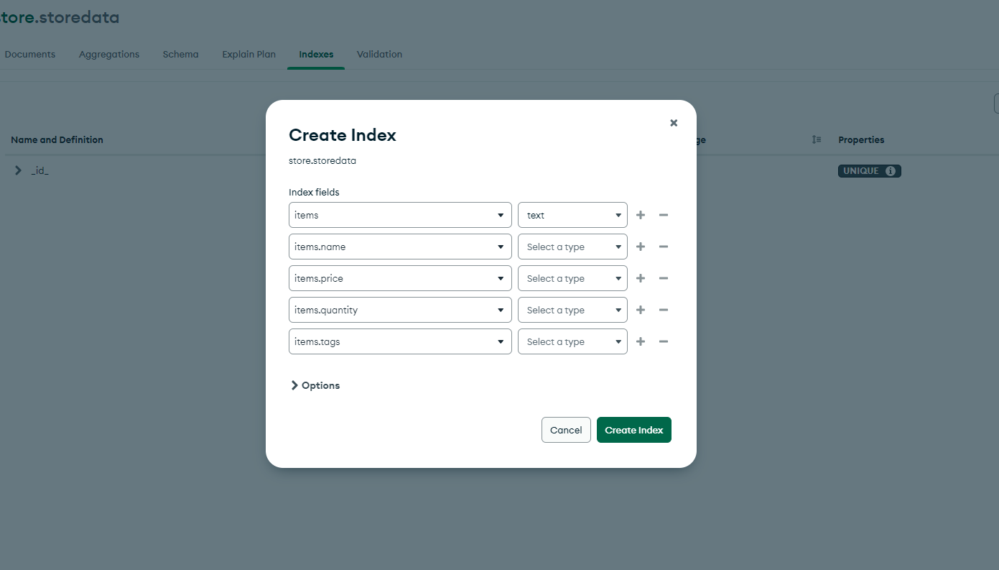
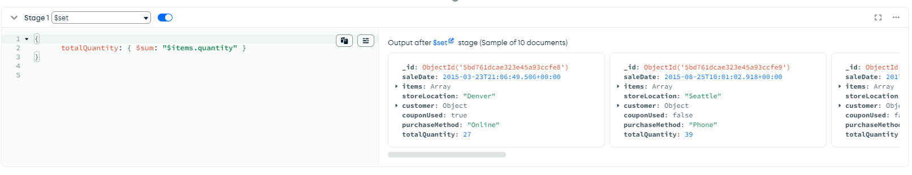
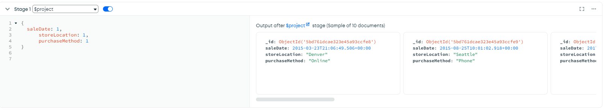
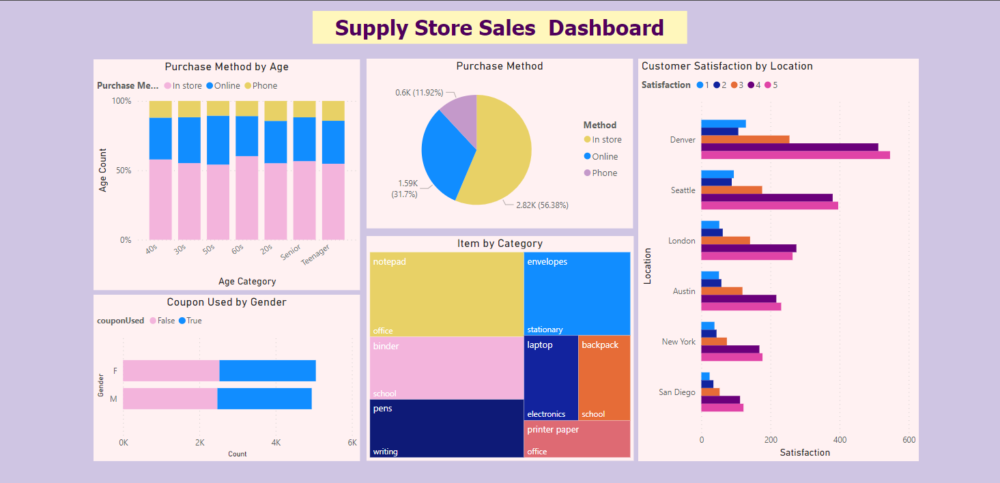

Don't forget to hit the :star: if you like this repo.

# Special Topic Data Engineering (SECP3843): Alternative Assessment

#### Name: RADIN DAFINA BINTI RADIN ZULKAR NAIN
#### Matric No.: A20EC0135
#### Dataset: [Supply Store](https://github.com/drshahizan/dataset/tree/main/mongodb/01-sales)

## Question 5 (a)

When working with large datasets in MongoDB, optimizing data retrieval and processing is crucial to ensure efficient performance and minimize resource usage. Two essential techniques for optimizing large datasets in MongoDB are indexing and aggregation.

1. Indexing
   
   Indexing is the process of creating an index on one or more fields in a collection. It allows for efficient retrieval and sorting of data based on the indexed fields. To create an index in MongoDB Compass,     follow these steps:
   
   1. Select the collection you want to index.
   2. Click on the "Indexes" tab.
   3. Click on the "Create Index" button.
   4. Specify the fields to be indexed and the index options.
   5. Click on the "Create" button to create the index.
      
   

   
   Indexing can improve query performance by reducing the number of documents that need to be scanned during query execution. It provides faster data access and can significantly speed up queries that involve the indexed fields. In large datasets, indexing is crucial for efficient data retrieval and query optimization.
   
3. Aggregate
   
   Aggregation in MongoDB allows for performing complex data processing and analysis operations on the data stored in a collection. Aggregation pipelines consist of multiple stages that transform and reshape the data. To perform aggregation in MongoDB Compass, follow these steps:
   
   1. Click on the "Aggregations" tab.
   2. Add stages to the aggregation pipeline to specify the data transformation steps.
   3. Configure each stage with the required operators and expressions.
   4. Preview and execute the aggregation pipeline.
   
   - $set: Creates two new fields totalQuantity using the $sum aggregation operator to calculate the total price and total quantity of items in the items array.
     The $set stage allows to create new fields or update existing fields in the documents of the collection. By adding calculated fields or modifying existing fields, we can derive additional information or transform the data as required. This stage can optimize performance by reducing the need for additional computations or transformations in subsequent pipeline stages. It allows us to prepare the data for further processing and analysis efficiently.
     
      

      
   - $match: The $match stage filters the documents in the collection based on specified conditions.
     It allows us to select only the documents that match the given criteria, reducing the dataset size for further processing. By eliminating unnecessary documents early in the pipeline, we can significantly improve performance by reducing the amount of data that needs to be processed in subsequent stages. This stage helps optimize query execution by efficiently narrowing down the dataset to a subset of relevant documents.
     
      

      
   - $project: The $project stage allow us to shape the output of the aggregation pipeline by selecting specific fields and discarding others.
     It helps in optimizing performance by reducing the size of the output documents. By including only the necessary fields in the final result, we can minimize the data transferred over the network and improve the overall efficiency of the pipeline. This stage is particularly useful when dealing with large datasets where minimizing data transfer and storage can have a significant impact on performance.
     
      

      
By creating appropriate indexes and using aggregation pipelines, we can optimize the performance of queries and data processing on large datasets. Indexing helps in fast data retrieval, while aggregation provides powerful capabilities for data transformation and analysis. Together, they enable efficient and streamlined operations on large amounts of data, improving overall system performance and user experience.

## Question 5 (b)

  

## Contribution 🛠️
Please create an [Issue](https://github.com/drshahizan/special-topic-data-engineering/issues) for any improvements, suggestions or errors in the content.

You can also contact me using [Linkedin](https://www.linkedin.com/in/drshahizan/) for any other queries or feedback.

