

Don't forget to hit the :star: if you like this repo.

# Special Topic Data Engineering (SECP3843): Alternative Assessment

#### Name: Amirah Raihanah binti Abdul Rahim
#### Matric No.: A20EC0182
#### Dataset: Tweets

## Question 2 (a)
### Step-by-step process to add the data from the JSON file into MongoDb
1. Prepare the JSON file to the correct format.
* Navigate to [Tweets Dataset](https://github.com/drshahizan/dataset/tree/main/mongodb/06-tweets) to download the dataset.
* MongoDB has its specific document format for JSON files to be imported in the database. Therefore, it is crucial to check the documents structure before importing to the database. It is found out that the dataset file is not correctly formated. Hence, an additional step is needed to format the JSON data file.
* To prepare the data into correct JSON array, it needs to have bracket [ at beginning and end of the file. So the object is in [] and seperated with ','. I use Python to prepare the data and Google Colab as the code editor. Below I attached the link to Google Collab and the modified dataset.
   * Data preparation : [Data Preparation](https://github.com/drshahizan/SECP3843/blob/main/submission/raihanarahim/question2/files/code/modifyjson.ipynb) 
      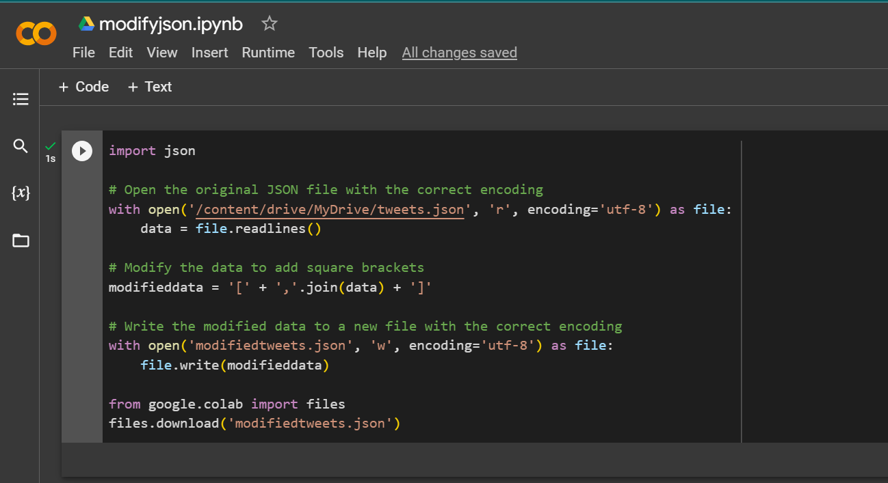
   * Modified JSON file :[modifiedtweets.json](https://github.com/drshahizan/SECP3843/blob/main/submission/raihanarahim/question2/files/modifiedtweets.json) 
2. Install the required software.
* MongoDB Community Server Download : [Link](https://www.mongodb.com/try/download/community)
* MongoDB Shell Download : [Link](https://www.mongodb.com/try/download/shell)
* MongoDB Command Line Database Tools Download : [Link](https://www.mongodb.com/try/download/database-tools)
3. Start the MongoDB server
* After downloading the software, copy the files and paste into `C:\Program Files\MongoDB\Server\6.0\bin`. It should look like this :
  
* Next, navigate to your local command prompt and go to Mongodb Server directory `C:\Program Files\MongoDB\Server\6.0\bin`.
  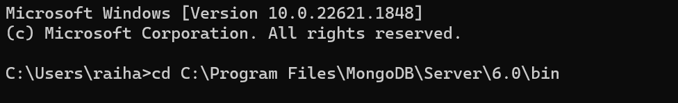
* Then, type `mongosh` in command prompt as below : 
  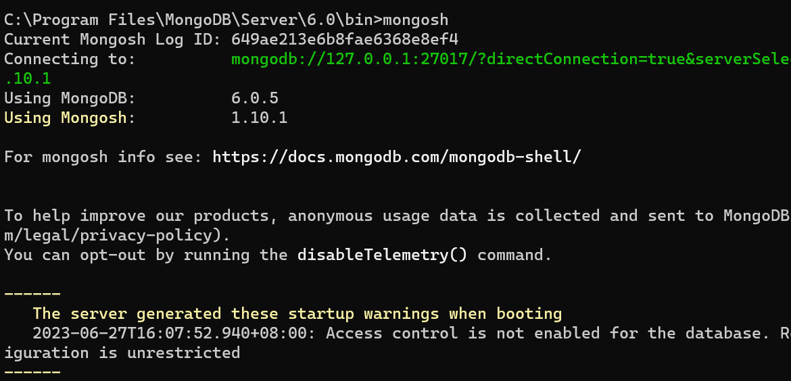
* Change the database used by running this command `use tweets`. 
  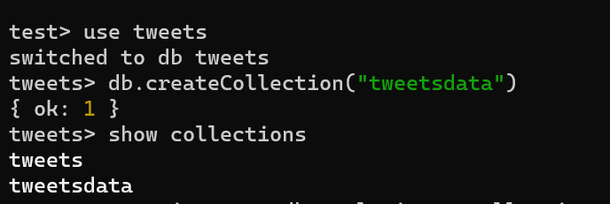
* Then, proceed to importing the JSON file by using this `mongoimport` command. In the command we specify the database : `tweets` and the collections : `tweetsdata` 
  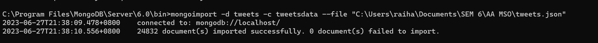
* Check in Mongodb Compass to ensure the file have been imported succesfully.
  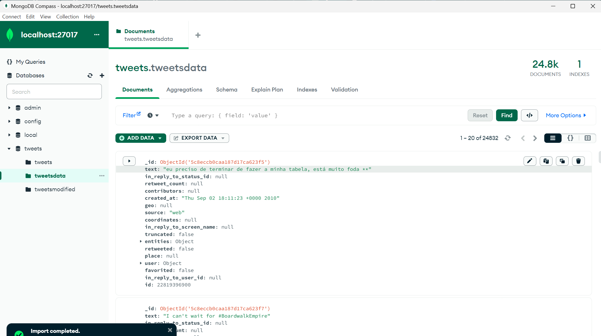
* tweets JSON dataset imported succesfully!
## Question 2 (b)
## Five MongoDB Queries

Go to command prompt and run the `mongosh` command to continue with querying MongoDB data.

### Create
 * To create or insert in MongoDB there are 2 methods which are 
	* `insertOne()` : This method insert a single object.
	* `insertMany()` : This method insert array of objects.
 * I will use the `insertOne()` method. Below is the command to use this method :
   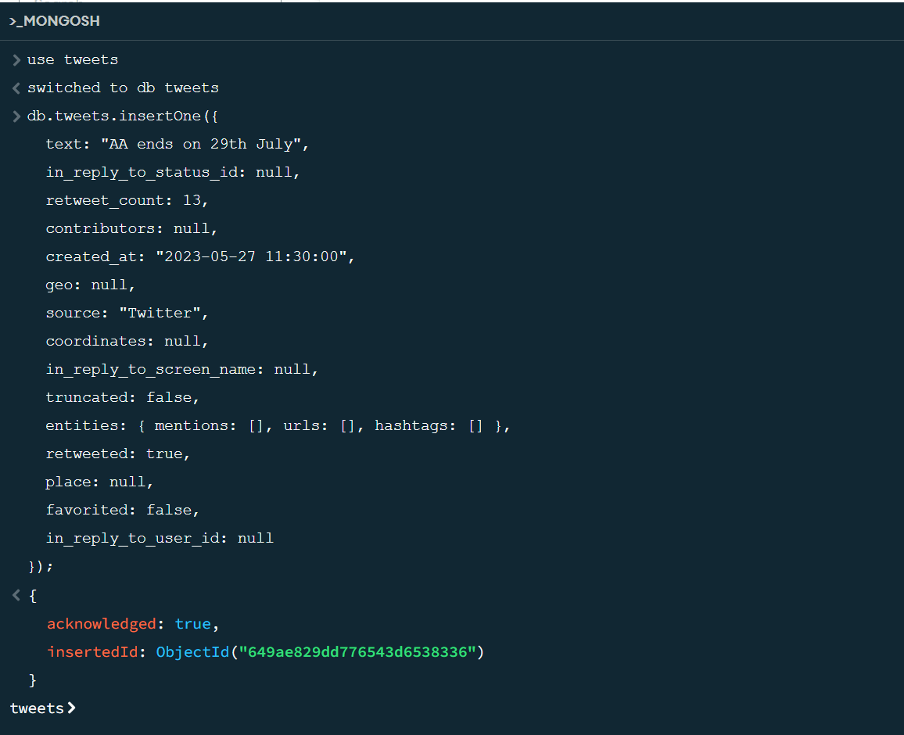
 * The data inserted succefully into the tweets database.
   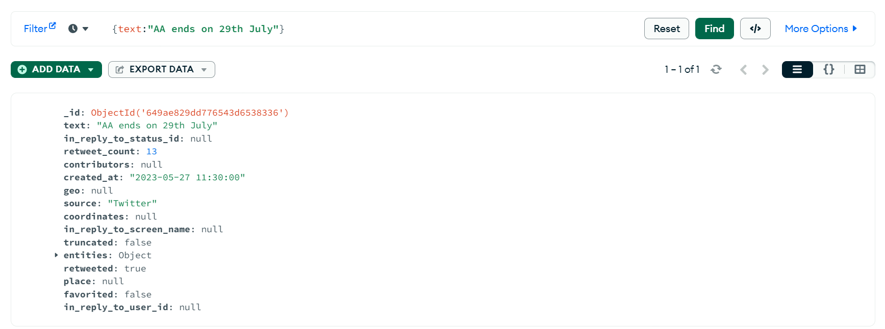

### Read
 * To read data from MongoDB, I use the `find()` method.
 * I wanted to find this ` id : 22819398000 `from the database.
 * Below is the command to find the id and results :
   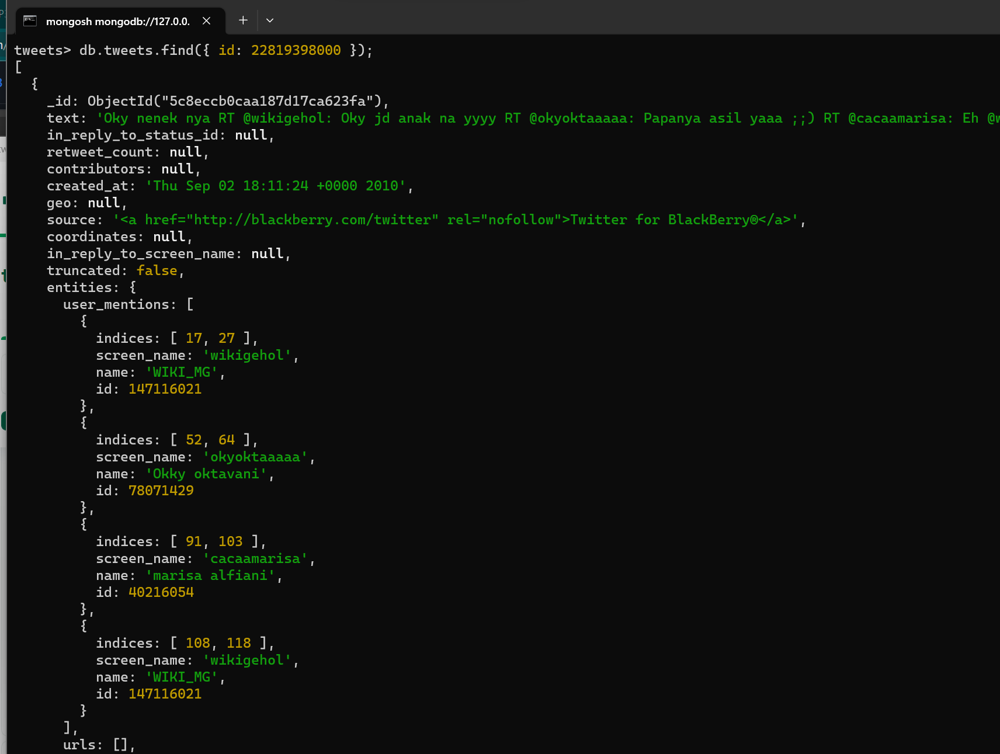
 * To ensure that the data exist, check in MongoDB Compass :
   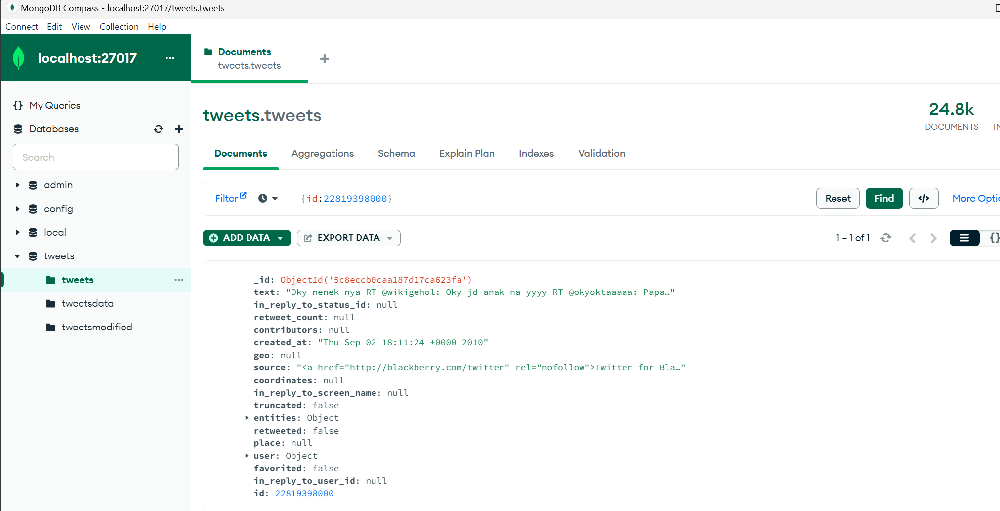
   
### Update
In MongoDB the are 2 methods to update your database which are 
	* `updateOne()` : This method update only one object. 
	* `updateMany()` : This method update array of objects. 
  I am going to demonstrate using both of the methods.

1. Update `id : 22819398000 ` and set `contributors = 2` using `updateOne()` method  
   i) In Mongosh, run the command below by specifying the id and what attributes you wish to      update :
 
  ii) Before the update command :
 
  iii) After the update command :
 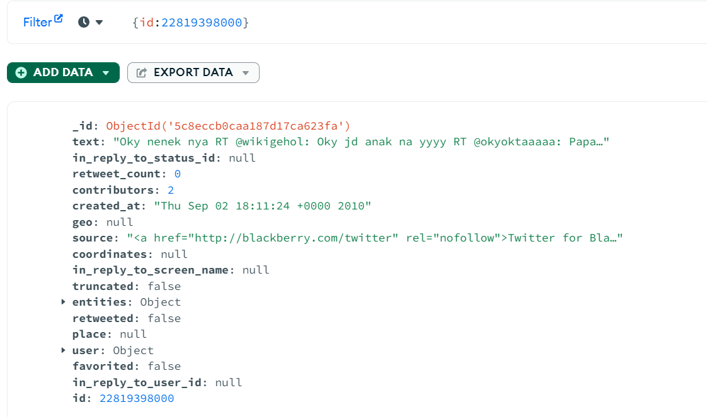
  iv) Succesfully updated the object!  
 
2. Update ` retweet_count: null ` and set `retweet_count: 0` using `updateMany()` method  
   i) In Mongosh, run the command below by specifying attributes you wish to      update :
 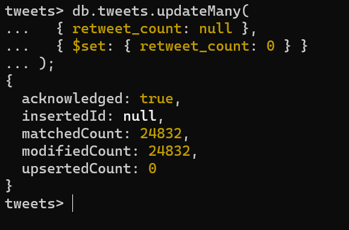
  ii) Before the update command :
 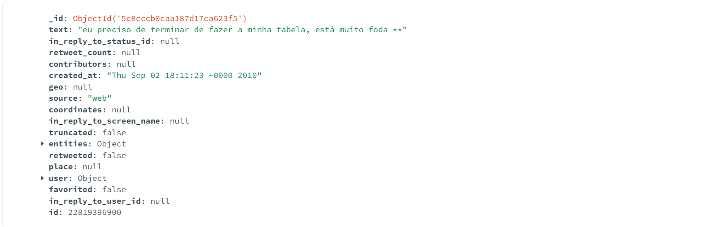
  iii) After the update command :
 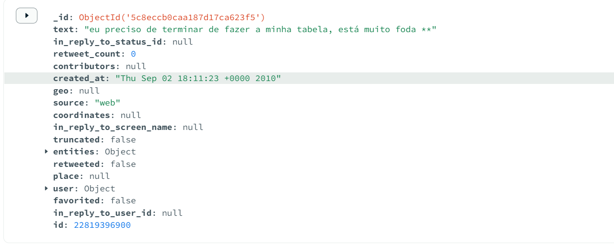
  iv) Succesfully updated the object!

### Delete
 * To delete data from MongoDB, I use the `deleteOne()` method.
 * I wanted to delete this ` id : 22819397800 `from the database.
 * Below is the command to delete the id and the result:
    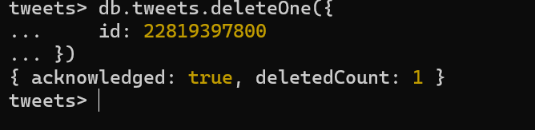
 * Before the delete command  : 
    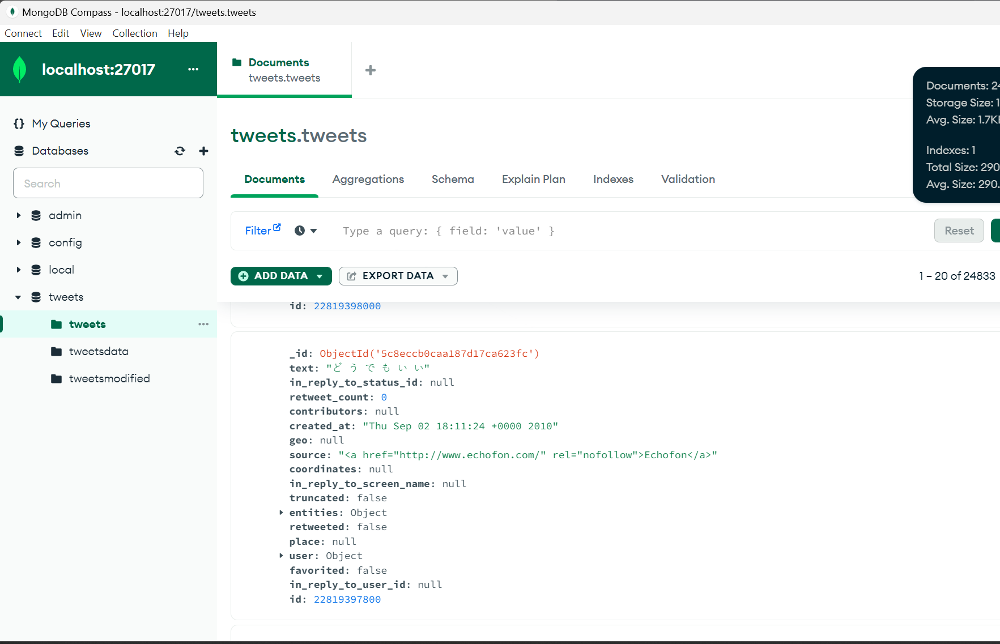
 * After the delete command  : 
    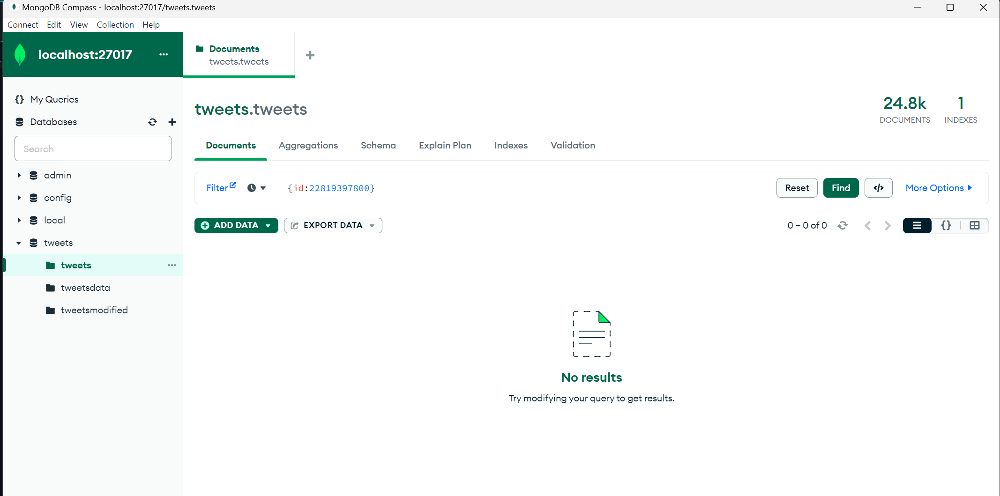\
 * Succesfully deleted the object!

## Contribution 🛠️
Please create an [Issue](https://github.com/drshahizan/special-topic-data-engineering/issues) for any improvements, suggestions or errors in the content.

You can also contact me using [Linkedin](https://www.linkedin.com/in/drshahizan/) for any other queries or feedback.

