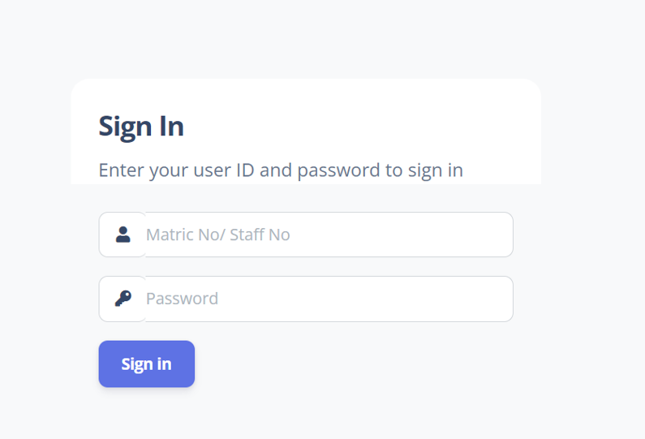

<a href="https://github.com/drshahizan/SECP3843/stargazers"></a>
<a href="https://github.com/drshahizan/SECP3843/network/members"></a>
<a href="https://github.com/drshahizan/SECP3843/pulls"></a>
<a href="https://github.com/drshahizan/SECP3843/issues"></a>
<a href="https://github.com/drshahizan/SECP3843/graphs/contributors"></a>


Don't forget to hit the :star: if you like this repo.

# Special Topic Data Engineering (SECP3843): Alternative Assessment

#### Name: Amirah Raihanah binti Abdul Rahim
#### Matric No.: A20EC0182
#### Dataset: Tweets

## Question 3 (a)
### Steps to create user registration and login module on web server (Django) and database (MySQL).
1. Setup Django project using command prompt by installing django and also MySQL connector using pip installation
```
pip install django
pip install mysqlclient
```
2. Create a project file. In this case, I named my file as `tweetsproject`. Run the following command to create :
 ```
django-admin startproject tweetsproject
```
3. Next, configure the MySQL database connection by adding credentials in `settings.py` located in project file. This is because the default database for Django is dbsqlite hence configuration need to be done.The `ENGINE` value is where we define what database we are using for our project. Below is the example configuration :
 ```
DATABASES = {
    'default': {
        'ENGINE': 'django.db.backends.mysql',
        'NAME': 'tweetsproject',
        'HOST': 'localhost',
        'PORT': '3306',
        'USER': 'root',
        'PASSWORD': '',
    }
}
```
4. After succesfully configure the database, create a new app in your Django project file by running the command below :
 ```
python manage.py startapp tweetsapp
```
5. Define models to store the user attributes for login and register module.<br>
   Example of attributes needed are :
* `username` : store user's name
* `user id` : unique identifier for each user
* `user password` : authorization for every user to access the system
* `user role` : to differentiate roles of user
  <br>
  * Defining models are based on the requirement of the specific system. Any additional attributes can be added too.
  * Django application provides a built-in user authentication and authorization which makes it easier compared to defining it from scratch. You can also modify based on your requirements as it is flexible.
* Below is an instance on how to define models :
 ```
class TechnicalWorker(AbstractBaseUser, PermissionsMixin):
    email = models.EmailField(unique=True)
    username = models.CharField(max_length=150, unique=True)
    name = models.CharField(max_length=255)
    is_active = models.BooleanField(default=True)
    is_staff = models.BooleanField(default=False)

    objects = UserManager()

    USERNAME_FIELD = 'email'
    REQUIRED_FIELDS = ['username', 'name']

    def __str__(self):
        return self.email

    def get_full_name(self):
        return self.name

    def get_short_name(self):
        return self.username
```
6. Run migrations to create database tables corresponding to the models that have been created. The command is as follows :

 ```
python manage.py makemigrations
python manage.py migrate

```
<br>
These 2 commands will create tables in mySQL and its schema.

7. After configuring the Django and MySQL, now we create the view file to handle the login or register request from users.
* The process of this module requires input validation, create new objects, retrieving and storing in database.
* The logic need to be implemented correctly to cater each of these process to ensure only authorized and authenticated are able to access the system.
* Below I provide an example of view method to register user using Django built-in `User` model :
 ```
def register(request):
    if request.method == 'POST':
        username = request.POST['username']
        password = request.POST['password']
        confirm_password = request.POST['confirm_password']

        # Validation
        if password != confirm_password:
            return render(request, 'registration/register.html', {'error': 'Passwords do not match'})

        if User.objects.filter(username=username).exists():
            return render(request, 'registration/register.html', {'error': 'Username already exists'})

        # Create a new user
        user = User.objects.create_user(username=username, password=password)
        user.save()

        # Log in the user after registration
        login(request, user)
        return redirect('home')  # Redirect to home page after successful registration

    return render(request, 'registration/register.html')

```
8. Since Django uses MVT (Models-Views-Templates), we have discussed on Models and Views. Now, we will create Templates for login and registration.
* Templates can be customize according to your preferences and creativity. Create HTML templates for both login and register in the project's template file. Django will then render the forms to handle user's request.
* Code snippet of Login template :
 ```
<form action="action_page.php" method="post">
  <div class="imgcontainer">
    
  </div>

  <div class="container">
    <label for="uname"><b>Username</b></label>
    <input type="text" placeholder="Enter Username" name="uname" required>

    <label for="psw"><b>Password</b></label>
    <input type="password" placeholder="Enter Password" name="psw" required>

    <button type="submit">Login</button>
    <label>
      <input type="checkbox" checked="checked" name="remember"> Remember me
    </label>
  </div>

  <div class="container" style="background-color:#f1f1f1">
    <button type="button" class="cancelbtn">Cancel</button>
    <span class="psw">Forgot <a href="#">password?</a></span>
  </div>
</form>

```
Example of rendered Login page.<br>
<br>


9. Next, we need to configure `urls.py` to ensure correct routing between pages. This is to define which page user redirected to. It will map URLs to the corresponding view.
* Example on how URLs are defined in `urls.py`
 ```
from django.contrib import admin
from django.urls import path, include
from django.conf import settings
from django.conf.urls.static import static
from customer.views import Index, About

urlpatterns = [
    path('admin/', admin.site.urls),
    path('accounts/', include('allauth.urls')),
    path('', Index.as_view(), name='index'),
    path('about/', About.as_view(), name='about'),


```
10. Lastly, test your module to ensure the login and register view are rendered correctly and the process has no error. User credentials can be stored and retrieved from database. These are the steps to create user authetication module using Django and MySQL database.

## Question 3 (b)
 To overcome the challenges of Data Replication and Synchronization between MongoDB and MySQL databases, I will be using database-specific replications techniques. The technique I'm using is `Capturing database changes with Debezium Apache Kafka connectors`.<br>
 Debezium is an open-source distributed platform dor change data capture(CDC) and provides connectors for various databases including MySQL and MongoDB.
 
### Steps using Debezium with Apache Kafka Connectors.

Consider the following scenario where the tweets data are stored in MongoDB and MySQL stores user information data. I'm going to use Debezium to capture changes made on the databases then streaming the change events to Kafka topic.

1. Install Debezium using pip installer on your command prompt.
```
pip install debezium
```
2. Configure Debezium to capture changes.
* Configuration for MongoDB
```
connector.class=io.debezium.connector.mongodb.MongoDbConnector
mongodb.connection.string=mongodb://localhost:27017
topic.prefix=tweets

```
* Configuration for MySQL
```
connector.class=io.debezium.connector.mysql.MySqlConnector
database.hostname=localhost
database.port=3306
database.user=root
database.password=password
database.server.id=1
database.server.name=my-db
topic.prefix=my-users

```
*Start Debezium MySQL connector using the command :
```
./bin/connect-standalone.sh ./config/connect-standalone.properties ./config/mysql-connector.properties

```
* Configure MongoDB Sink Connector
  * Download and install MongoDB Kafka Connector using the command :
 ```
confluent-hub install mongodb/kafka-connect-mongodb:1.5.2

```
* Start MongoDB Sink Connector using the following command :
```
./bin/connect-standalone.sh ./config/connect-standalone.properties ./config/mongodb-connector.properties

```
3. Configure Apache Kafka to receive the change events
* Firstly, start Kafka server by running this command :
```
kafka-server-start /etc/kafka/server.properties

```
* Create your desired Kafka topic to store the change events.
```
kafka-topics --create --bootstrap-server localhost:9092 --topic tweets

```
4. Write a consumer to process the change events.
```
try:
    while True:
        msg = consumer.poll(timeout=1.0)

        if msg is None:
            continue
        if msg.error():
            if msg.error().code() == KafkaError._PARTITION_EOF:
                continue
            else:
                print(msg.error())
                break

        print('Received message:')
        print(f"Before: {msg.value().decode('utf-8')['before']}")
        print(f"After: {msg.value().decode('utf-8')['after']}")
        print(f"Source: {msg.value().decode('utf-8')['source']}")
        print(f"Operation: {msg.value().decode('utf-8')['op']}")
        print(f"Timestamp: {msg.value().decode('utf-8')['ts_ms']}")
        print()

except KeyboardInterrupt:
    pass

finally:
    consumer.close()


```
5. Start Debezium by running this command :
```
debezium-server

```
Output of the Kafka consumer script to process the change events:
```
Received message:
Before: {'id': 1, 'name': 'Amirah Raihanah', 'email': 'raihanah@gmail.com'}
After: {'id': 1, 'name': 'Amirah Raihanah', 'email': 'raihanah@gmail.com'}
Source: {'version': '1.6.1.Final', 'connector': 'mysql', 'name': 'mysql_server', 'ts_ms': 1675490511000, 'snapshot': 'false', 'db': 'aaproject', 'table': 'user', 'server_id': 1, 'gtid': None, 'file': 'mysql-bin.000001', 'pos': 154, 'row': 0, 'thread': 15, 'query': None}
Operation: c
Timestamp: 1675490511534

Received message:
Before: {'id': 2, 'name': 'Myza Nazifa', 'email': 'myzanazifah@gmail.com'}
After: {'id': 2, 'name': 'Myza Nazifa', 'email': 'myzanazifah@gmail.com'}
Source: {'version': '1.6.1.Final', 'connector': 'mysql', 'name': 'mysql_server', 'ts_ms': 1675490523000, 'snapshot': 'false', 'db': 'aaproject', 'table': 'user', 'server_id': 1, 'gtid': None, 'file': 'mysql-bin.000001', 'pos': 349, 'row': 0, 'thread': 15, 'query': None}
Operation: c
Timestamp: 1675490523528

Received message:
Before: {'id': 1, 'name': 'Ali Ahmad', 'email': 'aliahmad@gmail.com'}
After: {'id': 1, 'name': 'Ali Ahmad', 'email': 'aliahmad@gmail.com'}
Source: {'version': '1.6.1.Final', 'connector': 'mysql', 'name': 'mysql_server', 'ts_ms': 1675490537000, 'snapshot': 'false', 'db': 'aaproject', 'table': 'user', 'server_id': 1, 'gtid': None, 'file': 'mysql-bin.000001', 'pos': 536, 'row': 0, 'thread': 15, 'query': None}
Operation: u
Timestamp: 167549053757


```

By following the provided steps and adapting the code snippets to the specific setup and requirements, we can effectively capture data changes from your MySQL database using Debezium, replicate those changes to MongoDB through Apache Kafka, and further process them using a Kafka consumer written in Python. This approach allows for real-time data synchronization and enables to perform custom logic or transformations on the change events before updating the MongoDB database.


## Contribution 🛠️
Please create an [Issue](https://github.com/drshahizan/special-topic-data-engineering/issues) for any improvements, suggestions or errors in the content.

You can also contact me using [Linkedin](https://www.linkedin.com/in/drshahizan/) for any other queries or feedback.

[](https://visitorbadge.io/status?path=https%3A%2F%2Fgithub.com%2Fdrshahizan)


