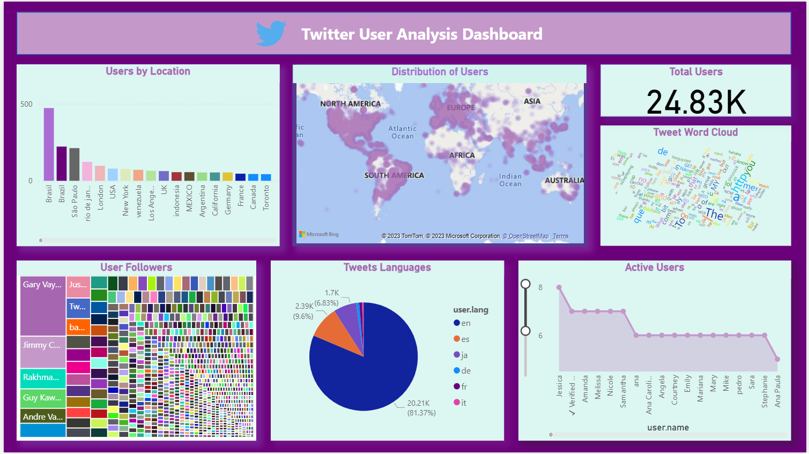

<a href="https://github.com/drshahizan/SECP3843/stargazers"></a>
<a href="https://github.com/drshahizan/SECP3843/network/members"></a>
<a href="https://github.com/drshahizan/SECP3843/pulls"></a>
<a href="https://github.com/drshahizan/SECP3843/issues"></a>
<a href="https://github.com/drshahizan/SECP3843/graphs/contributors"></a>


Don't forget to hit the :star: if you like this repo.

# Special Topic Data Engineering (SECP3843): Alternative Assessment

#### Name: Amirah Raihanah binti Abdul Rahim
#### Matric No.: A20EC0182
#### Dataset: Tweets

## Question 5 (a)
### Optimizing Portal Performance when dealing with large volume JSON dataset.

1. `Data Cleaning and Processing` : Remove unecessary column that will not be use in the visualizations. Also, remove unwanted character and standardize the format of the dataset.

2. `Use streaming JSON parser` : Instead of loading the entire file, the JSON parser will only parse the receiving data.

3. `Use JSON caching` : This will allow the portal to use cache data compared to requesting data everytime which is time consuming and not effective.

4. `Use suitable library to process the data` : There are many libraries that can cater the size of your data. For instance Dask, Modin, PySpark and Koalas

### 1. Data Cleaning and Processing

* Remove unused column to reduce the size of dataset.
Take this scenario where I want to analyze and visualize `user` details data from the Tweets JSON dataset. Hence I will drop all other columns.
<br>
Steps :

i) Import the JSON file 
```py
import pandas as pd

# Load the JSON file into a DataFrame
data = '/content/drive/MyDrive/tweetsmodified.json'
df = pd.read_json(data)

# View the DataFrame

pd.set_option('display.max_columns', None)
df.head(5)
```


ii) Check the initial JSON file size : 

```py
import os
import math

# Save the DataFrame as a JSON file
df.to_json('data_output.json')

# Get the file size of the JSON file
file_size = os.path.getsize('data_output.json')

# Convert the file size to a human-readable format
def convert_size(size_bytes):
    # 2**10 = 1024
    if size_bytes == 0:
        return "0B"
    size_name = ("B", "KB", "MB", "GB", "TB", "PB", "EB", "ZB", "YB")
    i = int(math.floor(math.log(size_bytes, 1024)))
    p = math.pow(1024, i)
    s = round(size_bytes / p, 2)
    return f"{s} {size_name[i]}"

# Print the file size
print(f"JSON file size: {convert_size(file_size)}")
```


iii) Then, drop the other columns.

```py
# Select only the 'user' column
df_user = df[['user']].copy()

# Drop all other columns
df_user.drop(df_user.columns.difference(['user']), axis=1, inplace=True)

# Print the updated DataFrame
print(df_user)
```


iv) After other columns has dropped, check again the file size.


```py
# Save the DataFrame as a JSON file
df_user.to_json('data_output2.json')

# Get the file size of the JSON file
file_size = os.path.getsize('data_output2.json')

# Convert the file size to a human-readable format
def convert_size(size_bytes):
    # 2**10 = 1024
    if size_bytes == 0:
        return "0B"
    size_name = ("B", "KB", "MB", "GB", "TB", "PB", "EB", "ZB", "YB")
    i = int(math.floor(math.log(size_bytes, 1024)))
    p = math.pow(1024, i)
    s = round(size_bytes / p, 2)
    return f"{s} {size_name[i]}"

# Print the file size
print(f"JSON file size: {convert_size(file_size)}")
```


> According to the code above, after dropping the other columns the file size from `46.45MB` has reduced to `28.29MB`. Thus, this will optimize the performance of the Portal as it does not need to load large volume JSON data.

### 2. Use streaming JSON parser

* Instead of loading the entire JSON data, streaming parsers parse the JSON data after being received. This help to reduce memory usage and also improve the parsing speed.
<br>
Steps :

i) Load the JSON data.
```py
import pandas as pd

# Load the JSON file into a DataFrame
data = '/content/drive/MyDrive/tweetsmodified.json'
df = pd.read_json(data)

# View the DataFrame

pd.set_option('display.max_columns', None)
df.head(5)
```


ii) Run the following code to parse the JSON file.
```py
import json

def parse_json_stream(json_data):
    parser = json.JSONDecoder()
    buffer = ""
    
    for chunk in json_data:
        buffer += chunk
        try:
            while buffer:
                obj, idx = parser.raw_decode(buffer)
                yield obj
                buffer = buffer[idx:].lstrip()
        except json.JSONDecodeError:
            # Incomplete JSON, wait for more data
            continue
    
    # Handle any remaining buffered data
    if buffer:
        obj, _ = parser.raw_decode(buffer)
        yield obj

# Example usage
with open('/content/drive/MyDrive/tweetsmodified.json', 'r') as file:
    json_data_chunks = file.readlines()

# Simulating receiving JSON data in chunks
for obj in parse_json_stream(json_data_chunks):
    print(obj)
```
> JSON data succesfully parsed thus we can see that  less time taken needed to accomplish parsing.

### 3. Use JSON caching
* Caching JSON data will reduce the time taken to fetch data. This is because it will retrieve the data from cache instead of having to retrieve from memory. This caching method will improve portal performance significantly.
<br>
Steps :

i) Choose caching mechanism

* In this example, we will use Redis as our caching mechanism. The configuration is to have 100 items, time to live of 1 minute and LRU as the eviction policy.
```py
import redis

cache = redis.Redis()

# Set the size of the cache to 100 items
cache.set_max_entries(100)

# Set the time to live for cached items to 1 minute
cache.set_expire(60)

# Set the eviction policy to LRU
cache.set_eviction_policy('lru')
```

ii) Use the cached memory

* To use the cache memory, we will implement the code below. The code below shows that it will first check the data if it has been cached or not. If its not cached, it will retrieve from the database.

```py
import redis

cache = redis.Redis()

def get_data(key):
    data = cache.get(key)
    if data is None:
        data = fetch_data_from_database(key)
        cache.set(key, data)
    return data
```
> Caching data in the portal will improve performance by retrieving it much more quickly than fetching it from the database.

### 4. Use suitable library to process the data


## Question 5 (b)
### Dashboard on Tweets dataset.

In my case, I am assigned to Tweets Dataset. The dataset consist of  data regarding tweets such as user who posted it, when the tweet's posted, engagement on the tweet and user's details. I decided to create a dashboard to analyze user's data. The title of my dashboard is `Twitter User Analysis Dashboard`.
<br>
<div align="center">
  
</div>
<br>
Referring to the dashboard above there are 7 visualizations.

1. Total Users

* This card represent the number of users in the dataset. The analysis is based on these 24,8300 Twitter users.
  
2. Users by Location
   
* This visualization mainly focuses on analyzing Users and its location. Based on the graph, we can see that the highest Twitter Users are from Brazil with 472 records and the lowest one is from Toronto with 43 records. 
<br>
<br>

3. Distribution of Users
   
* Next, we will get more detailed view on the distribution of users. As you can see from the visualization above, the distribution is represented by heatmap. The darker the purple colour, the bigger the  user distribution are in that place. As you can tell, the users are widely distributed in South America which correlate with our users by location graph. This is because Brasil in in South America.

* You can also see detailed location of a user by filtering to `Jimmmy Carr`. Then the map will show exact location of the user :
 

4. Tweet Word Cloud
   
* The word cloud is to analyze what are the most used word in user's Tweet. The word cloud above has filtered out stop words. Since not all users uses the same language so we cannot get a good word cloud.

* The most used word are :
  * `The`
  * `to`
  * `MY`
  * `You`
  * `HTTP`
    
5. User Followers

* Next, we will analyze User Followers to determine which user has the highest followers. 
It is found out that Gary Vaynerchuk has the highest followers, 854199 compared to the other users. This visualization is important to help us get insights on what makes the particular user has many followers.<br>


6. Tweets Languages
    
* Since there are worlwide users in Twitter. I wanted to know what are the most used language in Twiter. To accomplish this, I use column `user.lang` and `user.name`. Pie chart is choosen to visualize the data and it shows that English is the main language used in Twitter.<br>
  

7. Active Users
* Lastly, I would like to analyze on which users are active and which are not. To accomplish this, I used `user.favourites` and `user.following` as our features. Assumption made is: if the user has higher number of favourites  have higher following count the user is considered as active.This is because if user spend more time on Twitter, they will likely have more following and higher number of favourites.<br>


## Dashboard file
[Complete Dashboard on PowerBI](https://github.com/drshahizan/SECP3843/blob/main/submission/raihanarahim/question5/files/AAQ5.pbix)

## Contribution 🛠️
Please create an [Issue](https://github.com/drshahizan/special-topic-data-engineering/issues) for any improvements, suggestions or errors in the content.

You can also contact me using [Linkedin](https://www.linkedin.com/in/drshahizan/) for any other queries or feedback.

[](https://visitorbadge.io/status?path=https%3A%2F%2Fgithub.com%2Fdrshahizan)


