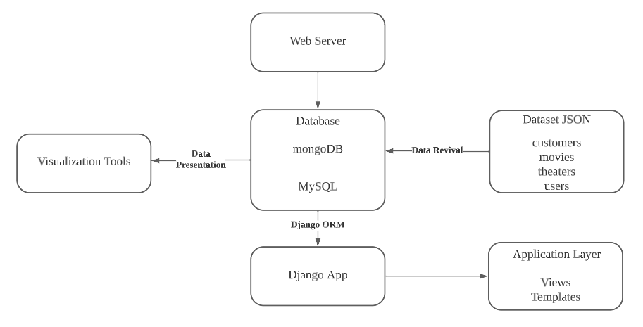

<a href="https://github.com/drshahizan/SECP3843/stargazers"></a>
<a href="https://github.com/drshahizan/SECP3843/network/members"></a>
<a href="https://github.com/drshahizan/SECP3843/pulls"></a>
<a href="https://github.com/drshahizan/SECP3843/issues"></a>
<a href="https://github.com/drshahizan/SECP3843/graphs/contributors"></a>


Don't forget to hit the :star: if you like this repo.
# Special Topic Data Engineering (SECP3843): Alternative Assessment

#### Name: Luqman Ariff Bin Noor Azhar
#### Matric No.: A20EC0202
#### Dataset: 03 - Movies

## Question 1 (a)
#### Step 1: Set up the Development Environment
1. Install Python: Ensure that Python is installed on all five servers used in the project. Python can be downloaded from the official Python website. An Integrated Development Environment (IDE) would also be needed in order to make any tweaks necessary. The one we will be using is Visual Studio Code which can be downloaded from their official website.

2. Install Django: Use pip, the Python package manager, to install Django on each server. Open a terminal or command prompt to run the following command:
```
pip install django
```

3. Install Required Packages: Install any additional packages or dependencies required for integrating Django with MySQL and MongoDB. For MySQL, you need to install the `mysqlclient` package, and the `djongo` package for MongoDB. Run the following commands in the terminal or command prompt we have just opened:
 ```
 pip install mysqlclient
 pip install djongo
 ```
#### Step 2: Set up the Django Project
1. Create a Django Project: Use the Django command-line tool to create a new Django project. There are plenty of existing Django projects online, use whichever you see the most suitable for your goal. Run the following command and do not forget to replace `project_name` with your actual project name:
```
django-admin startproject project_name
```

2. Create Django App: Inside the project directory, create a new Django app. This will handle all the portal's functionalities. Run the following command:
```
python manage.py startapp app_name
```

3. Configure Database Connections: In the project's `settings.py` file, configure the database connections for both MySQL and MongoDB. Provide the necessary credentials and connection details for each database. Django uses the DATABASES setting to define multiple database connections. It should look like this example:
```
 DATABASES = {
    'default': {
        'ENGINE': 'django.db.backends.postgresql',
        'NAME': 'project_name’,
        'USER': 'postgres',
        'PASSWORD': '1234',
        'HOST': 'localhost',
        'PORT': '5432',
    },
    'mysql': {
        'ENGINE': 'django.db.backends.mysql',
        'NAME': 'your_mysql_database',
        'USER': 'mysql_user',
        'PASSWORD': 'mysql_password',
        'HOST': 'mysql_host',
        'PORT': 'mysql_port',
    },
    'mongodb': {
        'ENGINE': 'djongo',
        'NAME': 'your_mongodb_database',
        'CLIENT': {
            'host': 'mongodb_host',
            'port': 'mongodb_port',
            'username': 'mongodb_user',
            'password': 'mongodb_password',
            'authSource': 'admin',
        }
    }
}

```
#### Step 3: Define Models and Migrations
1. Define Models: Create Django models that represent the tables in the MySQL and MongoDB databases. Define fields and relationships based on the dataset's table structures. It should look like this example:
```
from django.db import models
from djongo import models as djongo_models

class Comment(models.Model):
    name = models.CharField(max_length=255)
    email = models.EmailField()
    movie_id = models.ObjectIdField()
    text = models.TextField()
    date = models.DateTimeField()

class Movie(models.Model):
    plot = models.TextField()
    genres = models.ArrayField(models.CharField(max_length=255))
    runtime = models.IntegerField()
    cast = models.ArrayField(models.CharField(max_length=255))
    num_mflix_comments = models.IntegerField()
    title = models.CharField(max_length=255)
    fullplot = models.TextField()
    countries = models.ArrayField(models.CharField(max_length=255))
    released = models.DateField()
    directors = models.ArrayField(models.CharField(max_length=255))
    rated = models.CharField(max_length=255)
    awards = models.JSONField()
    lastupdated = models.CharField(max_length=255)
    year = models.IntegerField()
    imdb = models.JSONField()
    type = models.CharField(max_length=255)
    tomatoes = models.JSONField()

class Theater(models.Model):
    theaterId = models.IntegerField()
    location = models.JSONField()

class User(models.Model):
    name = models.CharField(max_length=255)
    email = models.EmailField()
    password = models.CharField(max_length=255)
```

2. Generate Migrations: Run the following command to generate Django database migrations based on the models we have defined previously:
```
python manage.py makemigrations
```

3. Apply Migrations: Apply the migrations to create the necessary tables in both MySQL and MongoDB. Run the following command:
```
python manage.py migrate
```
#### Step 4: JSON Data Handling and Storage
1. Parse and Import JSON Data: Write a script or Django management command to parse the JSON dataset and import the data into the appropriate models. Use Django's ORM to save the data to both MySQL and MongoDB databases. Iterate over the JSON dataset, extract the relevant fields, create model instances, and save them to the respective databases.
2. Create Django management command file: We will parse and import the JSON dataset into a file called `import_data.py`. It should look like the below example:
```
import json
from django.core.management.base import BaseCommand
from project_name.models import Comment, Movie, Theater, User
```
3. Define:
```
 class Command(BaseCommand):
    help = 'Import data from JSON dataset'

    def handle(self, *args, **options):
        # Specify the path to your JSON dataset
        json_file = 'path/to/your/json_dataset.json'

        # Open and load the JSON file
        with open(json_file, 'r') as file:
            data = json.load(file)

        # Iterate over the JSON dataset
        for item in data:
            # Extract relevant fields from the JSON item
            comment_data = {
                'name': item['name'],
                'email': item['email'],
                'movie_id': item['movie_id'],
                'text': item['text'],
                'date': item['date']
            }

            # Create Comment model instance and save it to both MySQL and MongoDB
            comment = Comment(**comment_data)
            comment.save(using='default')
            comment.save(using='mongodb')

            # Extract relevant fields from the JSON item
            movie_data = {
                'plot': item['plot'],
                'genres': item['genres'],
                'runtime': item['runtime'],
                'cast': item['cast'],
                'num_mflix_comments': item['num_mflix_comments'],
                'title': item['title'],
                'fullplot': item['fullplot'],
                'countries': item['countries'],
                'released': item['released'],
                'directors': item['directors'],
                'rated': item['rated'],
                'awards': item['awards'],
                'lastupdated': item['lastupdated'],
                'year': item['year'],
                'imdb': item['imdb'],
                'type': item['type'],
                'tomatoes': item['tomatoes']
            }

            # Create Movie model instance and save it to both MySQL and MongoDB
            movie = Movie(**movie_data)
            movie.save(using='default')
            movie.save(using='mongodb')

            # Repeat the same process for Theater and User models

        self.stdout.write(self.style.SUCCESS('Data imported successfully!'))
```
4. Run the management command:
```
python manage.py import_data
```
#### Step 5: Query and Retrieve Data
1. Query Data from MySQL: Use Django's ORM to query and retrieve data from the MySQL database. Write Django queries or use the provided API endpoints to fetch specific data based on user requirements. It should like this example:
```
from project_name.models import Comment, Movie
# Query all comments with a specific email address
comments = Comment.objects.using('mongodb').filter(email='example@example.com')

# Query all movies with a specific genre
movies = Movie.objects.using('mongodb').filter(genres__contains=’Drama’)

# Query a single movie based on its title
movie = Movie.objects.using('mongodb').get(title='Civilization')
```


2. Query Data from MongoDB: Use Django's ORM with the djongo package to query and retrieve data from the MongoDB database. Use Django's queryset methods to filter and retrieve data from MongoDB collections.
```
from project_name.models import Comment, Movie
# Query all comments with a specific email address
comments = Comment.objects.using('mongodb').filter(movie_id='movie_id_value')

# Query all movies with a specific genre
movies = Movie.objects.using('mongodb').filter(genres__contains=’Drama’)

# Query a single movie based on its title
movie = Movie.objects.using('mongodb').get(title='Civilization')
```
#### Step 6: View and Template Integration
1. Create Views: Define views in Django that handle the logic for fetching data from both MySQL and MongoDB databases. Write view functions or classes that query the data and pass it to the templates for rendering. It should look like this example which is a function that displays the details of a movie based on its movie_id:
```
from django.shortcuts import render
from your_app.models import Comment, Movie

def movie_details(request, movie_id):
    # Query the movie details from MySQL
    movie = Movie.objects.get(id=movie_id)

    # Query the comments for the movie from MongoDB
    comments = Comment.objects.using('mongodb').filter(movie_id=movie_id)

    # Pass the retrieved data to the template for rendering
    return render(request, 'movie_details.html', {'movie': movie, 'comments': comments})
```

2. Create Templates: Design and create HTML templates that define the structure and presentation of the web pages. Integrate the data fetched from the databases into the templates to dynamically generate content. It should look like this example:
```
<h1>{{ movie.title }}</h1>
<p>{{ movie.plot }}</p>

<h2>Comments:</h2>
<ul>
  
    <li>{{ comment.text }}</li>
  
</ul>
```
#### Step 7: Routing and URL Configuration
1. Define URLs: Set up URL patterns in Django's urls.py file to map incoming requests to the appropriate views. Define URL patterns for different pages and API endpoints based on the portal's requirements. Open the `urls.py` file and implement this example into your file:
```
from django.urls import path
from your_app import views

urlpatterns = [
    # URL pattern for the movie details page
    path('movies/<str:movie_id>/', views.movie_details, name='movie_details'),

    # URL pattern for an API endpoint to retrieve comments for a movie
    path('api/movies/<str:movie_id>/comments/', views.movie_comments_api, name='movie_comments_api'),
]
```


## Question 1 (b)

#### Architecture Components
1. User Interface

User interface refers to the methods through which a user interacts with a computer system, software application, or electronic device. It encompasses all the components and elements that allow users to input commands, navigate functionalities, and receive system feedback. The main purpose of a user interface is to facilitate effective communication and interaction between the user and the system.

2. Django Web Server

The Django Web Server handles HTTP requests, processes them, and generates dynamic web pages. It utilizes Django's URL routing, request handling, session management, and template rendering capabilities.

3. Database Server

The Database Server consists of two components: MySQL Database and MongoDB Database. The MySQL Database stores and manages structured data, such as user information, and utilizes SQL queries for data retrieval and manipulation. On the other hand, the MongoDB Database stores and manages a JSON dataset with varying structures and nested data. It follows a document-oriented model and employs MongoDB queries for data retrieval and manipulation.

4. JSON Dataset

Consists of four datasets, comments, movies, theaters, and users.

5. Django App

The Django App represents the Django application that integrates the JSON dataset, MySQL, and MongoDB. It defines models to represent the JSON dataset and interact with the databases. The Django ORM (Object-Relational Mapping) is used for database operations and data retrieval.

6. Applications Layer

The Applications Layer consists of Views and Templates. Views handle user requests, retrieve data from the databases, and pass it to the templates. Templates render dynamically generated web pages using the retrieved data.

7. Visualization

The Visualization Tool interacts with the MySQL and MongoDB databases to retrieve the necessary data for visualization purposes. It executes queries against the databases to extract relevant data and generates visual representations such as charts, graphs, or reports. The resulting visualizations are then presented to users through the web server, enabling them to gain insights and analyze the data.


The central component of the diagram is the Django web server, which is responsible for handling HTTP requests, processing them, and generating dynamic web pages. The structured data, including movie details, comments, theaters details, users information, is stored in the JSON dataset called movies.json, comments.json, theaters.json, and users.json respectively. To manage this structured data, a MySQL database is utilized, following a relational model and utilizing SQL queries for data retrieval and manipulation. Additionally, the JSON dataset is stored and managed in a MongoDB database, which follows a document-oriented model and supports MongoDB queries for data operations.

The Django application, referred to as the Django App in the diagram, acts as a connector between the web server, the JSON dataset, and the databases. It defines models that represent the JSON dataset and enables interaction with both the MySQL and MongoDB databases. Views and templates in Django handle user requests, retrieve data from the databases, and render dynamically generated web pages. Lastly, visualization tools are utilized to generate insights and outcomes based on the data.

## Contribution 🛠️
Please create an [Issue](https://github.com/drshahizan/special-topic-data-engineering/issues) for any improvements, suggestions or errors in the content.

You can also contact me using [Linkedin](https://www.linkedin.com/in/drshahizan/) for any other queries or feedback.

[](https://visitorbadge.io/status?path=https%3A%2F%2Fgithub.com%2Fdrshahizan)

