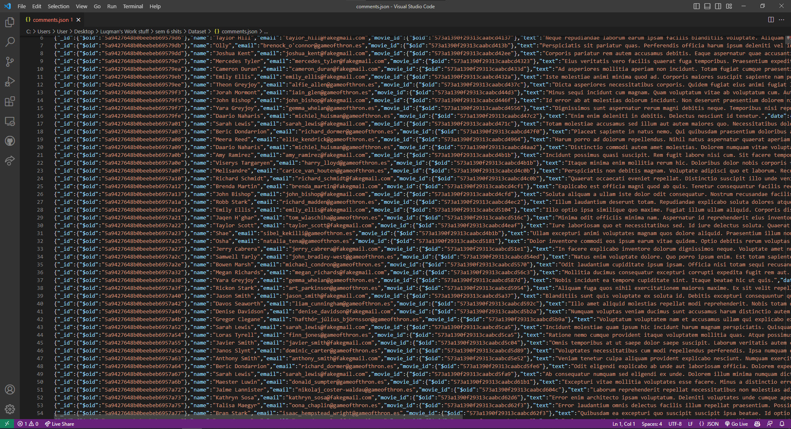
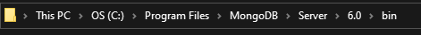
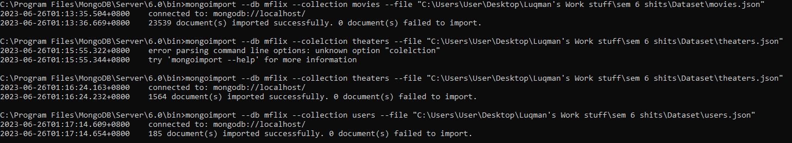
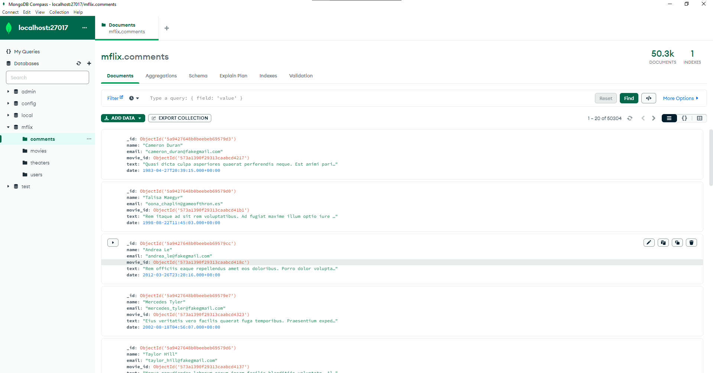

Don't forget to hit the :star: if you like this repo.
# Special Topic Data Engineering (SECP3843): Alternative Assessment

#### Name: Luqman Ariff Bin Noor Azhar
#### Matric No.: A20EC0202
#### Dataset: 03 - Movies

## Question 2 (a)
Step 1: Prepare the JSON file

Download the Movies dataset. There should be four JSON files, comments, movies, theaters, and users. Download all four files and put them in a single folder.

Step 2: Command Prompt

Head over to the file where the MongoDB file is located. Navigate through the files until you see the `bin` file. Open a Command Prompt from there.  

Step 3: Import the JSON file

From the command prompt, execute `mongoimport --db mflix --collection movies --file "C:\Users\User\Desktop\Luqman's Work stuff\sem 6 shits\Dataset\movies.json"`. The data will be imported into your localhost and it will also automatically create both the database and the collection.

`mongoimport`: The MongoDB library we will be using to import the dataset.  

`--db`: The database name  

`--collection`: The collection name  

`--file`: The file path to the JSON file  

## Question 2 (b)

## Contribution 🛠️
Please create an [Issue](https://github.com/drshahizan/special-topic-data-engineering/issues) for any improvements, suggestions or errors in the content.

You can also contact me using [Linkedin](https://www.linkedin.com/in/drshahizan/) for any other queries or feedback.

