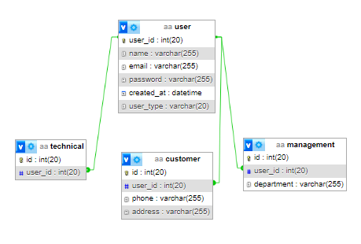

<a href="https://github.com/drshahizan/SECP3843/stargazers"></a>
<a href="https://github.com/drshahizan/SECP3843/network/members"></a>
<a href="https://github.com/drshahizan/SECP3843/pulls"></a>
<a href="https://github.com/drshahizan/SECP3843/issues"></a>
<a href="https://github.com/drshahizan/SECP3843/graphs/contributors"></a>


Don't forget to hit the :star: if you like this repo.
# Special Topic Data Engineering (SECP3843): Alternative Assessment

#### Name: Luqman Ariff Bin Noor Azhar
#### Matric No.: A20EC0202
#### Dataset: 03 - Movies

## Question 3 (a)
Step 1: Design database schema
We will need lay the foundation of how the module will function later on. We would need four tables, user, customer, management, and technical. Customer, management, and technical will referenced to table user. Below are the overview of the tables along with the data types.
User

| Name         | Data Type |
|--------------|-----------|
| `user_id`    | int       |
| `name`       | string    |
| `email`      | string    |
| `password`   | string    |
| `created_at` | date      |
| `user_type`  | string    |

Customer
| Name     | Data Type |
|----------|-----------|
| `id`     | int       |
| `user_id`| int       |
| `phone`  | string    |
| `address`| string    |

Technical
| Name      | Data Type |
|-----------|-----------|
| `id`      | int       |
| `user_id` | int       |


Management
| Name        | Data Type |
|-------------|-----------|
| `id`        | int       |
| `user_id`   | int       |
| `department`| string    |



Step 2: MySQL configuration
Head over to your Django project. We will need to install some packages in order for this step to work properly. Open the terminal and run the below commands to install the necessary packages.
```
pip install mysqlclient
pip install pymysql
```
Head over to the `settings.py` file. Navigate to the databases settings which we have created. We will change the configurations. It should look like this example below:


Step 3: Define Model
Now we will continue by defining the models of the recently created tables. Head over to your `models.py` file and define each model class. It should look like this example below:
Step 4: Database Migration
Once we’re done with defining the models, we will need to migrate the database. Open up a terminal and run these two commands:
```
python manage.py makemigrations
python manage.py migrate
```
Step 5: User Registration
Head over to the `accounts` app directory, open the `views.py` file. Import the modules we will be using, as such:
```
from django.shortcuts import render, redirect
from .forms import UserRegistrationForm
from .models import Customer, Technical, Management

```
Create the view function for registration. It should look like this:
Head over to the `forms.py` file and create the class for our form. It should look like this:
Step 6: Login
Open the terminal and run the following command to install this package:
```
pip install django.contrib.auth
```
Open `views.py` file and create your login view, it should look like this:
Open `urls.py` and insert both paths for login and register as such:


## Question 3 (b)
Lorem ipsum dolor sit amet, consectetur adipisicing elit, sed do eiusmod tempor incididunt ut labore et dolore magna aliqua. Ut enim ad minim veniam, quis nostrud exercitation ullamco laboris nisi ut aliquip ex ea commodo consequat. Duis aute irure dolor in reprehenderit in voluptate velit esse cillum dolore eu fugiat nulla pariatur. Excepteur sint occaecat cupidatat non proident, sunt in culpa qui officia deserunt mollit anim id est laborum.

## Contribution 🛠️
Please create an [Issue](https://github.com/drshahizan/special-topic-data-engineering/issues) for any improvements, suggestions or errors in the content.

You can also contact me using [Linkedin](https://www.linkedin.com/in/drshahizan/) for any other queries or feedback.

[](https://visitorbadge.io/status?path=https%3A%2F%2Fgithub.com%2Fdrshahizan)

