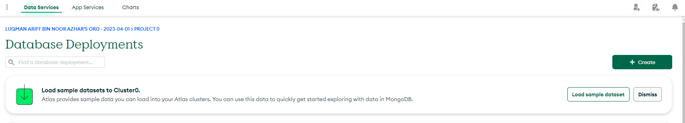
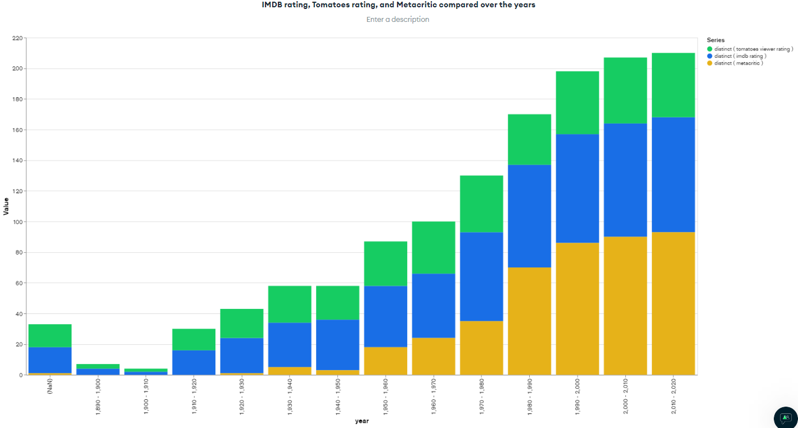
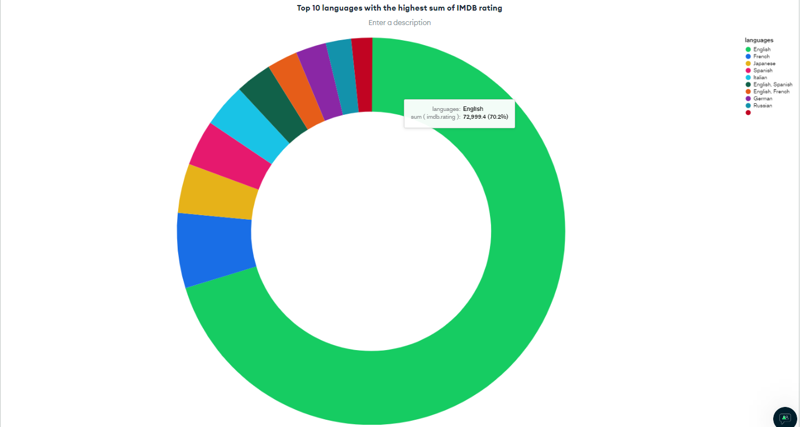
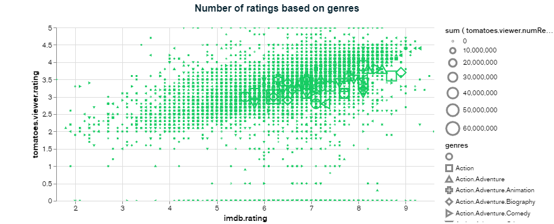
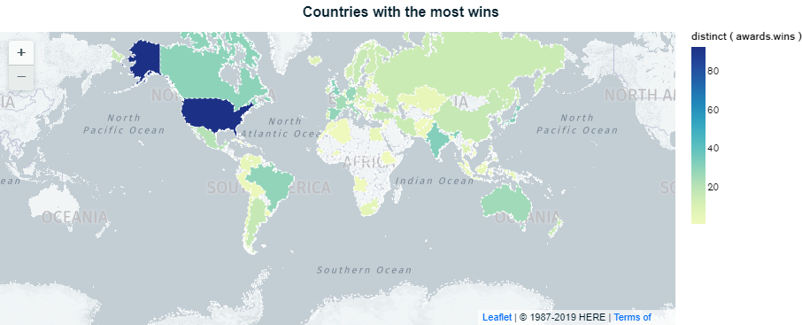

Don't forget to hit the :star: if you like this repo.
# Special Topic Data Engineering (SECP3843): Alternative Assessment

#### Name: Luqman Ariff Bin Noor Azhar
#### Matric No.: A20EC0202
#### Dataset: 03 - Movies

## Question 5 (a)
Lorem ipsum dolor sit amet, consectetur adipisicing elit, sed do eiusmod tempor incididunt ut labore et dolore magna aliqua. Ut enim ad minim veniam, quis nostrud exercitation ullamco laboris nisi ut aliquip ex ea commodo consequat. Duis aute irure dolor in reprehenderit in voluptate velit esse cillum dolore eu fugiat nulla pariatur. Excepteur sint occaecat cupidatat non proident, sunt in culpa qui officia deserunt mollit anim id est laborum.

## Question 5 (b)
I chose to visualize my dashboard with MongoDB Atlas. It has a built-in chart creator which will make our job a lot easier. It is also can be done by drag-and-drop, thus no coding is needed. The dataset is already imported as we have done so for Question 2.

Step 1: Head to MongoDB website

Open this [link](https://account.mongodb.com/account/login?_ga=2.62663724.188383531.1687805900-413483686.1685199079)

Step 2: Build a Chart

Click on the `Charts` tab.

Select a data source. We will be using our mflix database. Then you can start building your charts.

---
#### Charts and Dashboard Development

The chart above shows IMDB rating, Tomatoes rating, and Metacritic rating all put together in a stacked column to be compared over the years.

The chart above shows Top 10 languages with the highest sum of IMDB ratings.

The chart above shows the Number of ratings based on genres.

The chart above shows the Countries with the most wins. USA has the most wins with 93, second place tied by both India and Japan with 32 wins 

Dashboard
## Contribution 🛠️
Please create an [Issue](https://github.com/drshahizan/special-topic-data-engineering/issues) for any improvements, suggestions or errors in the content.

You can also contact me using [Linkedin](https://www.linkedin.com/in/drshahizan/) for any other queries or feedback.

