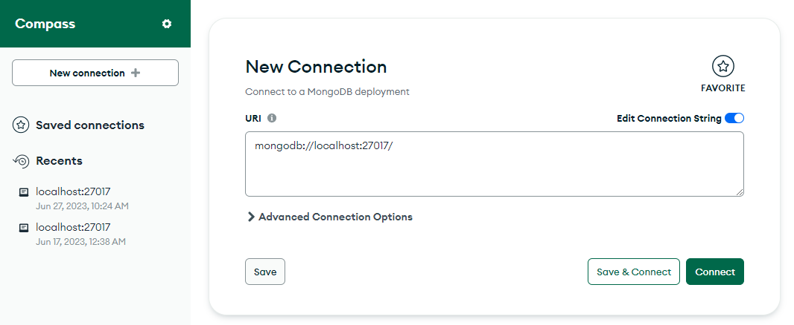
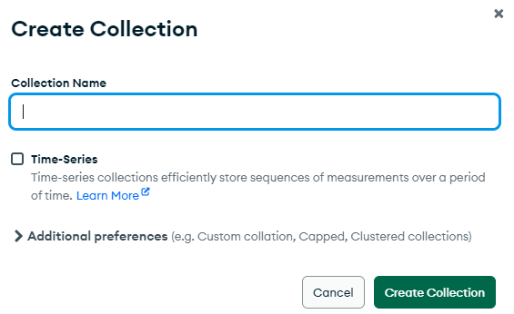
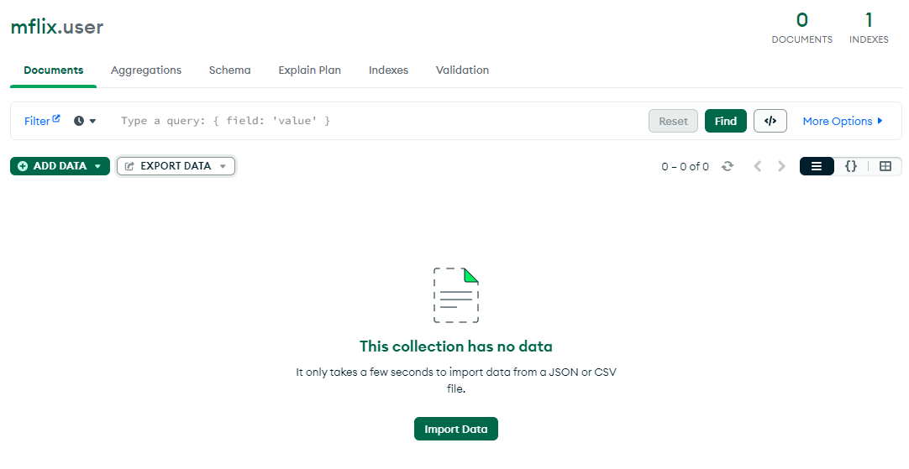
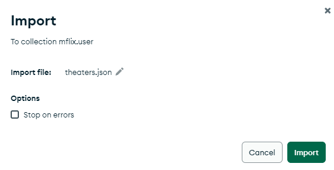
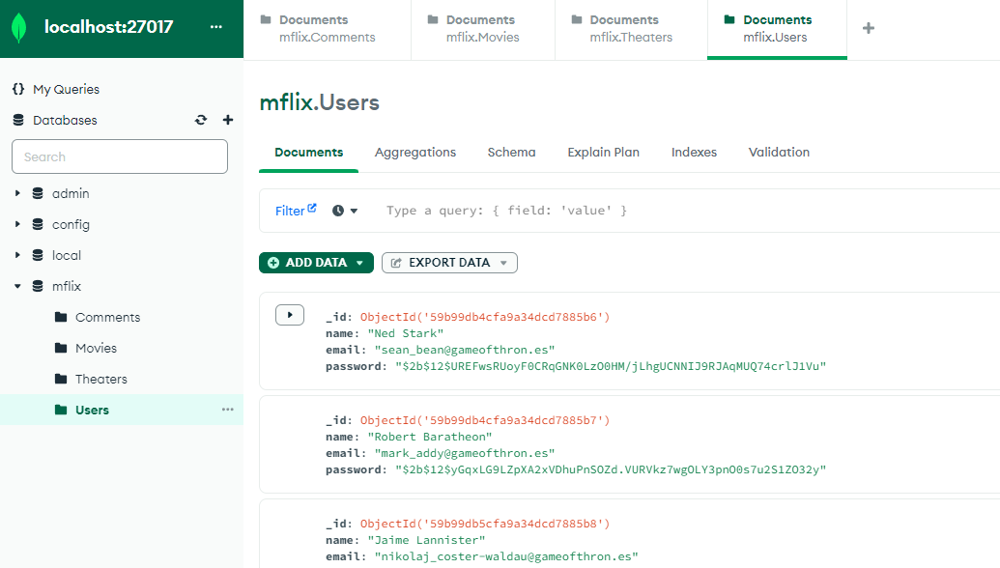
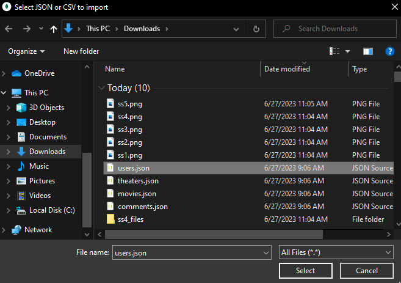

Don't forget to hit the :star: if you like this repo.

# Special Topic Data Engineering (SECP3843): Alternative Assessment

#### Name: Singthai Srisoi
#### Matric No.: A20EC0147
#### Dataset: Mflix Dataset

## Question 2 (a)
**Step 1: Create a Database in MongoDB Compass**

1. Launch MongoDB Compass and connect to your MongoDB server.
2. Click on the "New Connection" button or select "New Connection" from the "File" menu to create a new connection.
3. Fill in the necessary connection details, such as the hostname, port, authentication credentials (if required), and SSL options.
4. Click on the "Connect" button to establish the connection to the MongoDB server.
5. Once connected, you will see a list of databases on the left-hand side of the MongoDB Compass interface.
6. Click on the "+" icon next to "Databases" to create a new database.
7. Enter a name for the database and click on the "Create Database" button to create the database in MongoDB Compass.

**Explanation:** In this step, you are creating a new database in MongoDB Compass. The database will serve as a container for your imported data.

**Caution:** Ensure that you have the necessary permissions to create databases on the MongoDB server. If you are using a managed MongoDB service, make sure you have the appropriate access rights to create databases.

---

**Step 2: Import Data**

1. With the newly created database selected in MongoDB Compass, click on the "Collection" button or select "Collection" from the "File" menu to create a new collection within the database.
2. Enter a name for the collection and click on the "Create Collection" button to create the collection.
3. Select the newly created collection from the left-hand side panel.
4. Click on the "Add Data" button located in the collection view.
5. Choose the JSON option from the available data import options.

**Explanation:** In this step, you are creating a new collection within the database where you will import your JSON data.

**Caution:** Ensure that the database and collection names are unique and follow any naming conventions or guidelines you have in place.

---

**Step 3: Choose Data File**

1. In the JSON import dialog, click on the "Browse" button to select the JSON file you want to import.
2. Navigate to the directory where your JSON file is located, select the file, and click on the "Open" button.

**Explanation:** In this step, you are selecting the JSON file that contains the data you want to import into MongoDB.

**Caution:** Make sure you have the correct JSON file that contains the data you intend to import. Verify the file path and ensure that the file is accessible.

---

**Step 4: Check Data**

1. After selecting the JSON file, MongoDB Compass will display a preview of the imported data.
2. Review the preview to ensure that the data appears as expected and that it matches the structure of your JSON file.
3. Check for any errors or inconsistencies in the data preview.

**Explanation:** This step allows you to inspect the data before importing it into MongoDB to ensure its accuracy and completeness.

**Caution:** Pay close attention to any error messages or warnings displayed in the preview. If there are any issues with the data, you may need to address them before proceeding with the import.

## Question 2 (b)
Lorem ipsum dolor sit amet, consectetur adipisicing elit, sed do eiusmod tempor incididunt ut labore et dolore magna aliqua. Ut enim ad minim veniam, quis nostrud exercitation ullamco laboris nisi ut aliquip ex ea commodo consequat. Duis aute irure dolor in reprehenderit in voluptate velit esse cillum dolore eu fugiat nulla pariatur. Excepteur sint occaecat cupidatat non proident, sunt in culpa qui officia deserunt mollit anim id est laborum.

## Contribution 🛠️
Please create an [Issue](https://github.com/drshahizan/special-topic-data-engineering/issues) for any improvements, suggestions or errors in the content.

You can also contact me using [Linkedin](https://www.linkedin.com/in/drshahizan/) for any other queries or feedback.

