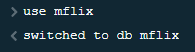
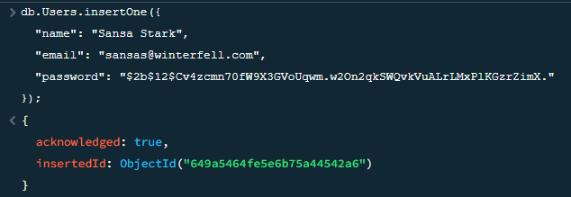
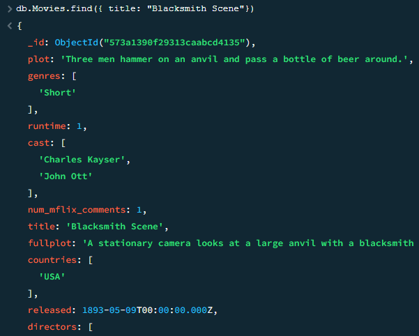
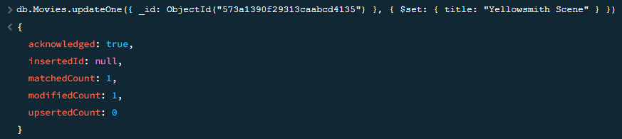
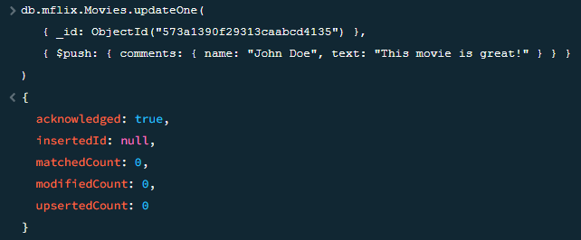
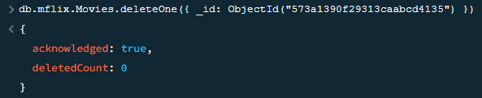

<a href="https://github.com/drshahizan/SECP3843/stargazers"></a>
<a href="https://github.com/drshahizan/SECP3843/network/members"></a>
<a href="https://github.com/drshahizan/SECP3843/pulls"></a>
<a href="https://github.com/drshahizan/SECP3843/issues"></a>
<a href="https://github.com/drshahizan/SECP3843/graphs/contributors"></a>


Don't forget to hit the :star: if you like this repo.

# Special Topic Data Engineering (SECP3843): Alternative Assessment

#### Name: Singthai Srisoi
#### Matric No.: A20EC0147
#### Dataset: Mflix Dataset

## Question 2 (a)
Download MongoDB shell and DB Tools:
    these tools interact with MongoDB databases from your computer. Download them for free from the MongoDB website.
     - [MongoDB Shell](https://downloads.mongodb.com/compass/mongosh-1.10.1-win32-x64.zip)
     - [Database tools](https://fastdl.mongodb.org/tools/db/mongodb-database-tools-windows-x86_64-100.7.2.zip)

Extract the files from the downloaded package and put them in a folder on your computer.
Paste file in bin into `C:\mongodb\bin`:
```powershell
PS C:\mongodb> tree /F
Folder PATH listing
Volume serial number is EE79-4E7C
C:.
│   LICENSE-Community.txt
│   MPL-2
│   README
│   THIRD-PARTY-NOTICES
│
├───bin
│       bsondump.exe
│       InstallCompass.ps1
│       mongod.cfg
│       mongod.exe
│       mongod.pdb
│       mongodump.exe
│       mongoexport.exe
│       mongofiles.exe
│       mongoimport.exe
│       mongorestore.exe
│       mongos.exe
│       mongos.pdb
│       mongosh.exe
│       mongosh_crypt_v1.dll
│       mongostat.exe
│       mongotop.exe
│
├───data
│   │   collection-0-7436583191903012859.wt
│   │   collection-10-3908939732731855936.wt
│   │   collection-2-3908939732731855936.wt
│   │   collection-2-7436583191903012859.wt
│   │   collection-4-3908939732731855936.wt
│   │   collection-4-7436583191903012859.wt
│   │   collection-6-3908939732731855936.wt
│   │   collection-8-3908939732731855936.wt
│   │   index-1-7436583191903012859.wt
│   │   index-11-3908939732731855936.wt
│   │   index-3-3908939732731855936.wt
│   │   index-3-7436583191903012859.wt
│   │   index-5-3908939732731855936.wt
│   │   index-5-7436583191903012859.wt
│   │   index-6-7436583191903012859.wt
│   │   index-7-3908939732731855936.wt
│   │   index-9-3908939732731855936.wt
│   │   mongod.lock
│   │   sizeStorer.wt
│   │   storage.bson
│   │   WiredTiger
│   │   WiredTiger.lock
│   │   WiredTiger.turtle
│   │   WiredTiger.wt
│   │   WiredTigerHS.wt
│   │   _mdb_catalog.wt
│   │
│   ├───diagnostic.data
│   │       metrics.2023-06-16T17-36-48Z-00000
│   │       metrics.2023-06-18T13-04-17Z-00000
│   │       metrics.2023-06-18T15-44-57Z-00000
│   │       metrics.2023-06-18T21-12-11Z-00000
│   │       metrics.2023-06-24T09-03-08Z-00000
│   │       metrics.interim
│   │
│   └───journal
│           WiredTigerLog.0000000004
│           WiredTigerPreplog.0000000001
│           WiredTigerPreplog.0000000002
│
└───log
        mongod.log
```

Open the command prompt: 
    This is a program that lets you type commands on your computer. You can find it by searching for "cmd" in the Start menu.

Go to the MongoDB bin folder: 
    This is where the MongoDB programs are stored. You need to go there to use them. You can do this by typing `cd C:\mongodb\bin` in the command prompt and pressing Enter.

Start the MongoDB shell: 
    This is a program that lets you talk to MongoDB databases. You can start it by typing `mongo` in the command prompt and pressing Enter. It will connect to a MongoDB server on your computer by default.

```powershell
PS C:\mongodb> mongosh
Current Mongosh Log ID: 649a8715eae2f8b464b8413c
Connecting to:          mongodb://127.0.0.1:27017/?directConnection=true&serverSelectionTimeoutMS=2000&appName=mongosh+1.10.1
Using MongoDB:          6.0.6
Using Mongosh:          1.10.1

For mongosh info see: https://docs.mongodb.com/mongodb-shell/

------
   The server generated these startup warnings when booting
   2023-06-19T05:12:09.818+08:00: Access control is not enabled for the database. Read and write access to data and configuration is unrestricted
------
```
Create mflix database: 
    This is the database that you want to work with. It contains data about movies, theaters, users and comments. You can switch to it by typing `use mflix` in the MongoDB shell and pressing Enter.

```powershell
test> use mflix
switched to db mflix
```


Load JSON files into collections: 
    You have some JSON files that contain data for each collection in the mflix database. You need to load them into the database using a program called mongoimport. This program lets you import data from different formats into MongoDB collections.

 - `mongoimport C:\Users\User\Downloads\users.json -d mflix -c Users --drop`: This command loads the data from the `users.json` file into the Users collection in the `mflix` database. The `--drop` option deletes any existing data in the Users collection before loading.

 - `mongoimport C:\Users\User\Downloads\theaters.json -d mflix -c Theaters --drop`: This command loads the data from the `theaters.json` file into the Theaters collection in the `mflix` database. The `--drop` option deletes any existing data in the Theaters collection before loading.

 - `mongoimport C:\Users\User\Downloads\comments.json -d mflix -c Comments --drop`: This command loads the data from the `comments.json` file into the Comments collection in the `mflix`database. The `--drop` option deletes any existing data in the Comments collection before loading.

 - `mongoimport C:\Users\User\Downloads\movies.json -d mflix -c Movies --drop`: This command loads the data from the `movies.json` file into the Movies collection in the `mflix` database. The `--drop` option deletes any existing data in the Movies collection before loading.

```powershell
PS C:\mongodb> mongoimport C:\Users\User\Downloads\users.json -d mflix -c Users --drop
2023-06-27T15:05:07.081+0800    connected to: mongodb://localhost/
2023-06-27T15:05:07.191+0800    dropping: mflix.Users
2023-06-27T15:05:07.218+0800    185 document(s) imported successfully. 0 document(s) failed to import.
PS C:\mongodb> mongoimport C:\Users\User\Downloads\theaters.json -d mflix -c Theaters --drop
2023-06-27T15:07:05.453+0800    connected to: mongodb://localhost/
2023-06-27T15:07:05.494+0800    dropping: mflix.Theaters
2023-06-27T15:07:05.578+0800    1564 document(s) imported successfully. 0 document(s) failed to import.
PS C:\mongodb> mongoimport C:\Users\User\Downloads\comments.json -d mflix -c Comments --drop
2023-06-27T15:08:23.658+0800    connected to: mongodb://localhost/
2023-06-27T15:08:23.695+0800    dropping: mflix.Comments
2023-06-27T15:08:25.041+0800    50304 document(s) imported successfully. 0 document(s) failed to import.
PS C:\mongodb> mongoimport C:\Users\User\Downloads\movies.json -d mflix -c Movies --drop
2023-06-27T15:09:54.850+0800    connected to: mongodb://localhost/
2023-06-27T15:09:54.885+0800    dropping: mflix.Movies
2023-06-27T15:09:57.415+0800    23539 document(s) imported successfully. 0 document(s) failed to import.
```
Import done: 
  Each mongoimport command shows you how many documents were loaded and if there were any errors.
  
## Question 2 (b)

We are using \_MONGOSH for the query. First we need to use the database first.
```javascript
use mflix
```



i. Create - 1 query:
To create a new document in the collection, you can use the `insertOne()` method. Here's an example query to create a new document in the "Users" collection:
```javascript
db.Users.insertOne({
  "name": "Sansa Stark",
  "email": "sansas@winterfell.com",
  "password": "$2b$12$Cv4zcmn70fW9X3GVoUqwm.w2On2qkSWQvkVuALrLMxPlKGzrZimX."
});
```
This query creates a new user document in the "Users" collection with the provided data.



ii. Read - 1 query:
To read documents from a collection, you can use the `find()` method. Here's an example query to retrieve all documents from the "Movies" collection:
```javascript
db.Movies.findOne({ title: "Blacksmith Scene" });
```



This query retrieves all documents from the "Movies" collection.

iii. Update - 2 queries:
To update documents in a collection, you can use the `updateOne()` method. Here are two example queries for updating documents:

Example 1: Update a movie's title:
```javascript
db.Movies.updateOne(
    { _id: ObjectId("573a1390f29313caabcd4135") }, 
    { $set: { title: "Yellowsmith Scene" } })
```
This query updates the title of a movie document with the provided ID.



Example 2: Add a new comment to a movie:
```javascript
db.mflix.Movies.updateOne(
   { _id: ObjectId("573a1390f29313caabcd4135") },
   { $push: { comments: { name: "John Doe", text: "This movie is great!" } } })
```




This query adds a new comment to the "comments" array field of a movie document.

iv. Delete - 1 query:
To delete a document from a collection, you can use the `deleteOne()` method. Here's an example query to delete a document from the "Theaters" collection:
```javascript
db.mflix.Movies.deleteOne({ _id: ObjectId("573a1390f29313caabcd4135") })
```



This query deletes a theater document with the provided ID from the "Movies" collection.

## Contribution 🛠️
Please create an [Issue](https://github.com/drshahizan/special-topic-data-engineering/issues) for any improvements, suggestions or errors in the content.

You can also contact me using [Linkedin](https://www.linkedin.com/in/drshahizan/) for any other queries or feedback.

[](https://visitorbadge.io/status?path=https%3A%2F%2Fgithub.com%2Fdrshahizan)


