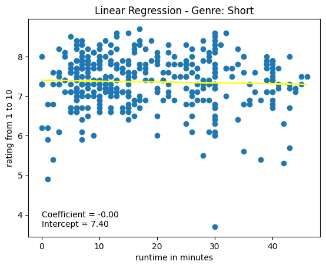
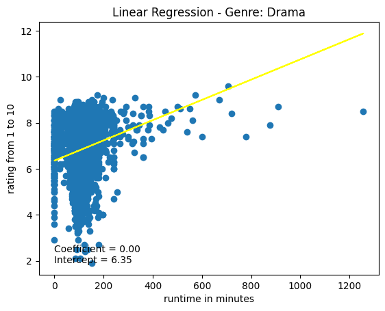

<a href="https://github.com/drshahizan/SECP3843/stargazers"></a>
<a href="https://github.com/drshahizan/SECP3843/network/members"></a>
<a href="https://github.com/drshahizan/SECP3843/pulls"></a>
<a href="https://github.com/drshahizan/SECP3843/issues"></a>
<a href="https://github.com/drshahizan/SECP3843/graphs/contributors"></a>


Don't forget to hit the :star: if you like this repo.

# Special Topic Data Engineering (SECP3843): Alternative Assessment

#### Name: Singthai Srisoi
#### Matric No.: A20EC0147
#### Dataset: Mflix Dataset

## Question 4 
In this case study, the goal is to analyze the relationship between the runtime of movies and their ratings. By using Linear Regression, we can train a model to predict movie ratings based on their runtime. This allows us to gain insights into how the runtime of a movie influences its rating.

The implementation involves the following steps:

Data Collection: The movie data is collected from a MongoDB database using the PyMongo library.

```python
from pymongo import MongoClient

# Connect to MongoDB
client = MongoClient('mongodb://localhost:27017')
db = client['mflix']
collection = db['Movies']

movies_data = list(collection.find())

features = []

for movie in movies_data:
    genres = movie.get('genres', [])
    for genre in genres:
        movie_features = [
            genre,
            movie.get('runtime', 0),
            movie.get('imdb', {}).get('rating', 0.0)
        ]
        features.append(movie_features)
```

Data Preparation: The relevant features (genre, runtime, rating) are extracted from the movie data and stored in a pandas DataFrame. Missing values are handled by dropping rows with NaN values and converting the data types appropriately.

```python
# select only wanted columns
df = pd.DataFrame(features, columns=['genre', 'runtime', 'rating'])

# drop nan
df['rating'].replace('', np.nan, inplace=True)
df.dropna(axis=0, inplace=True)

# change data type
df['genre'] = df['genre'].astype('str')
df['runtime'] = df['runtime'].astype('int32')
df['rating'] = df['rating'].astype(float)
```

Model Training and Evaluation: The Linear Regression model is trained using the runtime as the input feature (X) and the rating as the target variable (Y). The dataset is split into training and testing sets using the train_test_split function from scikit-learn. The model is then fitted on the training data and evaluated on the testing data using the R-squared metric.

Visualization: The scatter plot of the training data points along with the regression line is plotted using matplotlib. The coefficient and intercept values of the trained model are also displayed on the plot using the text annotation.


```python
trainset = genre_df[['rating', 'runtime']]
X = trainset['runtime']
Y = trainset['rating']

# Train and plot
X_train, X_test, Y_train, Y_test = train_test_split(X, Y, test_size=0.2, train_size=0.8, random_state=23)
X_train = np.array(X_train).reshape(-1, 1)
X_test = np.array(X_test).reshape(-1, 1)

lr = LinearRegression()
lr.fit(X_train, Y_train)
Y_pred_train = lr.predict(X_train)

intercept = lr.intercept_
coef = lr.coef_

plt.scatter(X_train, Y_train)
plt.plot(X_train, Y_pred_train, color='yellow')
plt.ylabel('rating from 1 to 10')
plt.xlabel('runtime in minutes')
plt.text(0, np.min(Y_train), f'Coefficient = {float(coef):.2f}\nIntercept = {float(intercept):.2f}', fontsize=10)
plt.title(f'Linear Regression - Genre: {genre}')
plt.show()
```

Cautions: There might be some genre that do not have enought data for training. To prevent this from happend, we can exclude these data

```python
genre_df = df[df['genre'] == genre]
if len(genre_df) <= 1:
    print(f"Not enough data for genre: {genre}")
    return
```

now we can add the learning in a function and call it in a lopp for each unique genre
```python
for genre in df['genre'].unique():
    train_and_plot_genre_model(df, genre)
```

Here's an example screenshot illustrating the solution implemented:

- 
- 

The plot shows the relationship between the runtime of movies (x-axis) and their ratings (y-axis). The yellow line represents the regression line fitted by the Linear Regression model. The coefficient and intercept values are displayed below the plot, indicating the strength and direction of the linear relationship.

By using Linear Regression, we can gain insights into how the runtime of movies influences their ratings. This information can be valuable in making decisions related to movie production, marketing, and audience preferences. Additionally, this approach can be extended to analyze the impact of other features, such as genre, on movie ratings by training separate models for each genre and visualizing the results.

## Contribution 🛠️
Please create an [Issue](https://github.com/drshahizan/special-topic-data-engineering/issues) for any improvements, suggestions or errors in the content.

You can also contact me using [Linkedin](https://www.linkedin.com/in/drshahizan/) for any other queries or feedback.

[](https://visitorbadge.io/status?path=https%3A%2F%2Fgithub.com%2Fdrshahizan)


