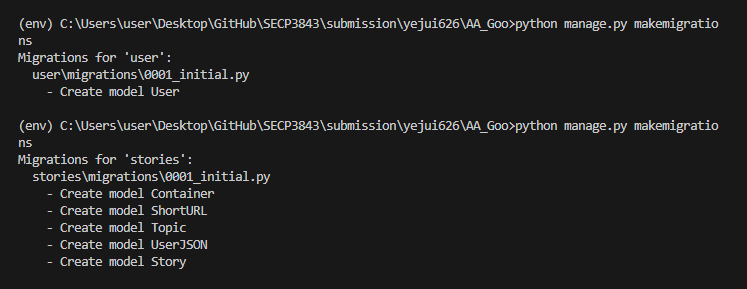
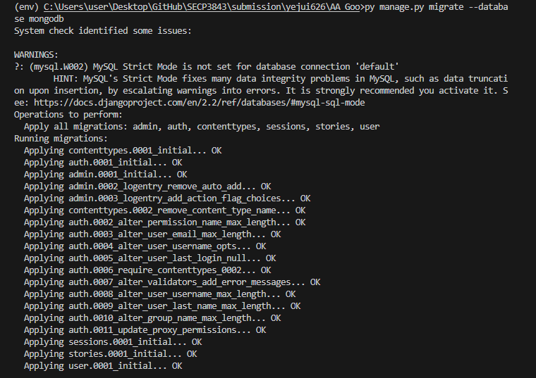

<a href="https://github.com/drshahizan/SECP3843/stargazers"></a>
<a href="https://github.com/drshahizan/SECP3843/network/members"></a>
<a href="https://github.com/drshahizan/SECP3843/pulls"></a>
<a href="https://github.com/drshahizan/SECP3843/issues"></a>
<a href="https://github.com/drshahizan/SECP3843/graphs/contributors"></a>


Don't forget to hit the :star: if you like this repo.

# Special Topic Data Engineering (SECP3843): Alternative Assessment

#### Name: GOO YE JUI
#### Matric No.: A20EC0191
#### Dataset: Stories Dataset

## Question 1 (a)
### Explanation of steps required to integrate Django with JSON, ensuring efficient data storage and retrieval from both MySQL and MongoDB databases.
These are the steps for implementing a configuration using the servers used in this project. It is to ensure seamless integration between the Django web framework, a JSON dataset provided in this project, and the MySQL and MongoDB databases.

### 1. Steps to setup Django server including the project and application folder.
First, we are using the Django web framework as the base for building the portal. Hence, we need to setup the Django server.

1. Locate to the project file and create a virtual environment.
```python
py -m venv env
env\Scripts\activate
```

2. Once you’ve created and activated your Python virtual environment, you can install Django into this dedicated development workspace using 
```python 
pip install django 
```

3. After you’ve successfully installed Django, you’re ready to create the scaffolding for your new web application. With your virtual environment set up and activated and Django installed, you can now create a project using 
```python 
django-admin startproject AA_Goo
```

4. For this project, we need to create an app contain the functionality of providing users with a platform for viewing data and executing dashboard visualizations based on JSON-provided data. You can execute the startapp command through the manage.py file to generates a default folder structure for a Django app using 
```python 
py manage.py startapp stories
```

4. Also, we need to create an app contain the functionality of providing users to login and user registration. You can execute the startapp command through the manage.py file using 
```python 
py manage.py startapp user
```

### 2. Configuring Django database settings
   1. Open the Django project's `settings.py` file.
   2. Define the database settings for both MySQL and MongoDB.
   ``` python
        DATABASES = {
            'default': {
                'ENGINE': 'django.db.backends.mysql',
                'NAME': 'aa',
                'USER': 'root',
                'PASSWORD': '',
                'HOST': 'localhost',
                'PORT': 3306,
            },
            'mongodb': {
                'ENGINE': 'djongo',
                'ENFORCE_SCHEMA': False,
                'NAME': 'AA',
                'CLIENT': {
                    'host': 'localhost:27017',
                    'port': 27017,
                    'username': '',
                    'password': '',
                }
            }
        }
   ```
   3. Install database connectors ("mysqlclient" and "djongo" library) for MySQL and MongoDB using 
   ``` python
    pip install mysqlclient
    pip install djongo
   ```   
### 2. Configuring Django models for both stories and user app
To allow seamless integration between Django and the databases, we need to define a Django models that represent the structure and fields of the JSON dataset.

   1. Open the stories app's `models.py` file.
   2. Define Django models that represent the structure and fields of the JSON dataset according to the data dictionary  the User class for user authentication and login.
   ``` python
        from django.db import models
        ###MONGODB
        class Container(models.Model):
            name = models.CharField(max_length=255)
            short_name = models.CharField(max_length=255)

            class Meta:
                verbose_name = 'Container'
                app_label = 'stories'


        class Topic(models.Model):
            name = models.CharField(max_length=255)
            short_name = models.CharField(max_length=255)

            class Meta:
                verbose_name = 'Topic'
                app_label = 'stories'


        class UserJSON(models.Model):
            name = models.CharField(max_length=255)
            registered = models.DateTimeField()
            fullname = models.CharField(max_length=255)
            icon = models.URLField()
            profileviews = models.IntegerField()

            class Meta:
                verbose_name = 'UserJSON'
                app_label = 'stories'


        class ShortURL(models.Model):
            short_url = models.URLField()
            view_count = models.IntegerField()

            class Meta:
                verbose_name = 'ShortURL'
                app_label = 'stories'


        class Story(models.Model):
            href = models.URLField()
            title = models.CharField(max_length=255)
            comments = models.IntegerField()
            container = models.ForeignKey(Container, on_delete=models.CASCADE)
            submit_date = models.DateTimeField()
            topic = models.ForeignKey(Topic, on_delete=models.CASCADE)
            promote_date = models.DateTimeField()
            idJSON = models.CharField(max_length=255)
            media = models.CharField(max_length=255)
            diggs = models.IntegerField()
            description = models.TextField()
            link = models.URLField()
            user = models.ForeignKey(UserJSON, on_delete=models.CASCADE)
            status = models.CharField(max_length=255)
            shorturl = models.ManyToManyField(ShortURL)

            class Meta:
                verbose_name = 'Story'
                app_label = 'stories'

   ```
   3. Open the user app's `models.py` file.
   4. Define Django models that represent the User class for user authentication and login.
   ``` python
        from django.db import models
        from django.contrib.auth.models import AbstractBaseUser, BaseUserManager

        ###MySQL
        class UserManager(BaseUserManager):
            def _create_user(self, email, password, **extra_fields):
                if not email:
                    raise ValueError("The Email field must be set")
                
                email = self.normalize_email(email)
                user = self.model(email=email, **extra_fields)
                user.set_password(password)
                user.save(using=self._db)
                return user
            
            def create_user(self, email, password, **extra_fields):
                """Create and save a regular User with the given email and password."""
                extra_fields.setdefault("is_staff", False)
                extra_fields.setdefault("is_superuser", False)
                return self._create_user(email, password, **extra_fields)
            
            def create_superuser(self, email, password, **extra_fields):
                extra_fields.setdefault('is_staff', True)
                extra_fields.setdefault('is_superuser', True)
                return self._create_user(email, password, **extra_fields)

        class User(AbstractBaseUser):
            USER_TYPE_CHOICES = (
                ('customer', 'Customer'),
                ('technical_worker', 'Technical Worker'),
                ('senior_management', 'Senior Management'),
            )

            email = models.EmailField(unique=True)
            name = models.CharField(max_length=255)  # Name field
            user_type = models.CharField(max_length=20, choices=USER_TYPE_CHOICES)
            is_active = models.BooleanField(default=True)
            is_staff = models.BooleanField(default=False)

            USERNAME_FIELD = 'email'
            REQUIRED_FIELDS = ['name','user_type']

            objects = UserManager()

            class Meta:
                verbose_name = 'User'
                app_label = 'user'
            
            def __str__(self):
                return self.email
   ```
### 3. Configuring Django Database Routing
To allow Django to support multiple databases, we require a database routing to specify which database to use for each model. Routing rules to route specific models to MySQL or MongoDB based on their requirements is set up under this file. For example, the models `[Container, Topic, User, ShortURL, Story]` that we have just created is routed to MongoDB.

```python
# database_router.py
from django.conf import settings

class DatabaseRouter(object):
    def db_for_read(self, model, **hints):

        if model._meta.app_label in settings.DATABASE_APPS_MAPPING:
            return settings.DATABASE_APPS_MAPPING[model._meta.app_label]
        return None

    def db_for_write(self, model, **hints):

        if model._meta.app_label in settings.DATABASE_APPS_MAPPING:
            return settings.DATABASE_APPS_MAPPING[model._meta.app_label]
        return None

    def allow_relation(self, obj1, obj2, **hints):

        db1 = settings.DATABASE_APPS_MAPPING.get(obj1._meta.app_label)
        db2 = settings.DATABASE_APPS_MAPPING.get(obj2._meta.app_label)
        if db1 and db2:
            return db1 == db2
        return None

    def allow_migrate(self, db, app_label, model_name=None, **hints):

        if db in settings.DATABASE_APPS_MAPPING.values():
            return settings.DATABASE_APPS_MAPPING.get(app_label) == db
        elif app_label in settings.DATABASE_APPS_MAPPING:
            return False
```
Inside the project `settings.py` file, you need to declare `DATABASE_ROUTERS` and `DATABASE_APPS_MAPPING`
```python
DATABASE_APPS_MAPPING = {
    'contenttypes': 'default',
    'auth': 'default',
    'admin': 'default',
    'sessions': 'default',
    'messages': 'default',
    'staticfiles': 'default',
    'user': 'default',
    'stories': 'mongodb',
}

DATABASE_ROUTERS = ['AA_Goo.database_router.DatabaseRouter']
```
### 4. Make migrations into database
Finally, we can now make migrations of model into the database according to the mapping and app label. <br>

#### Step 1: Execute the make migrations command
To generate the database migration files based on the model, execute this command 
```python 
python manage.py makemigrations
```


#### Step 2: Make migration for Mongodb
To apply the migrations to the MongoDB database specified in the `settings.py` file, use the migrate command with the --database option.
```python 
python manage.py migrate --database=mongodb
```


#### Step 3: Make migration for MySQL
To apply the migrations to the default database specified in the `settings.py` file, use the migrate command with the --database option.
```python 
python manage.py migrate --database=default
```


## Question 1 (b)
### System Architecture Diagram
This system architecture focuses on the seamless integration between the web server (Django), dataset (JSON), and databases (MySQL and MongoDB). <br>


### Detailed explanation for each component

   - **Django Web Server and MVT** <br>
   Django acts as an agent to process the requests from the users and send response to the users while interacting with the databases and dataset. There is two application server in this project which are the `stories` and `user` application.
      - **Models:** Specify the necessary data structures and relationships required by the application which allow us to do CRUD seamlessly.
      - **Views:** Handle the logic for processing requests, retrieving data from the databases, and rendering templates.
      - **Templates:** Contain the HTML structure and placeholders for dynamic data.

   - **Dataset (JSON)** <br>
   Location of the dataset is stored. In this case, the dataset was downloaded to local from github.

   - **Databases** <br>
      Handles data storage, retrieval, and management operations.
      - **MySQL:**
      It is a relational database server which used to store structure data. In this project, it is used to store user authentication data used for user registration and login.
      - **MongoDB:**
      It is a NoSQL database server which used to store JSON data. In this project, it is used to store the JSON dataset (Stories dataset).

   - **External Libraries for database integration**
        - **ORM**: 
         To perform interaction between Django models and MySQL, Django's ORM (Object-Relational Mapping) provides an abstraction layer that allows us to work with MySQL using Python classes and methods, making it easier to perform database operations. In this project, it is used to interact with the user app's model.

        - **Djongo**: 
        Django can serve as the MongoDB connector when integrating it with MongoDB. Djongo enables interaction between Django models and MongoDB collections. In this project, it is used to interact with the stories app's model.

    

## Contribution 🛠️
Please create an [Issue](https://github.com/drshahizan/special-topic-data-engineering/issues) for any improvements, suggestions or errors in the content.

You can also contact me using [Linkedin](https://www.linkedin.com/in/drshahizan/) for any other queries or feedback.

[](https://visitorbadge.io/status?path=https%3A%2F%2Fgithub.com%2Fdrshahizan)


