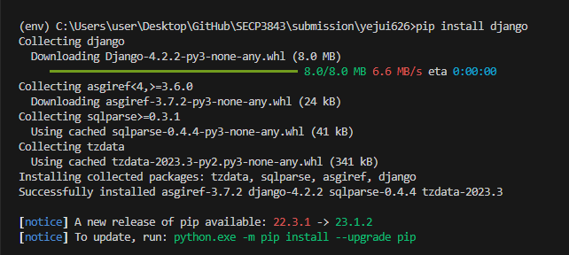

<a href="https://github.com/drshahizan/SECP3843/stargazers"></a>
<a href="https://github.com/drshahizan/SECP3843/network/members"></a>
<a href="https://github.com/drshahizan/SECP3843/pulls"></a>
<a href="https://github.com/drshahizan/SECP3843/issues"></a>
<a href="https://github.com/drshahizan/SECP3843/graphs/contributors"></a>


Don't forget to hit the :star: if you like this repo.

# Special Topic Data Engineering (SECP3843): Alternative Assessment

#### Name: GOO YE JUI
#### Matric No.: A20EC0191
#### Dataset: Stories Dataset

## Question 1 (a)
These are the steps for implementing a configuration using the servers used in this project. It is to ensure seamless integration between the Django web framework, a JSON dataset provided in this project, and the MySQL and MongoDB databases.

### Explanation of steps required to integrate Django with JSON, ensuring efficient data storage and retrieval from both MySQL and MongoDB databases.

### 1. Steps to setup Django server.
First, we are using the Django web framework as the base for building the portal. Hence, we need to setup the Django server.

1. Locate to your project file and create a virtual environment.
```python
py -m venv env
env\Scripts\activate
```

2. Once you’ve created and activated your Python virtual environment, you can install Django into this dedicated development workspace using `pip install django` .


3. After you’ve successfully installed Django, you’re ready to create the scaffolding for your new web application. With your virtual environment set up and activated and Django installed, you can now create a project using `django-admin startproject AA_Goo`


## Question 1 (b)
Lorem ipsum dolor sit amet, consectetur adipisicing elit, sed do eiusmod tempor incididunt ut labore et dolore magna aliqua. Ut enim ad minim veniam, quis nostrud exercitation ullamco laboris nisi ut aliquip ex ea commodo consequat. Duis aute irure dolor in reprehenderit in voluptate velit esse cillum dolore eu fugiat nulla pariatur. Excepteur sint occaecat cupidatat non proident, sunt in culpa qui officia deserunt mollit anim id est laborum.


## Contribution 🛠️
Please create an [Issue](https://github.com/drshahizan/special-topic-data-engineering/issues) for any improvements, suggestions or errors in the content.

You can also contact me using [Linkedin](https://www.linkedin.com/in/drshahizan/) for any other queries or feedback.

[](https://visitorbadge.io/status?path=https%3A%2F%2Fgithub.com%2Fdrshahizan)


