<a href="https://github.com/drshahizan/SECP3843/stargazers"></a>
<a href="https://github.com/drshahizan/SECP3843/network/members"></a>
<a href="https://github.com/drshahizan/SECP3843/pulls"></a>
<a href="https://github.com/drshahizan/SECP3843/issues"></a>
<a href="https://github.com/drshahizan/SECP3843/graphs/contributors"></a>


Don't forget to hit the :star: if you like this repo.

# Special Topic Data Engineering (SECP3843): Alternative Assessment

#### Name: GOO YE JUI
#### Matric No.: A20EC0191
#### Dataset: Stories Dataset

## Question 2 (a)

### Prepartion of the JSON file

#### Step 1 : Download the dataset from the source
Download the [Stories Dataset](https://github.com/drshahizan/dataset/tree/main/mongodb/07-stories) from github to your local machine.

#### Step 2 : Ensure the JSON file follows the correct structure for MongoDB documents.
In MongoDB, every JSON object corresponds to a single document. For nested objects, make sure they are all enclosed in curly braces "{}". For arrays, enclose them with square brackets "[]" and make sure they are separated by commas ",". The **Stories Dataset** downloaded from the source does not comply with the structure well enough. Arrays objects are not seperated by commas and enclosed in a square brackets. The JSON dataset is modified with the code below
```python
import json
### The Stories JSON dataset is read with the encoding set to UTF-8
with open('stories.json', 'r', encoding='utf-8') as file:
    stories = file.readlines()
    
### The JSON dataset is modified to be enclosed with a square bracket and seperated by a comma
modify_stories = '[' + ','.join(stories) + ']'

with open('stories.json', 'w', encoding='utf-8') as file:
    file.write(modify_stories)
```

#### Original Dataset
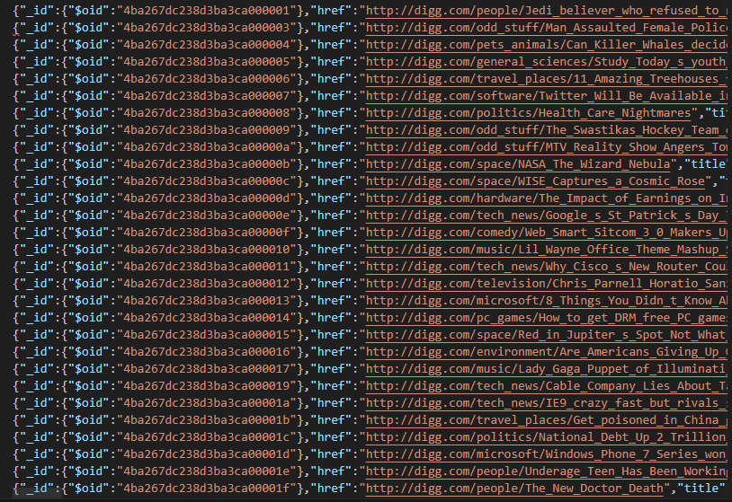
#### Modified Dataset
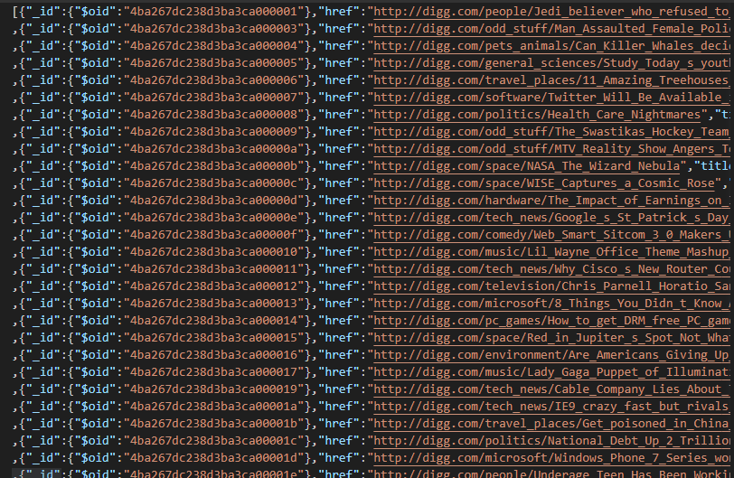)

### Starting the MongoDB server

#### Step 1 : Download MongoDB and set up enviroment variables

- [MongoDB Community Server](https://www.mongodb.com/try/download/community)
- [MongoDB Shell](https://www.mongodb.com/try/download/shell)
- [MongoDB Database Tools](https://www.mongodb.com/try/download/database-tools) <br>
After all of the tools are downloaded, export the bin files of MongoDB Shell and MongoDB Database Tools to the MongoDB Community Server bin folder. Also, make sure that your environment variables path consist of the bin folder path of MongoDB server. For example: <br>
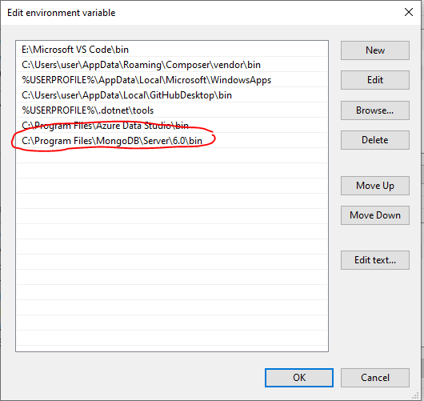

#### Step 2 : Launch MongoDB server
Locate to the bin folder of MongoDB server.
```python
cd C:\Program Files\MongoDB\Server\6.0\bin
```
In command prompt, launch MongoDB server by executing the command `mongod`. <br>
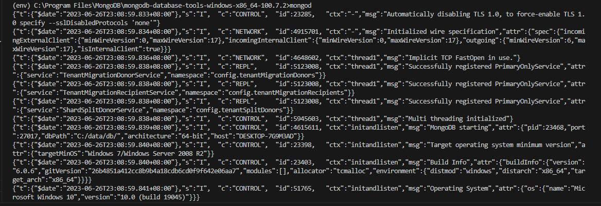

### Accessing the MongoDB shell
To access the MongoDB shell, execute the command `mongosh` in the cmd.<br>
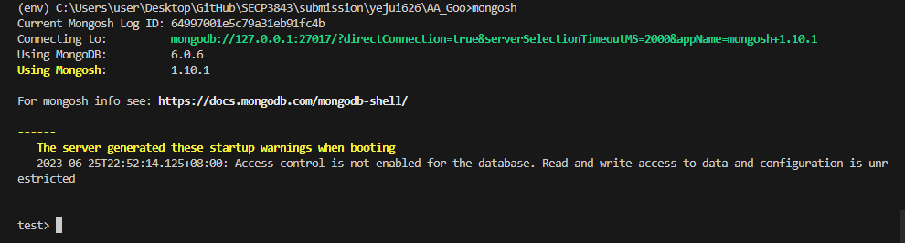

### Selecting the Target Database
In the MongoDB shell, select the database where you want to import the JSON data. Before this a database named AA is created using MongoDB Compass. Execute the command `use AA` in the MongoDB shell to switch to the target database.<br>
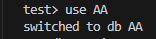

### Choosing the collection
Choose the collection within the selected database where you want to import the JSON data. In this case, I would like to store it into a collection named "Stories", hence `db.stories` is executed inside MongoDB shell. <br>
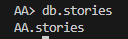

### ImportIng JSON dataset into MongoDB
To import JSON array into MongoDB, execute the `mongoimport` command with these parameters:
- --db : Database name
- --collection : Collection name
- --file : File path
- --jsonArray : File type as JSON array
```python
mongoimport --db=AA --collection=stories --file="C:\Users\user\Desktop\GitHub\SECP3843\submission\yejui626\question2\files\code\stories.json" --jsonArray
```
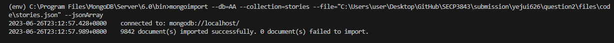

### View dataset in MongoDB

#### View databases inside MongoDB
Now that we have imported the JSON dataset, we can now view the databases inside MongoDB using `show dbs` in MongoDB shell. <br>


#### Check if the dataset is correctly imported
Query the dataset from the database using `db.stories.find()` to verify the dataset. <br>
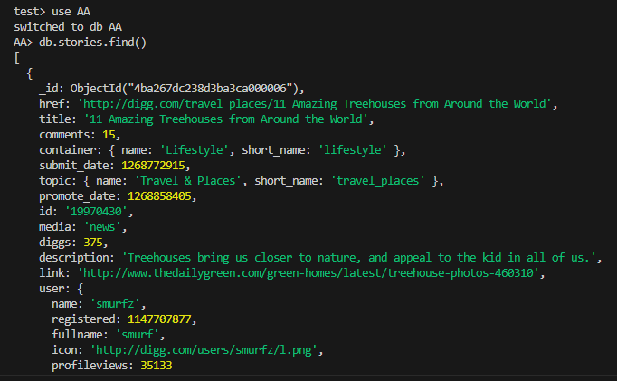

## Question 2 (b)

### 1. Create Query
With the code below, and MongoDB will insert the JSON document into the "stories" collection in the database "AA". 
```python
db.stories.insertOne({
  "href": "http://digg.com/technology/Gaming_Systems_101:_Xbox_vs_PlayStation",
  "title": "Gaming Systems 101: Xbox vs PlayStation",
  "comments": {"$numberInt": "289"},
  "container": {"name": "Technology","short_name": "tech"},
  "submit_date": {"$numberInt": "1268762345"},
  "topic": {"name": "Gaming","short_name": "gaming"},
  "promote_date": {"$numberInt": "1268888888"},
  "id": "19967543",
  "media": "article",
  "diggs": {"$numberInt": "701"},
  "description": "A comprehensive comparison between Xbox and PlayStation gaming systems, including their features, performance, and game libraries.",
  "link": "http://www.example.com/gaming-systems-101",
  "user": {"name": "gamer123","registered": {"$numberInt": "1198745632"},"fullname": "John Doe","icon": "http://digg.com/users/gamer123/l.png","profileviews": {"$numberInt": "12345"}},
  "status": "popular",
  "shorturl": [{"short_url": "http://digg.com/d31Lp9i","view_count": {"$numberInt": "5432"}}]
});
```
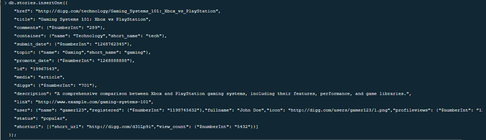

### 2. Read Query
Now that we have created the new documents into the collection, the documents can be retrieved based on one of the variable as the parameter. In this case, I am using `title` as the parameter.
```python
db.stories.find({title:"Gaming Systems 101: Xbox vs PlayStation"})
```
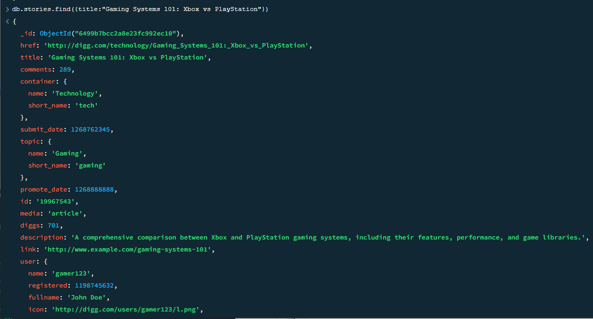

### 3. Update Query

#### First Update Query
To update a single document, we can execute the command `db.stories.updateOne()`. In this case, I am updating the `title` field of a document with a specific `_id` value for the document that we have created just now:
```python
db.stories.updateOne(
  { _id: ObjectId("6499b7bcc2a8e23fc992ec10") },
  { $set: { title: "Gaming Systems 101: Xbox vs PlayStation (New)" } } 
)
```
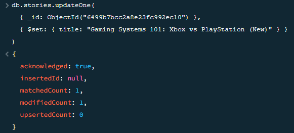

#### Second Update Query
To update multiple documents, we can execute the command `db.stories.updateMany()`. In this case, I am updating the `status` field of documents with a specific `title`:
```python
db.stories.updateMany(
  { title: "Gaming Systems 101: Xbox vs PlayStation (New)" }, 
  { $set: { status: "Updated" } } 
)
```
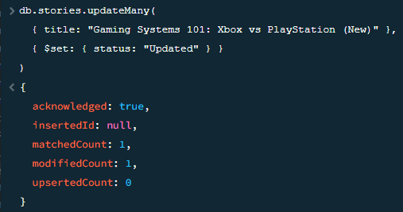

### 4. Delete Query
To delete the document that was just updated, execute the commad `db.stories.deleteOne()`, you need to provide a filter that matches the document you want to delete. In this case, I use the _id field to identify the document.
```python
db.stories.deleteOne({ _id: ObjectId("6499b7bcc2a8e23fc992ec10") })
```
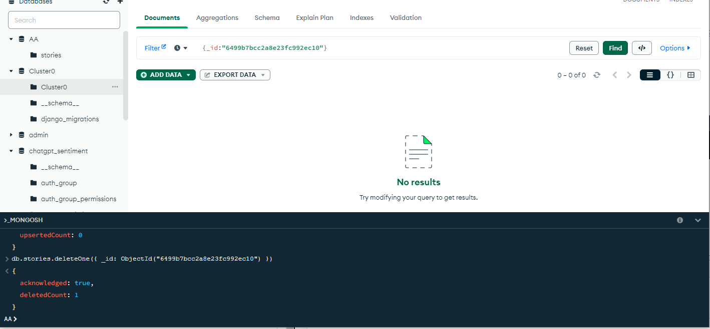

## Contribution 🛠️
Please create an [Issue](https://github.com/drshahizan/special-topic-data-engineering/issues) for any improvements, suggestions or errors in the content.

You can also contact me using [Linkedin](https://www.linkedin.com/in/drshahizan/) for any other queries or feedback.

[](https://visitorbadge.io/status?path=https%3A%2F%2Fgithub.com%2Fdrshahizan)


