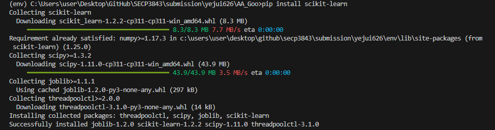
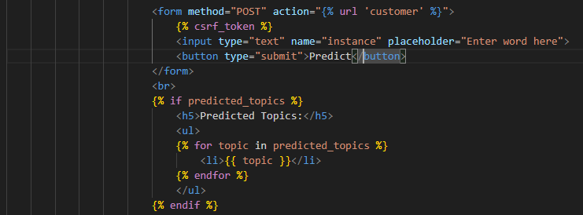
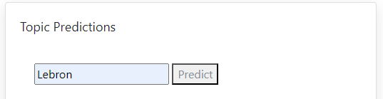
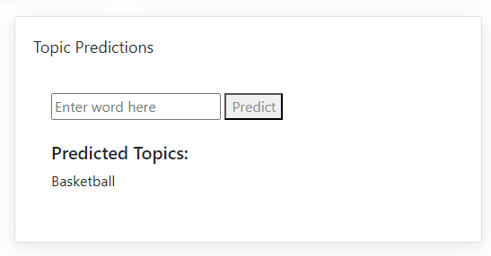
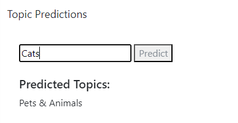

<a href="https://github.com/drshahizan/SECP3843/stargazers"></a>
<a href="https://github.com/drshahizan/SECP3843/network/members"></a>
<a href="https://github.com/drshahizan/SECP3843/pulls"></a>
<a href="https://github.com/drshahizan/SECP3843/issues"></a>
<a href="https://github.com/drshahizan/SECP3843/graphs/contributors"></a>


Don't forget to hit the :star: if you like this repo.

# Special Topic Data Engineering (SECP3843): Alternative Assessment

#### Name: GOO YE JUI  
#### Matric No.: A20EC0191
#### Dataset: Stories Dataset

## Question 4 (a)
Based on the provided Stories Dataset, I have identified one suitable machine learning approach which is text classification using Naive Bayes Classifier. This approach helps me to analyze and categorize textual data. In this project, I am using the `topic` as the label and `description` as the feature. 

### Potential Usage of this feature
For further usage of this feature, it can help website provide personalized recommendations to users based on their interest or preferred categories. For example, when a user used the search bar to search for "Lebron", it will recommend more stories about the topic "Basketball" to the user.

### Implementation of Machine Learning in Django

#### Step 1 : Install required libraries
To perform machine learning, we need to install the `scikit-learn` library to our project using 
```python
pip install scikit-learn
```

#### Step 2 : Define the machine learning function in the Django view
Inside the Django view, I have define a function named `customer` that will connect to the stories collection from MongoDB and do prediction about the instance from user input.
```python
def customer(request):
    context = {}
    # Create a MongoClient instance
    client = MongoClient('mongodb://localhost:27017')

    # Access the MongoDB database
    db = client['AA']

    # Access the collection named "stories"
    collection = db['stories']

    # Query the collection and retrieve the JSON data
    data = list(collection.find())

    # Extract the story descriptions
    descriptions = []
    topic_names = []

    for story in data:
        description = story['description']
        topic_name = story['topic']['name']
        descriptions.append(description)
        topic_names.append(topic_name)

    # Create an instance of CountVectorizer
    vectorizer = CountVectorizer()

    # Fit the vectorizer on the descriptions and transform them into a bag-of-words representation
    features = vectorizer.fit_transform(descriptions)

    # Create an instance of the Naive Bayes classifier
    classifier = MultinomialNB()

    # Train the classifier on the features and encoded topic labels
    classifier.fit(features, topic_names)

    if request.method == 'POST':
        # Get the user input from the form
        new_data = [request.POST.get('instance')]

        # Transform the user input using the vectorizer
        new_features = vectorizer.transform(new_data)

        # Use the trained classifier for prediction
        predicted_topics = classifier.predict(new_features)

        # Render the customer template with the prediction results
        return render(request, 'home/customer.html', {'predicted_topics': predicted_topics})

    # Render the initial customer template
    return render(request, 'home/customer.html', context)
```

#### Step 3 : Define template
Define a template that will render the function. <br>
<br>
<br>
<br>
<br>

<br>


## Contribution 🛠️
Please create an [Issue](https://github.com/drshahizan/special-topic-data-engineering/issues) for any improvements, suggestions or errors in the content.

You can also contact me using [Linkedin](https://www.linkedin.com/in/drshahizan/) for any other queries or feedback.

[](https://visitorbadge.io/status?path=https%3A%2F%2Fgithub.com%2Fdrshahizan)


