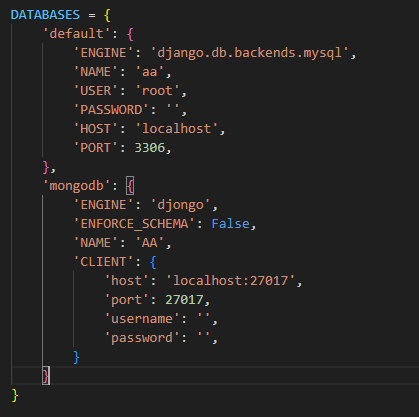
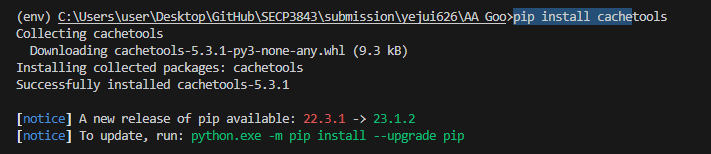
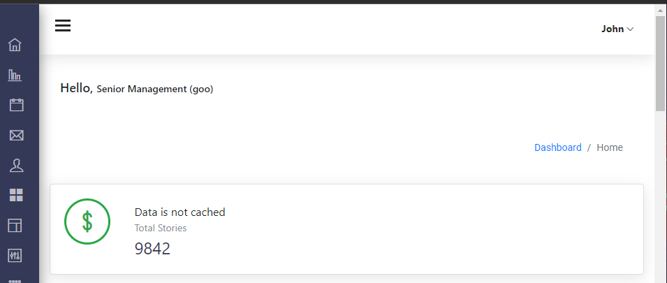
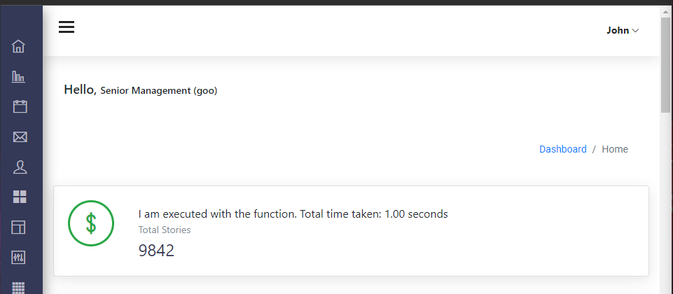
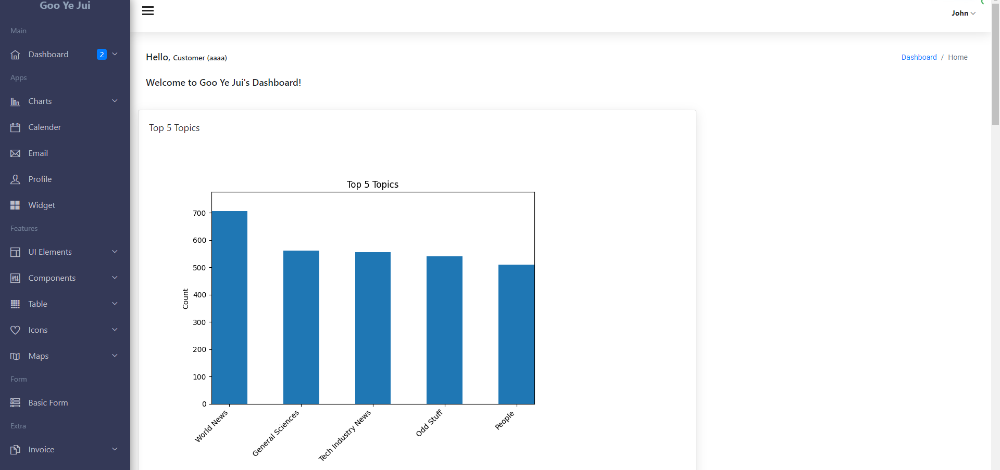
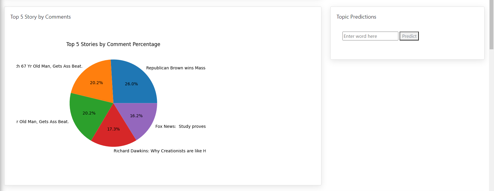
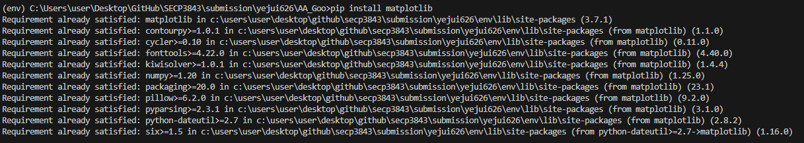
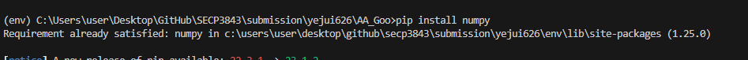

<a href="https://github.com/drshahizan/SECP3843/stargazers"></a>
<a href="https://github.com/drshahizan/SECP3843/network/members"></a>
<a href="https://github.com/drshahizan/SECP3843/pulls"></a>
<a href="https://github.com/drshahizan/SECP3843/issues"></a>
<a href="https://github.com/drshahizan/SECP3843/graphs/contributors"></a>


Don't forget to hit the :star: if you like this repo.

# Special Topic Data Engineering (SECP3843): Alternative Assessment

#### Name: GOO YE JUI  
#### Matric No.: A20EC0191
#### Dataset: Stories Dataset

## Question 5 (a)

Performance of the portal can be optimized when dealing with large volumes of JSON data from the dataset, especially during dashboard visualizations. This could be a problem when the volume of user is high. Imagine if a thousand of users is trying to access the portal and you have only one database for it, the database will not have enough resources to deal with all of them in real time. 

### Proposed Solution 1: Replication in database
The solution I am proposing is to use replicas in database. This technique uses multiple copies of the resource in order to guarantee performance, availability and fault tolerance.

#### Implementation of Replicas Instance
We must declare the read replicas as additional databases in the Django settings file in order to allow their use. In this case, I am setting the master instance (read/write server) as the `default` database and designating `mongodb` as additional databases is the idea.

1. Step 1: Configure the database settings
In `settings.py`, configure two different database.


2. Step 2: Configure a router to choose the read replicas when required.
I have designed a unique router that can select a random replica for read requests while using the default instance for writes.


### Proposed Solution 2: Caching
I have also utilized the caching mechanisms to store and reuse processed data. By caching the results of computationally intensive operations. Caching helps me to avoid repeating those operations for every user request.

#### Implementation of Caching

1. Step 1: Install the cache tools library
```python
pip install cachetools
```


2. Define a cache_key and cache_timeout in your `views.py`.
```python
cache_key = 'my_data_cache_key'
cache_timeout = 60  # Cache data for 60 seconds
```

3. Define a function that is used to get data from the cache.
```python
def get_data_from_cache_or_source():
    data = cache.get(cache_key)
    message = "Not cached"

    if data is not None:
        # Keeping track of total time taken
        timeTaken = time.time()
        time.sleep(1)  
        total_time_taken = time.time() - timeTaken
        message = f"I am executed with the function. Total time taken: {total_time_taken:.2f} seconds"
    
        return data, message

    # Data is not cached, compute or fetch it from the source
    # Create a MongoClient instance
    client = MongoClient('mongodb://localhost:27017')

    # Access the MongoDB database
    db = client['AA']

    # Access the collection named "stories"
    collection = db['stories']

    # Query the collection and retrieve the JSON data
    data = list(collection.find())

    # Store the data in the cache
    cache.set(cache_key, data, cache_timeout)

    # Set the message when data is not cached
    message = "Data is not cached"

    # Return the data and message
    return data, message
```

4. For pages that you wish to be cached, define `@cached(cache = LRUCache(maxsize=128))` on top of the function. For example: 

```python
@cached(cache = LRUCache(maxsize=128))
def senior_management(request):
    context = {}
    data, message = get_data_from_cache_or_source()
    total_stories = len(data)  # Compute the total count of stories

    context['total_stories'] = total_stories  # Add the count to the context
    context['message'] = message

    return render(request, 'home/senior_management.html', context)
```



## Question 5 (b)
The image below shows the dashboard that I have created using the JSON dataset.


<br>
These are the descriptions and steps to implement this dashboard.

### The Top 5 Topic Visualization
This visualization shows the top 5 topics in the dataset. The top 5 topics is identified using the counts of topic occured inside the dataset for each documents.

### The Top 5 Stories by comment
This visualization shows the top 5 stories in the dataset. The top 5 topics is identified using the comments count of the story.

### Topic Predictions
This feature is used to predict the topic of the title input from the user.


#### Steps to implement the visualization

1. Make sure to install all required like `matplotlib` and `numpy` using 
```python
pip install matplotlib
pip install numpy
```



2. Create Django View function for the visualization script.

#### View function for Top 5 Topic Visualization
```python
def top_5_topic(request):
    # Create a MongoClient instance
    client = MongoClient('mongodb://localhost:27017')

    # Access the MongoDB database
    db = client['AA']

    # Access the collection named "stories"
    collection = db['stories']

    # Query the collection and retrieve the JSON data
    data = list(collection.find())

    # Extract the topic names and their counts
    topic_counts = {}
    for story in data:
        topic_name = story['topic']['name']
        if topic_name in topic_counts:
            topic_counts[topic_name] += 1
        else:
            topic_counts[topic_name] = 1

    # Sort the topics by count in descending order
    sorted_topics = sorted(topic_counts.items(), key=lambda x: x[1], reverse=True)

    # Take the top 5 topics and their counts
    top_topics = dict(sorted_topics[:5])
    topics = list(top_topics.keys())
    counts = list(top_topics.values())

    # Set the figure size
    plt.figure(figsize=(8, 6))

    # Set the bar width and padding
    bar_width = 0.5
    index = np.arange(len(topics))

    # Create the bar chart
    plt.bar(index, counts, width=bar_width, align='center')

    # Customize the x-axis labels and tick positions
    plt.xticks(index, topics)
    plt.xticks(rotation=45, ha='right')

    # Add padding between the bars
    plt.subplots_adjust(bottom=0.2)
    plt.margins(0.1)
    plt.autoscale(enable=True, axis='x', tight=True)

    # Add labels and title
    plt.xlabel('Topics')
    plt.ylabel('Count')
    plt.title('Top 5 Topics')

    # Save the chart to a file
    chart_path = 'user/static/images/chart.png' 
    plt.savefig(chart_path)


    chart_path = 'user/static/images/chart.png' 
    # Pass the chart path to the template
    context = {'chart_path': chart_path}

    # Render the template with the data
    return render(request, 'home/customer.html', context)
```
#### View function for The Top 5 Stories by Comment

```python
def top_5_by_comments(request):
    # Create a MongoClient instance
    client = MongoClient('mongodb://localhost:27017')

    # Access the MongoDB database
    db = client['AA']

    # Access the collection named "stories"
    collection = db['stories']

    # Query the collection and retrieve the JSON data
    data = list(collection.find())

    # Sort the stories by comment count in descending order and take the top 5
    top_stories = sorted(data, key=lambda x: x['comments'], reverse=True)[:5]

    # Calculate the total number of comments for all stories
    total_comments = sum(story['comments'] for story in data)

    # Calculate the percentage of comments for each story and create the labels and sizes lists
    labels = []
    sizes = []
    for story in top_stories:
        percentage = (story['comments'] / total_comments) * 100
        labels.append(story["title"])
        sizes.append(percentage)

    plt.pie(sizes, labels=labels, autopct='%1.1f%%')
    plt.title('Top 5 Stories by Comment Percentage')

    # Save the chart to a file
    chart_path = 'user/static/images/pie_chart.png'
    plt.savefig(chart_path)

    # Pass the chart path to the template
    context = {'chart_path_pie': chart_path}

    # Render the template with the data
    return render(request, 'home/customer.html', context)
```

3. Inside the app's template file, add the file path to the src of the img element.


## Contribution 🛠️
Please create an [Issue](https://github.com/drshahizan/special-topic-data-engineering/issues) for any improvements, suggestions or errors in the content.

You can also contact me using [Linkedin](https://www.linkedin.com/in/drshahizan/) for any other queries or feedback.

[](https://visitorbadge.io/status?path=https%3A%2F%2Fgithub.com%2Fdrshahizan)


